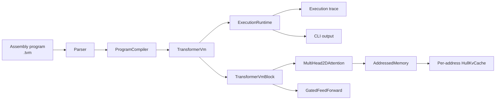
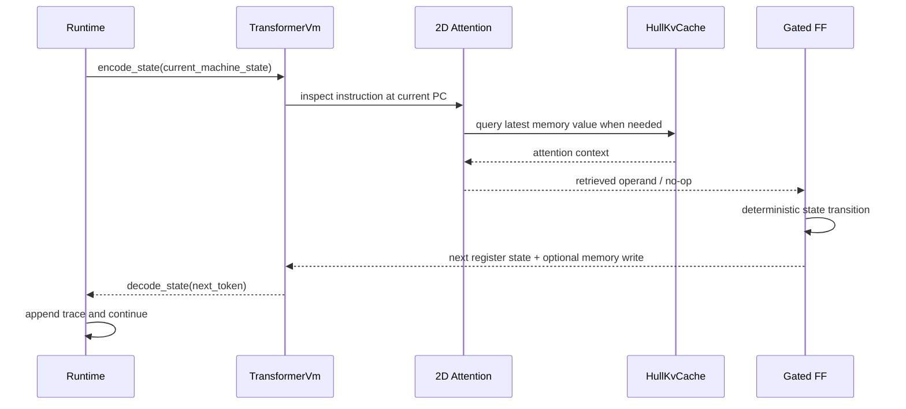

# transformer-vm-rs

Deterministic program execution in a transformer-shaped runtime, implemented in Rust.

This repository now ships a complete MVP:

- A compact assembly language and parser
- A deterministic program compiler
- A transformer-shaped execution model with 2D attention and gated feed-forward blocks
- A convex-hull-backed KV cache for latest-write memory lookups
- A runtime that records execution traces
- A native reference interpreter plus lockstep differential verification
- A CLI that runs end-to-end programs from disk
- Unit, integration, property-style, and CLI tests

It is intentionally an honest MVP. The shipped code proves the architecture end to end for a compact ISA; it does not yet include Burn integration, learned weights, or a full WASM-to-weights compiler.

## Why This Exists

The repository started as a design/specification for a Rust implementation of the ideas in Percepta's March 2026 essay, ["Can LLMs Be Computers?"](https://www.percepta.ai/blog/can-llms-be-computers).

The code in `main` now implements the smallest version of that vision that is fully runnable and testable:

- State is encoded into a fixed `d_model = 36` token
- Execution is expressed as `encode -> attention -> gated transition -> decode`
- Memory reads go through a 2D convex-hull KV cache
- Programs halt deterministically with reproducible traces

## MVP Scope

Implemented:

- `d_model = 36`, `18` logical heads, `head_dim = 2`
- Selectable memory attention modes:
  - `average-hard` for deterministic latest-write argmax
  - `softmax` for full-history weighted reads
  - `hard-softmax:<temperature>` for temperature-controlled interpolation
- `HullKvCache` with convex hull maintenance and argmax queries
- Compact ISA with arithmetic, logic, stack, and subroutine control flow:
  - `NOP`
  - `LOADI`
  - `LOAD`
  - `STORE`
  - `PUSH`
  - `POP`
  - `ADD`
  - `ADDM`
  - `SUB`
  - `SUBM`
  - `MUL`
  - `MULM`
  - `AND`
  - `ANDM`
  - `OR`
  - `ORM`
  - `XOR`
  - `XORM`
  - `CMP`
  - `CMPM`
  - `CALL`
  - `RET`
  - `JMP`
  - `JZ`
  - `JNZ`
  - `HALT`
- Labels plus `.memory` and `.init` directives
- CLI runner and sample programs
- Native ISA interpreter for semantic reference execution
- Lockstep verification of transformer execution against the native interpreter
- Criterion benchmarks proving O(log n) hull query scaling
- Property tests via proptest
- Strict verification with `cargo test` and `cargo clippy -D warnings`

Not implemented yet:

- Burn backend
- Learned parameters or training
- True WASM bytecode lowering
- Multi-layer compiled dispatch over real weight matrices
- GPU kernels and performance tuning

## Quick Start

### 1. Run the sample programs

```bash
cargo run --bin tvm -- run programs/addition.tvm
cargo run --bin tvm -- run programs/memory_roundtrip.tvm
cargo run --bin tvm -- run programs/subroutine_addition.tvm
cargo run --bin tvm -- run programs/stack_roundtrip.tvm
cargo run --bin tvm -- run programs/counter.tvm --max-steps 128 --trace
cargo run --bin tvm -- run programs/soft_attention_memory.tvm --attention-mode hard-softmax:10
cargo run --bin tvm -- run programs/fibonacci.tvm --layers 3 --verify-native
```

### 2. Expected output shape

```text
program: programs/addition.tvm
steps: 3
halted: true
pc: 2
sp: 4
acc: 8
zero_flag: false
carry_flag: false
memory: [0, 0, 0, 0]
layers: 1
attention_mode: average-hard
elapsed_ms: 0.0
throughput_steps_per_sec: ...
```

### 3. Verify the project

```bash
cargo fmt --all
cargo clippy --all-targets --all-features -- -D warnings
cargo test
```

### 4. Differential verification

`--verify-native` runs the same program through a separate native interpreter and checks every traced state transition against the transformer runtime.

```bash
cargo run --bin tvm -- run programs/subroutine_addition.tvm --verify-native
```

## Architecture



### Step-by-step execution



### Memory lookup model

Each memory address maintains its own 2D write history:

- `x = step number`
- `y = stored value`
- query direction = `[1, 0]`

That makes "latest write wins" a hull query instead of a scan.

```mermaid
flowchart TB
    Q[LOAD address 2] --> D[Query direction [1, 0]]
    D --> H[HullKvCache for address 2]
    H --> P0[step 0 value 0]
    H --> P1[step 2 value 41]
    H --> P2[step 5 value 99]
    P2 --> R[Argmax = latest write]
```

This is a pragmatic MVP simplification of the larger research direction. It preserves the 2D geometric lookup mechanism while avoiding the full address-selection encoding problem in a single shared cache.

## Execution Model

The runtime is intentionally shaped like a transformer pipeline:

1. `encode_state` maps machine registers into a 36-dimensional token.
2. `MultiHead2DAttention` resolves memory operands through hull-backed histories.
3. `GatedFeedForward` applies the compiled instruction transition.
4. `decode_state` recovers the next machine state.
5. The runtime repeats until `HALT` or `max_steps`.

The model is deterministic. There is no sampling, no stochastic decoding, and no external tool invocation during execution.

## Attention Modes

The runtime now honors the configured attention mode end to end:

- `average-hard` keeps the hull-backed `O(log n)` latest-write lookup path.
- `softmax` blends the full write history using softmax over write-step scores.
- `hard-softmax:<temperature>` uses the same weighted read with explicit temperature control.

Lower hard-softmax temperatures approach argmax behavior; higher temperatures smooth toward an average over the address history. The softer modes are implemented as full-history scans in this MVP, which makes them useful comparison and validation modes rather than performance paths.

## Assembly Language

### Directives

- `.memory <size>` sets the memory size
- `.init <address> <value>` seeds initial memory

### Stack Semantics

- `SP` is encoded in machine state and initializes to `.memory` size.
- The stack grows downward from the highest address, so `PUSH` and `CALL` decrement `SP` before writing.
- `POP` and `RET` read `MEM[SP]`, then increment `SP`.
- Stack and data share the same memory array; reserve high addresses for call frames if you also use low addresses as data.
- `.memory` is capped at `255` cells because addresses and `SP` are 8-bit encoded in the current MVP.

### Instructions

| Instruction | Meaning |
| --- | --- |
| `NOP` | No operation |
| `LOADI <imm>` | `ACC = imm` |
| `LOAD <addr>` | `ACC = MEM[addr]` |
| `STORE <addr>` | `MEM[addr] = ACC` |
| `PUSH` | Decrement `SP`, then write `ACC` to the stack |
| `POP` | Load `ACC` from `MEM[SP]`, then increment `SP` |
| `ADD <imm>` | `ACC += imm` |
| `ADDM <addr>` | `ACC += MEM[addr]` |
| `SUB <imm>` | `ACC -= imm` |
| `SUBM <addr>` | `ACC -= MEM[addr]` |
| `MUL <imm>` | `ACC *= imm` |
| `MULM <addr>` | `ACC *= MEM[addr]` |
| `AND <imm>` | `ACC &= imm` |
| `ANDM <addr>` | `ACC &= MEM[addr]` |
| `OR <imm>` | `ACC \|= imm` |
| `ORM <addr>` | `ACC \|= MEM[addr]` |
| `XOR <imm>` | `ACC ^= imm` |
| `XORM <addr>` | `ACC ^= MEM[addr]` |
| `CMP <imm>` | `ACC = ACC - imm`, `carry_flag = ACC < imm` |
| `CMPM <addr>` | `ACC = ACC - MEM[addr]`, `carry_flag = ACC < MEM[addr]` |
| `CALL <label|pc>` | Push return address, then jump |
| `RET` | Pop return address and jump back |
| `JMP <label|pc>` | Unconditional jump |
| `JZ <label|pc>` | Jump when zero flag is set |
| `JNZ <label|pc>` | Jump when zero flag is not set |
| `HALT` | Stop execution |

### Example: counter

```asm
.memory 4
.init 1 5

LOADI 0
STORE 0
loop:
LOAD 0
ADD 1
STORE 0
LOAD 0
SUBM 1
JZ done
JMP loop
done:
LOAD 0
HALT
```

Result:

- `ACC = 5`
- `MEM[0] = 5`
- `HALT = true`

## Code Layout

| Path | Responsibility |
| --- | --- |
| `src/assembly.rs` | Assembly parser and label resolution |
| `src/compiler.rs` | Program-to-model compilation |
| `src/config.rs` | Model configuration and validation |
| `src/geometry.rs` | `Point2D` and `HullKvCache` |
| `src/memory.rs` | Addressed memory backed by per-address hull histories |
| `src/model.rs` | Attention, gated transition logic, and model step |
| `src/runtime.rs` | Execution loop and trace capture |
| `src/state.rs` | 36-dimensional machine state encoding |
| `src/bin/tvm.rs` | CLI entrypoint |
| `programs/*.tvm` | Runnable sample programs (addition, counter, fibonacci, memory_roundtrip, multiply, stack_roundtrip, subroutine_addition) |
| `benches/hull_benchmark.rs` | Criterion benchmarks for hull operations |
| `tests/` | Unit, integration, and CLI coverage |

## Testing

The shipped test suite covers:

- State encode/decode round-trip correctness (including proptest)
- Randomized hull argmax correctness vs brute force (including proptest)
- Hull edge cases: collinear points, duplicate x, single/two-point, empty, monotonic vs general
- Program execution for addition, memory round-trips, branching, overflow, looping, fibonacci, multiply
- Stack behavior: `PUSH`/`POP`, `CALL`/`RET`, nested calls, overflow, underflow
- JNZ branch-taken and fall-through paths
- Deterministic execution: same program always produces same output
- Full CLI execution against a real program file

Benchmarks (run with `cargo bench`):

| Size | Hull query | Brute force | Speedup |
| --- | --- | --- | --- |
| 100 | 21 ns | 264 ns | 12x |
| 1,000 | 35 ns | 4.1 µs | 118x |
| 10,000 | 30 ns | 39.8 µs | 1,327x |

Current verification commands:

```bash
cargo clippy --all-targets --all-features -- -D warnings
cargo test
```

## Current Status

This repository is now runnable end to end and suitable for:

- Exploring deterministic transformer-shaped execution
- Testing compact compiled programs
- Experimenting with 2D hull-backed lookup mechanics
- Serving as the foundation for a fuller WASM/Burn implementation

The next major step is replacing the explicit deterministic transition logic with real compiled weight matrices while preserving the same public execution model.

## References

- [Percepta: Can LLMs Be Computers?](https://www.percepta.ai/blog/can-llms-be-computers)
- `SPEC.md`
- `RFC-001-hull-kv-cache.md`
- `RFC-002-2d-attention.md`
- `RFC-003-state-encoding-compiler.md`
- `RFC-004-005-runtime-hybrid.md`

## License

MIT
