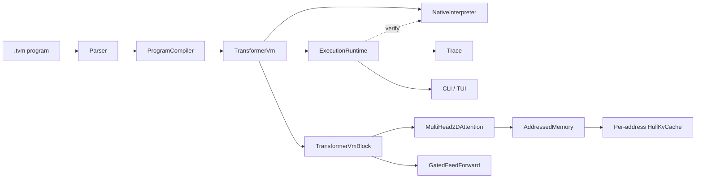
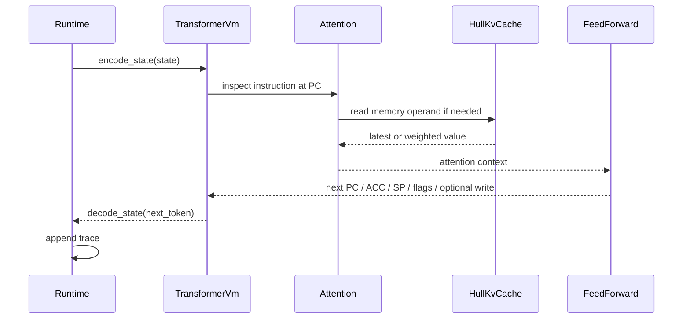

# transformer-vm-rs

Deterministic program execution in a transformer-shaped runtime, written in Rust.

This repository is a working MVP of a specific idea: parts of program execution can be expressed in transformer-like primitives instead of a conventional interpreter loop. The code here does that for a compact assembly language with:

- a fixed-width machine-state token (`d_model = 36`)
- 2D attention heads (`head_dim = 2`)
- hull-backed memory lookup for latest-write reads
- deterministic feed-forward transitions
- a native reference interpreter for differential verification

The result is not a language model pretending to be a VM. It is a small, explicit, testable machine whose execution path is shaped like `encode -> attention -> transition -> decode`.

## What This Repo Actually Implements

Implemented today:

- a parser for `.tvm` assembly programs
- a compact ISA with arithmetic, logic, branches, stack operations, and subroutines
- a transformer-shaped execution model
- per-address `HullKvCache` histories for memory lookup
- selectable attention modes:
  - `average-hard`
  - `softmax`
  - `hard-softmax:<temperature>`
- a CLI runner
- a TUI execution viewer
- a native interpreter
- lockstep transformer-vs-native verification
- unit, integration, property, CLI, and benchmark coverage

Not implemented yet:

- Burn integration
- learned weights or training
- a full WASM-to-transformer compiler
- GPU kernels
- a single shared memory-address selection mechanism across all writes

That last point matters. The current MVP keeps one write history per memory address. This preserves the geometric lookup mechanism while avoiding the harder problem of representing address selection inside one shared attention structure.

## Why This Is Interesting

If you come from machine learning:

- the repo shows a concrete case where transformer-style components are used for exact execution rather than prediction
- it makes the 2D-attention idea tangible instead of leaving it at the level of theory
- it gives you a deterministic reference point for later experiments with soft or learned variants

If you come from PL, compilers, or systems:

- the repo treats execution as a state transition system with explicit invariants
- it uses geometry for memory lookup rather than hash tables or linear scans
- it includes a second execution engine so semantic drift is caught immediately

## Quick Start

### Run a program

```bash
cargo run --bin tvm -- run programs/addition.tvm
```

### Run with a trace

```bash
cargo run --bin tvm -- run programs/counter.tvm --max-steps 128 --trace
```

### Compare transformer execution against the native interpreter

```bash
cargo run --bin tvm -- run programs/fibonacci.tvm --layers 3 --verify-native
```

### Open the TUI

```bash
cargo run --bin tvm -- tui programs/fibonacci.tvm --layers 3 --max-steps 128
```

### Validate the repo

```bash
cargo fmt --all
cargo clippy --all-targets --all-features -- -D warnings
cargo test
```

### Run benchmarks

```bash
cargo bench
```

## Example Output

`cargo run --bin tvm -- run programs/addition.tvm`

```text
program: programs/addition.tvm
steps: 3
halted: true
pc: 2
sp: 4
acc: 8
zero_flag: false
carry_flag: false
memory: [0, 0, 0, 0]
layers: 1
attention_mode: average-hard
elapsed_ms: ...
throughput_steps_per_sec: ...
```

With native verification enabled, the CLI also reports whether every checked step matched the reference interpreter.

## Core Idea

The runtime keeps a machine state:

- `PC`
- `ACC`
- `SP`
- `zero_flag`
- `carry_flag`
- `halted`
- memory cells

Each execution step looks like this:

1. Encode the machine state into a fixed 36-dimensional token.
2. Use attention to retrieve any memory operand needed by the current instruction.
3. Apply a deterministic feed-forward transition compiled for that instruction.
4. Decode the next machine state.
5. Append the step to the trace and continue.

That is the whole loop. No sampling. No hidden control flow. No external side effects beyond the explicit memory model.

## Memory As Geometry

This is the part that makes the project different.

For each memory address, the runtime stores a history of writes as 2D points:

- `x = execution step`
- `y = value written at that step`

For a latest-write read, the query direction is:

- `q = [1, 0]`

The score of a point `k = [x, y]` is the dot product:

```text
score(q, k) = q_x * k_x + q_y * k_y
            = 1 * x + 0 * y
            = x
```

So the best match is simply the write with the largest step index. In 2D, the maximizer of a dot product lies on the convex hull, which means the runtime can answer the query from a hull-backed structure instead of scanning the full history.

That gives the MVP a clean geometric story:

- writes append points to a per-address history
- `average-hard` reads use hull argmax
- soft variants read the same history with weighted blending

This repo uses one hull per address. That keeps the idea simple and correct. A fuller design would tackle shared memory addressing directly.

## Attention Modes

| Mode | Semantics | Intended use |
| --- | --- | --- |
| `average-hard` | Deterministic latest-write lookup via hull argmax | Main execution path |
| `softmax` | Weighted read over the full write history | Comparison baseline |
| `hard-softmax:<temperature>` | Weighted read with explicit temperature control | Interpolation between hard and soft behavior |

Lower temperatures make `hard-softmax` behave more like argmax. Higher temperatures make it smoother and less local.

In this MVP:

- `average-hard` is the geometric fast path
- `softmax` and `hard-softmax` are full-history scans

That is intentional. The softer modes exist to study semantics and continuity, not to claim equal performance.

## Architecture



### Execution path



## What "Compiled" Means Here

The project compiles each instruction into deterministic transition logic inside the model implementation. The feed-forward path applies explicit matrices and control rules for the current instruction and produces:

- next `PC`
- next `ACC`
- next `SP`
- next flags
- optional memory write

So this is already compiled execution in a real sense, but it is still an MVP:

- the ISA is compact
- the compiler target is internal Rust data structures, not a serialized model format
- there is no WASM front-end yet
- there is no learned or Burn-backed backend yet

## Differential Verification

This repo has two execution engines:

1. `ExecutionRuntime`
   A transformer-shaped runtime that executes through encode, attention, and compiled transition logic.

2. `NativeInterpreter`
   A direct ISA interpreter with the same machine semantics.

The verifier runs both engines step by step and fails on the first mismatch:

- instruction mismatch
- state-before mismatch
- state-after mismatch
- final-state mismatch
- step-count mismatch

This is one of the most important pieces in the repository. It means changes to the transformer path can be tested against an independent semantic reference instead of trusted by inspection.

Run it from the CLI:

```bash
cargo run --bin tvm -- run programs/subroutine_addition.tvm --verify-native
```

## Assembly Language

### Directives

- `.memory <size>` sets the number of memory cells
- `.init <address> <value>` seeds initial memory

### Stack model

- `SP` initializes to `.memory` size
- the stack grows downward
- `PUSH` and `CALL` decrement `SP` before writing
- `POP` and `RET` read from `MEM[SP]` and then increment `SP`
- stack and data share one memory array
- memory is capped at `255` cells because addresses and `SP` are encoded as 8-bit values in the current MVP

### Instruction set

| Instruction | Effect |
| --- | --- |
| `NOP` | No operation |
| `LOADI <imm>` | `ACC = imm` |
| `LOAD <addr>` | `ACC = MEM[addr]` |
| `STORE <addr>` | `MEM[addr] = ACC` |
| `PUSH` | `SP -= 1`, then `MEM[SP] = ACC` |
| `POP` | `ACC = MEM[SP]`, then `SP += 1` |
| `ADD <imm>` | `ACC += imm` |
| `ADDM <addr>` | `ACC += MEM[addr]` |
| `SUB <imm>` | `ACC -= imm` |
| `SUBM <addr>` | `ACC -= MEM[addr]` |
| `MUL <imm>` | `ACC *= imm` |
| `MULM <addr>` | `ACC *= MEM[addr]` |
| `AND <imm>` | `ACC &= imm` |
| `ANDM <addr>` | `ACC &= MEM[addr]` |
| `OR <imm>` | `ACC \|= imm` |
| `ORM <addr>` | `ACC \|= MEM[addr]` |
| `XOR <imm>` | `ACC ^= imm` |
| `XORM <addr>` | `ACC ^= MEM[addr]` |
| `CMP <imm>` | `ACC = ACC - imm`, `carry_flag = ACC < imm` |
| `CMPM <addr>` | `ACC = ACC - MEM[addr]`, `carry_flag = ACC < MEM[addr]` |
| `CALL <label|pc>` | Push return address, then jump |
| `RET` | Pop return address and jump |
| `JMP <label|pc>` | Unconditional jump |
| `JZ <label|pc>` | Jump if `zero_flag` is set |
| `JNZ <label|pc>` | Jump if `zero_flag` is not set |
| `HALT` | Stop execution |

### Example program

```asm
.memory 4
.init 1 5

LOADI 0
STORE 0
loop:
LOAD 0
ADD 1
STORE 0
LOAD 0
SUBM 1
JZ done
JMP loop
done:
LOAD 0
HALT
```

Expected final state:

- `ACC = 5`
- `MEM[0] = 5`
- `halted = true`

## Sample Programs

| Program | What it demonstrates |
| --- | --- |
| `programs/addition.tvm` | Straight-line arithmetic |
| `programs/memory_roundtrip.tvm` | Store then latest-write readback |
| `programs/counter.tvm` | Looping and zero-based branch termination |
| `programs/multiply.tvm` | Repeated arithmetic over memory state |
| `programs/fibonacci.tvm` | Multi-step stateful computation |
| `programs/stack_roundtrip.tvm` | `PUSH` and `POP` behavior |
| `programs/subroutine_addition.tvm` | `CALL` and `RET` |
| `programs/soft_attention_memory.tvm` | Difference between hard and soft memory read modes |

## CLI and TUI

### CLI

`run` executes a program from disk and prints the final machine state.

Useful flags:

- `--max-steps <N>`
- `--trace`
- `--layers <N>`
- `--attention-mode average-hard|softmax|hard-softmax:<temperature>`
- `--verify-native`

Examples:

```bash
cargo run --bin tvm -- run programs/memory_roundtrip.tvm
cargo run --bin tvm -- run programs/soft_attention_memory.tvm --attention-mode hard-softmax:10
cargo run --bin tvm -- run programs/fibonacci.tvm --layers 3 --trace --verify-native
```

### TUI

`tui` runs the same execution engine in an interactive terminal UI.

```bash
cargo run --bin tvm -- tui programs/fibonacci.tvm --layers 3 --max-steps 128
```

Keys:

- `q` quit
- `space` pause/resume
- `n` single-step while paused
- `1`, `2`, `3` switch views
- `t` switch theme
- `+`, `-` adjust playback rate

## Testing and Benchmarks

The test suite covers:

- state encode/decode round trips
- parser behavior and label resolution
- hull argmax correctness against brute force
- hull edge cases such as duplicates, collinearity, and non-monotonic insertion
- runtime execution of arithmetic, memory, branching, stack, and subroutine programs
- native interpreter behavior
- lockstep parity between transformer execution and the native interpreter
- randomized differential checks in both `average-hard` and `hard-softmax` modes
- CLI behavior

Criterion benchmarks live in [`benches/hull_benchmark.rs`](benches/hull_benchmark.rs). They compare:

- hull-backed argmax vs brute-force argmax
- monotonic insertion cost
- insert-then-query pipeline cost

Run them with:

```bash
cargo bench
```

## Repository Layout

| Path | Responsibility |
| --- | --- |
| `src/assembly.rs` | Assembly parsing, directives, label resolution |
| `src/compiler.rs` | Program-to-model compilation entrypoints |
| `src/config.rs` | Model configuration and attention-mode parsing |
| `src/error.rs` | Error types used across parser, runtime, and verifier |
| `src/geometry.rs` | `Point2D` and `HullKvCache` |
| `src/memory.rs` | Addressed memory plus per-address write histories |
| `src/model.rs` | Attention path, feed-forward transitions, transformer VM blocks |
| `src/runtime.rs` | Transformer execution loop and trace capture |
| `src/interpreter.rs` | Native reference interpreter |
| `src/verification.rs` | Lockstep transformer-vs-native comparison |
| `src/state.rs` | Machine-state encoding and decoding |
| `src/tui.rs` | Interactive terminal viewer |
| `src/bin/tvm.rs` | CLI entrypoint |
| `tests/` | Integration, property, hull, runtime, interpreter, and CLI tests |
| `programs/` | Runnable example programs |
| `benches/` | Criterion benchmarks |

## Current Limits

The current MVP is intentionally narrow.

- It uses a compact assembly language, not WASM input.
- It uses deterministic compiled transitions, not learned parameters.
- It keeps one write history per memory address.
- It does not attempt GPU acceleration.
- It does not claim to be a useful general-purpose VM.

That narrowness is a feature. The repository is useful because the semantics are small enough to inspect and strong enough to test.

## Where To Go Next

The most important next steps are:

1. WASM lowering into the current machine model.
2. A stronger treatment of memory addressing beyond per-address histories.
3. Burn-backed or serialized model representations for the compiled transition path.
4. More ambitious demonstrations that stress long traces and richer control flow.

## Further Reading

- [Percepta: Can LLMs Be Computers?](https://www.percepta.ai/blog/can-llms-be-computers)
- [`SPEC.md`](SPEC.md)
- [`RFC-001-hull-kv-cache.md`](RFC-001-hull-kv-cache.md)
- [`RFC-002-2d-attention.md`](RFC-002-2d-attention.md)
- [`RFC-003-state-encoding-compiler.md`](RFC-003-state-encoding-compiler.md)
- [`RFC-004-005-runtime-hybrid.md`](RFC-004-005-runtime-hybrid.md)

## License

MIT
