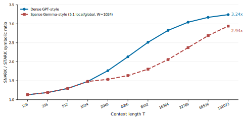

# On the Alignment of Transformer Workloads and STARK Proof Systems

**Omar Espejel**  
Starknet Foundation  
April 2026

---

## Abstract

This paper presents a transformer-specific complexity analysis comparing SNARK circuit size and STARK trace length for verifiable inference. Arithmetic work in a standard transformer block maps similarly in both settings, but non-arithmetic primitives such as softmax, normalization, and activation functions stress the two proving families differently. Under the representative cost model used throughout this paper (`C_exp = 300`, `C_norm = 30`, `C_nonlin = 150`), GPT-2 small (`d = 768`, `T = 1024`, `H = 12`, `L = 12`) yields approximately `157.8B` SNARK constraints versus `106.5B` STARK trace rows across 12 layers, or about `1.48x` more symbolic proving work on the SNARK side under these assumptions. Over the practically relevant range studied here, the ratio increases with sequence length as softmax-related work becomes a larger share of total symbolic work, before approaching a finite architecture-dependent ceiling.

We complement this analytic comparison with a concrete proof-stack prototype, `llm-provable-computer`, in which execution traces from a deterministic transformer-shaped virtual machine are directly consumable as AIR witnesses [30]. `omarespejel/llm-provable-computer` is the maintained fork used for this paper, the reproducibility bundle, and the early S-two migration work. It builds directly on Abdelhamid Bakhta's original public repository, `AbdelStark/llm-provable-computer`, which established the upstream prototype and public implementation line. The current fork extends that base with the paper draft, reproducibility artifacts, research-oriented semantic agreement artifacts, neural-style programs, and early S-two backend seams; it does not yet prove full standard-softmax transformer inference on S-two, and the repo-backed proof path remains limited to `average-hard` attention rather than full standard softmax. The resulting claim is therefore narrower and stronger than a generic “STARKs beat SNARKs” position: transformer workloads emphasize exactly the dimensions on which STARK-native systems may compound advantages, while modern SNARK systems remain serious and rapidly improving competitors. A supplementary comparison appendix summarizes the current public system posture.

---

## 1. Introduction

Verifiable inference matters because model outputs are now operational inputs. If a model score can trigger a trade, influence a diagnosis, decide a routing path, or authorize an onchain action, then “trust me, the model ran” is not enough. The problem is no longer only one of privacy or provenance; it is one of computational integrity.

The zkML ecosystem has already shown that proving neural network inference is feasible. Sumcheck-based systems have made linear layers practical. Lookup-based systems have shown that non-polynomial functions can be handled efficiently enough to support real workloads. Public product and engineering materials from Lagrange report that DeepProve has proven full GPT-2 inference and later Gemma-class progress [24, 25]. Public repo and product materials from BitSage and Giza/StarkWare similarly show active and increasingly concrete STARK-native development, even if maturity remains uneven across systems and components [26, 28, 29]. Recent ZKML surveys now organize the field across verifiable training, testing, and inference, which helps situate this paper as primarily an inference-and-systems contribution [33].

The question addressed here is therefore narrower and more useful than “can transformers be proved?” The question is: **which proof architecture compounds most cleanly as transformer workloads scale in model size, sequence length, and deployment complexity?**

This paper makes three distinct claims:

1. **Analytic claim.** Under a stated transformer cost model, non-arithmetic operations such as softmax, LayerNorm, and GELU can shift prover economics in favor of STARK-native systems.
2. **Systems claim.** Deterministic execution of transformer-relevant programs can be compiled into traces that are directly consumable as AIR witnesses.
3. **Infrastructure claim.** The S-two / Starknet stack makes this direction increasingly practical, even though the reference repository used here still relies on the vanilla backend for its default artifact bundle and primary transformer proof relation, while exposing only an experimental S-two path for a narrow fixture set.

The repository artifact supports the second claim directly. The first claim is a model-based comparison, not an apples-to-apples end-to-end benchmark of production provers on identical hardware. The third claim is partially supported by recent StarkWare and Starknet releases, but remains ahead of the current repository implementation. The paper therefore aims to be a rigorous architecture-and-systems thesis, not a final empirical verdict on STARK versus SNARK transformer proving.

Evidence note. This paper relies on three evidence classes: archival literature, official engineering/product materials, and commit-pinned repository artifacts. Claims derived from the latter two are labeled accordingly and are used to characterize current public system posture rather than to substitute for matched archival benchmarks.

This paper contributes three concrete things: an exact transformer-specific symbolic cost model that separates arithmetic from non-arithmetic proving work, a semantics-hardened repository artifact showing that transformer-relevant execution traces can serve directly as AIR witnesses, and a current infrastructure analysis connecting that artifact to public S-two and Starknet developments without overstating present implementation maturity.

---

## 2. Background

### 2.1 STARKs, AIR, and Circle STARKs

STARKs arithmetize computation as an execution trace and a set of polynomial transition constraints. In AIR form, each row of the trace represents one machine step, and low-degree constraints express valid state evolution. Soundness is then reduced to polynomial proximity testing via FRI and related machinery. The core appeal for prover-heavy workloads is transparent setup, post-quantum security, and a prover dominated by field arithmetic, FFT-style operations, and hash commitments rather than elliptic-curve MSMs [1, 2, 3, 4].

Circle STARKs adapt the STARK framework to the Mersenne-31 field (`2^31 - 1`), enabling highly efficient arithmetic over a chip-friendly field. StarkWare’s S-two prover is the current flagship implementation of this direction and is explicitly positioned for recursion, client-side proving, zkML, and Starknet integration. In this paper, **S-two** follows StarkWare’s current public naming, while **STWO** is used only when referring to repository, crate, or project names that retain the older capitalization. Public StarkWare product and documentation materials describe S-two 2.0.0 as fully open source and developer-ready and describe recursive proving support as part of the stack [17, 18, 20]. On March 31, 2026, StarkWare publicly announced a further recursion upgrade from Cairo-based recursion to circuit-based recursion, reporting a reduction from roughly one minute to roughly three seconds for proving verification in the recursive path [19]. These improvements matter directly for any architecture that expects to aggregate many proofs or compress them for onchain verification, but they should be understood here as public engineering/product claims rather than archival benchmark results.

### 2.2 SNARKs, GKR, and modern zkML

Modern zkML systems rarely rely on naive gate-by-gate circuits for the entire model. Instead, they combine multiple proof techniques. GKR and sumcheck handle large linear algebra blocks efficiently. Lookup arguments or custom circuits handle non-polynomial functions such as exponentials, normalization, and activation functions. The practical competition is therefore not “R1CS vs AIR” in isolation; it is a competition among system architectures that mix arithmetization strategies, commitment schemes, recursion mechanisms, and hardware assumptions [5, 6, 7, 10, 11].

That distinction matters for this paper. The model developed below does **not** claim that every modern SNARK implementation literally pays a naive `100–500` constraint cost for every non-arithmetic operation in the same way. It instead uses representative constants to show how transformer workloads can amplify overhead in proof systems whose handling of non-arithmetic primitives is less native than the lookup-centric STARK path.

### 2.3 LogUp and lookup-heavy workloads

Lookup arguments are central to the argument because the transformer bottlenecks of interest are not just matrix multiplies. Softmax requires exponentials and normalization. LayerNorm requires division and square-root-like structure. GELU requires nonlinear approximations. LogUp-style lookup arguments let a prover show that each quantized evaluation belongs to a precommitted table with low additional algebraic degree, making these operations comparatively natural in STARK-native designs [8, 10, 38, 39].

---

## 3. Transformer Operation Count

We consider a standard transformer block with model dimension `d`, sequence length `T`, number of heads `H`, head dimension `d_k = d / H`, and feedforward expansion `4d` [12].

### 3.1 Arithmetic operations

Arithmetic work per layer is:

- QKV projection: `3Td^2`
- Attention scores: `T^2 d`
- Value aggregation: `T^2 d`
- Output projection: `Td^2`
- Feedforward network: `8Td^2`
- LayerNorm linear scaling: `2Td`

Summing the dominant arithmetic components gives:

```text
12Td^2 + 2T^2d + 2Td
```

### 3.2 Non-arithmetic operations

Non-arithmetic work per layer is:

- Softmax: `T^2 H`
- LayerNorm nonlinear component: `2Td`
- GELU: `4Td`

Summing these terms gives:

```text
T^2H + 6Td
```

The key structural point is not just that these terms exist, but that they become more important precisely in the regimes that matter for modern transformers: long contexts and repeated normalization / activation over wide hidden states.

---

## 4. A Transformer-Specific Cost Model

This section is the analytic core of the paper. It should be read as a **model-based comparison of symbolic proving work**, not as a controlled head-to-head benchmark of complete production systems. Throughout this section, raw SNARK constraint counts and raw STARK trace rows are used as symbolic proxies for prover-side work under the simplifying assumption that prover cost is dominated by algebraic operations that scale approximately linearly with these objects. That is a modeling assumption, not a claim that one constraint and one trace row are identical units of runtime cost in production systems.

### 4.1 SNARK-side symbolic cost

Using representative constants for non-arithmetic operations,

- `C_exp = 300`
- `C_norm = 30`
- `C_nonlin = 150`

we model the per-layer SNARK-side cost as:

```text
C_SNARK = 12Td^2 + 2T^2d + 2Td + T^2H * C_exp + 2Td * C_norm + 4Td * C_nonlin
```

This keeps the arithmetic term shared with the STARK side and makes explicit where the non-arithmetic amplification enters.

The constants `C_exp`, `C_norm`, and `C_nonlin` are **stylized comparative constants**, not normalized measurements extracted from one production prover stack running on one fixed hardware configuration. Their role is to make the model’s sensitivity to non-arithmetic work explicit, not to claim benchmark equivalence with any single deployed system.

The model isolates the non-arithmetic component of softmax; row-wise reductions, max-subtraction for numerical stability, and backend-specific normalization lowerings are not modeled separately and are instead absorbed into the arithmetic proxy or left to the threats-to-validity discussion.

Because softmax dominates the non-arithmetic budget in this model, `C_exp` is the highest-leverage constant. On the corrected GPT-2-small instantiation below, holding `C_norm = 30` and `C_nonlin = 150` fixed changes the overall SNARK/STARK ratio from about `1.13x` at `C_exp = 50` to `1.20x` at `C_exp = 100`, `1.48x` at `C_exp = 300`, and `1.77x` at `C_exp = 500`. By contrast, varying `C_norm` from `10` to `50` changes the ratio only from about `1.48x` to `1.49x`, while varying `C_nonlin` from `50` to `250` changes it from about `1.45x` to `1.52x`. The qualitative argument is therefore most sensitive to how one models softmax-like non-arithmetic work.

#### Table 1. Sensitivity of the GPT-2-small ratio to stylized non-arithmetic constants

| Constants varied | Setting | SNARK/STARK ratio |
|---|---:|---:|
| `C_exp` with `C_norm = 30`, `C_nonlin = 150` | `50` | `1.13x` |
| `C_exp` with `C_norm = 30`, `C_nonlin = 150` | `100` | `1.20x` |
| `C_exp` with `C_norm = 30`, `C_nonlin = 150` | `300` | `1.48x` |
| `C_exp` with `C_norm = 30`, `C_nonlin = 150` | `500` | `1.77x` |
| `C_norm` with `C_exp = 300`, `C_nonlin = 150` | `10` | `1.48x` |
| `C_norm` with `C_exp = 300`, `C_nonlin = 150` | `30` | `1.48x` |
| `C_norm` with `C_exp = 300`, `C_nonlin = 150` | `50` | `1.49x` |
| `C_nonlin` with `C_exp = 300`, `C_norm = 30` | `50` | `1.45x` |
| `C_nonlin` with `C_exp = 300`, `C_norm = 30` | `150` | `1.48x` |
| `C_nonlin` with `C_exp = 300`, `C_norm = 30` | `250` | `1.52x` |

This table should be read as a stress test of the model, not as a benchmark of deployed proving stacks. Its purpose is to show that the analytic claim is materially more sensitive to the assumed softmax-like cost than to the normalization or activation constants.

### 4.2 STARK-side symbolic cost

For the STARK side, we keep the exact expression:

```text
L_STARK = 12Td^2 + 2T^2d + T^2H + 8Td
```

A naive approximation such as `12Td^2 + 3T^2d` would not be justified for GPT-2 small because `H << d`. For GPT-2 small, `H = 12` and `d = 768`, so the `T^2H` term is `64x` smaller than a `T^2d` term. The asymptotic point remains valid, but that approximation materially inflates the STARK side numerically.

This STARK-side lookup treatment is also optimistic. Real LogUp-style or lookup-backed implementations do not get non-arithmetic operations “for free”: they pay additional overhead in auxiliary trace columns, interaction phases, logarithmic-derivative machinery, and commitment work. The one-row-per-symbolic-lookup abstraction is therefore a simplifying modeling choice, just as the SNARK-side constants are.

**Proposition 1.** Under the symbolic model of Sections 4.1 and 4.2, with `T, d, H > 0` and `C_exp, C_norm, C_nonlin >= 1`,

```text
C_SNARK - L_STARK = T^2H(C_exp - 1) + 2Td(C_norm - 1) + 4Td(C_nonlin - 1) >= 0.
```

Equality holds only when `C_exp = C_norm = C_nonlin = 1`. For fixed `d`, `H`, and constants with at least one strict inequality, the gap grows monotonically in `T`.

Rearranging the same expression gives the exact break-even surface:

```text
T^2H(C_exp - 1) + 2Td(C_norm - 1) + 4Td(C_nonlin - 1) = 0.
```

For fixed `C_norm` and `C_nonlin`, this yields

```text
C_exp^* = 1 - (2d / TH)[(C_norm - 1) + 2(C_nonlin - 1)].
```

If `C_norm = C_nonlin = 1`, the break-even reduces to `C_exp = 1`. On the GPT-2-small instantiation with `C_norm = 30` and `C_nonlin = 150`, the threshold is `C_exp^* = -39.875`, so no positive `C_exp` removes the modeled symbolic gap.

For the dense GPT-style case, the ratio also has a finite large-context asymptote. Writing

```text
R(T) = C_SNARK / L_STARK,
```

and keeping `d`, `H`, and the non-arithmetic constants fixed gives

```text
lim_{T -> ∞} R(T) = (2d + H C_exp) / (2d + H) = (2d_h + C_exp) / (2d_h + 1).
```

For GPT-2-small, `d_h = 64`, so under `C_exp = 300` the dense asymptote is approximately `3.32x`. The right interpretation is therefore not that the symbolic ratio diverges without bound, but that over the practical ranges studied here it rises as non-arithmetic work becomes a larger share of total work before saturating at a finite architecture-dependent ceiling.

### 4.3 Concrete analysis: GPT-2 small

Instantiating the model with GPT-2 small parameters (`d = 768`, `T = 1024`, `H = 12`, `L = 12`) gives the following.

#### Table 2. GPT-2 small symbolic work under the stated cost model

| Component | SNARK (constraints) | STARK (trace rows) | Ratio |
|---|---:|---:|---:|
| Arithmetic | 8,859,942,912 | 8,859,942,912 | 1.00x |
| Softmax | 3,774,873,600 | 12,582,912 | 300x |
| LayerNorm | 47,185,920 | 1,572,864 | 30x |
| GELU | 471,859,200 | 3,145,728 | 150x |
| Total per layer | 13,153,861,632 | 8,877,244,416 | 1.48x |
| Total (12 layers) | 157,846,339,584 | 106,526,932,992 | 1.48x |

Under this cost model, the non-arithmetic overhead adds about `4.29B` SNARK constraints versus about `17.3M` STARK rows per layer at `T = 1024`. Softmax alone contributes about `87.9%` of the SNARK non-arithmetic overhead. Scaling the same model to `T = 4096` yields an overall ratio of about `2.13x`, so the qualitative claim that the gap widens with context length remains intact.

### 4.4 Interpretation

This analysis does **not** prove that every STARK system is faster than every SNARK system on every transformer workload. It supports a narrower claim: once both sides handle large linear algebra efficiently, the remaining battleground is dominated by lookup handling, recursion, field arithmetic, and commitment backend. Transformer workloads expose these differences more sharply than many standard proving benchmarks do.

One further scope boundary matters here: the model abstracts each activation or normalized value as one algebraic object. It does **not** model int8/int4 quantization layouts, packing strategies, or backend-specific decompositions. Practical zkML systems often rely heavily on quantization, and that can change absolute constraint counts differently across SNARK and STARK systems. The present model is therefore best read as a structural comparison of symbolic work, not as a quantization-aware production estimate.

Recent implementation-level comparisons reinforce that point. A December 2025 empirical comparison of Groth16 and a reference STARK implementation on consumer ARM hardware reports much faster proving and dramatically smaller proofs for the Groth16 side, alongside faster verification and transparency/post-quantum advantages for the STARK side [34]. That result is relevant because it shows exactly what this section does **not** measure: symbolic row and constraint counts are not direct runtime measurements, and real STARK provers also pay for low-degree extension, Merkle commitments, and FRI rounds. At the same time, that benchmark is not a transformer-specific zkML evaluation and does not study S-two-class STARK implementations, so it should be read as a boundary condition on the present model rather than as a direct refutation of it.

Threats to validity for this section are therefore concentrated in four places: quantization and packing strategy, lookup-table reuse and non-arithmetic circuit lowering, recursion and proof-compression strategy, and hardware parallelism. The model intentionally abstracts over these dimensions in order to isolate the architectural role of non-arithmetic transformer work, but they matter materially to real deployed systems.

### 4.5 Analytic extension to released Gemma 3 architectures

The GPT-2-small analysis is useful because it keeps the algebra transparent, but it is no longer enough on its own. Public Lagrange engineering materials report DeepProve progress on Gemma 3-class inference, and that engineering update for **September 2025**, published on **October 20, 2025**, is explicit that supporting Gemma 3 required handling grouped-query attention (GQA), alternating local/global attention, RMSNorm, GeGLU, and RoPE [25]. Official Google Gemma 3 materials describe the family as a decoder-only transformer with GQA, RMSNorm, long-context support, and a `5:1` interleaving of local and global attention layers, with the 4B, 12B, and 27B variants supporting `128K` context and the smaller variants supporting shorter windows [14, 15].

This subsection is an **analytic scaling extension only**. It does not claim that the repository implements Gemma 3 execution, GQA, local/global attention scheduling, or long-context proving. It asks a narrower question: if one carries the paper’s symbolic comparison logic forward to a released sparse long-context architecture, does the qualitative divergence still persist?

For Gemma-style layers, we refine the notation from the GPT-2-style dense-attention case. Let `n_q` be the number of query heads, `n_kv` the number of key/value heads, `d_h` the head dimension, `q = n_q d_h`, `k = n_kv d_h`, `m` the MLP intermediate size, `L_g` the number of global-attention layers, `L_l` the number of local-attention layers, `W` the local sliding-window span, and `W_eff(T) = min(T, W)`. Using the same stylized comparative constants as above, the architecture-aware symbolic model becomes:

```text
A_Gemma(T) = L[Td(q + 2k) + Tdq + 3Tdm] + 2q[L_g T^2 + L_l T W_eff(T)]
S_Gemma(T) = n_q[L_g T^2 + L_l T W_eff(T)]
C_SNARK^Gemma(T) = A_Gemma(T) + S_Gemma(T) * C_exp + 2LTd * C_norm + LTm * C_nonlin
L_STARK^Gemma(T) = A_Gemma(T) + S_Gemma(T) + 2LTd + LTm
```

The main analytic consequence is clear even without pinning every family member to an exact parameter table in the main text. Gemma 3 is a harder test for this paper’s thesis than GPT-2-small because its released architecture already suppresses long-context cost through local/global sparsity. That sparsity should temper any dense-attention surrogate gap. But it does not eliminate the direction of the argument: as context grows, the softmax- and normalization-heavy non-arithmetic share remains structurally important, while the arithmetic side is increasingly amortized by system architectures that already handle large linear layers efficiently.

The paper therefore does **not** need to rest on unofficial parameter mirrors or on a dense-attention caricature of Gemma 3. It is enough to say that released long-context architectures already incorporate efficiency mechanisms that reduce quadratic attention costs, and that the symbolic divergence still matters precisely because the remaining burden is pushed further toward lookup-heavy and normalization-heavy structure. This strengthens the analytic thesis while avoiding overclaiming from unofficial or unstable model-configuration sources.

The same asymptotic logic remains useful in the sparse case. With a fixed local window `W` and a nonzero fixed fraction of global layers, the long-context ratio remains finite rather than diverging. In the representative `5:1` schedule used in Figure 1, the global-attention fraction is constant, so the ratio still rises toward a finite ceiling rather than growing without bound.

**Corollary.** For a fixed positive global-attention fraction and fixed local window `W`, the representative sparse long-context ratio has the same large-context ceiling as the dense case:

```text
lim_{T -> ∞} R_sparse(T) = (2d_h + C_exp) / (2d_h + 1).
```

The reason is that the local `T W_eff(T)` terms are lower order than the global `T^2` terms once `T` grows large, so sparsity delays the approach to the ceiling rather than lowering the ceiling itself.

Figure 1 visualizes that distinction. The dense curve uses the GPT-2-small symbolic model from Tables 1 and 2. The sparse curve is a **representative Gemma-style sparse attention schedule** under the same stylized constants: a `5:1` local/global pattern with a local sliding window `W = 1024`. It is included to illustrate how sparse production-style attention dampens, but does not erase, the symbolic SNARK/STARK divergence as context grows.



**Figure 1.** `SNARK/STARK` symbolic ratio versus context length. The dense curve uses the GPT-2-small symbolic model from Section 4.3. The sparse curve is not tied to one exact released checkpoint; it is a representative Gemma-style `5:1` local/global attention schedule with `W = 1024`, included to show the architectural damping effect of sparse long-context attention under the paper's stylized cost model. The horizontal dashed line marks the dense asymptotic ceiling from Section 4.2, making the “rises but saturates” behavior explicit.

For reproducibility, Figure 1 is generated by the repository's Section 4 figure script. The dense curve evaluates the Section 4 GPT-2-style symbolic model at context lengths `T ∈ {128, 256, 512, 1024, 2048, 4096, 8192, 16384, 32768, 65536, 131072}` using `d = 768`, `H = 12`, `C_exp = 300`, `C_norm = 30`, and `C_nonlin = 150`. The sparse curve keeps the same hidden width and stylized constants but replaces fully global attention with a representative Gemma-style schedule: five local-attention layers for every one global-attention layer, a local sliding window `W = 1024`, and an average attention span of `(T^2 + 5TW_eff(T)) / 6`, where `W_eff(T) = min(T, W)`. The dashed ceiling is the dense asymptote `(2d + HC_exp)/(2d + H)`. The figure is therefore an architectural comparison of dense versus sparse attention schedules under matched symbolic constants, not a claim about one exact released Gemma checkpoint. A supplementary scaling appendix provides exact numeric ratios for selected contexts together with the figure’s reproducibility metadata.

---

## 5. Repository Artifact: A Semantics-Hardened Transformer-VM Proof Stack

The implementation artifact used in this paper is the open repository `omarespejel/llm-provable-computer` [30]. `omarespejel/llm-provable-computer` is the maintained fork used for this paper, the reproducibility bundle, and the early S-two migration work. It builds directly on Abdelhamid Bakhta's original public repository, `AbdelStark/llm-provable-computer`, which established the upstream prototype and public implementation line. The current fork extends that base with the paper draft, reproducibility artifacts, research-oriented semantic agreement artifacts, neural-style programs, and an experimental S-two backend for a narrow arithmetic fixture set plus a normalization demo; it does not yet prove full standard-softmax transformer inference on S-two. The frozen `production-v1` artifact evidence discussed below remains pinned to commit-level snapshots, while newer experimental `stwo` artifacts are cited separately as later repository state. The right way to describe it is **not** “a production zkML stack for full transformer inference.” The right description is: **a semantics-and-proof artifact demonstrating that deterministic execution of transformer-relevant programs can be compiled into traces that are directly usable as AIR witnesses**.

### 5.1 What the repository demonstrates today

The repository snapshot analyzed here provides:

- a deterministic transformer-shaped virtual machine,
- a statement-versioned proof claim (`statement-v1`),
- transformer/native lockstep verification,
- multi-engine differential checks across transformer, native, Burn, and ONNX paths,
- ONNX export and independent validation,
- `research-v2` semantic agreement artifacts for one-step, prefix-trace, and matrix agreement checks,
- a production-oriented local proving profile (`production-v1`), and
- a reproducibility bundle with artifact hashes and benchmark metadata.

These capabilities support the trace-as-witness thesis directly and move the repository beyond a minimal proof-of-concept interpreter.

### 5.2 What the repository does **not** yet demonstrate

The repository remains deliberately narrow in several important ways:

- the default reproducibility bundle and primary transformer proof relation still use a custom vanilla STARK backend, even though the repo now also exposes an experimental `stwo-backend` for a narrow arithmetic fixture set and a dedicated normalization demo,
- the proved attention mode is currently `average-hard`, not standard softmax,
- learned/trained weights remain out of scope,
- zero-knowledge hiding is not implemented,
- full-ISA AIR coverage for all bitwise and compare instructions is not complete.

These limits matter because the paper’s strongest architectural claim is about lookup-heavy standard transformer nonlinearities on an S-two-style stack. The repository supports the structural trace thesis, but it does not yet close the loop on that full claim.

### 5.3 Reproducible artifact bundle

On April 4, 2026, we generated a `production-v1` reproducibility bundle from execution/proof commit `58bb05f` and documented it in an immutable repository artifact snapshot (artifact-index commit `8d435d5`) with benchmark metadata, exact command logs, SHA-256 hashes, and proof artifacts. The committed appendix index and raw metadata are included in this repository under:

- `docs/paper/artifacts/production-v1-2026-04-04/APPENDIX_ARTIFACT_INDEX.md`
- `docs/paper/artifacts/production-v1-2026-04-04/manifest.txt`
- `docs/paper/artifacts/production-v1-2026-04-04/benchmarks.tsv`
- `docs/paper/artifacts/production-v1-2026-04-04/sha256sums.txt`
- `docs/paper/artifacts/production-v1-2026-04-04/commands.log`

The artifact bundle includes STARK proofs for `addition`, `dot_product`, `single_neuron`, and `fibonacci`, along with `research-v2` semantic agreement artifacts. It also includes a committed transformer-specific attention-semantics fixture, `run_soft_attention_memory`, with benchmark entry, command log, and hash-anchored outputs in the same appendix bundle. After that frozen `production-v1` bundle, the repository also added a newer fixed-shape `stwo` artifact at `docs/paper/artifacts/gemma-block-v1/stwo-execution-proof.json`: a Gemma-inspired block checksum fixture whose top-level execution proof carries a normalization lookup companion binding the claimed `norm_sq = 16` and `inv_sqrt_q8 = 64` memory cells. The large proof JSON files themselves are intentionally left out of the original `production-v1` appendix bundle; what is committed in-repo is the stable metadata layer and selected newer artifact files needed for reproducibility and citation.

#### Table 3. Production-v1 local artifact results (commit `58bb05f`)

| Artifact | Prove Time | Verify Time | Proof Size |
|---|---:|---:|---:|
| `addition.proof.json` | 71s | 2s | 7,644,769 bytes |
| `dot_product.proof.json` | 430s | 5s | 12,835,175 bytes |
| `single_neuron.proof.json` | 390s | 4s | 11,767,989 bytes |
| `fibonacci.proof.json` | 856s | 4s | 11,137,502 bytes |

Additional semantic-agreement timings from the same bundle:

- `research_v2_step_dot_product`: `3s`
- `research_v2_trace_dot_product`: `1s`
- `research_v2_matrix_default_suite`: `4s`
- `run_soft_attention_memory`: `1s`

These measurements were produced on an `arm64` macOS host using `rustc 1.92.0`, `cargo 1.92.0`, `STARK_PROFILE=production-v1`, and `proof_max_steps=256`. They should be interpreted as **artifact reproducibility evidence and semantic/proof-stack evidence**, not as comparative prover-performance evidence or frontier-model performance claims.

### 5.4 Why this artifact matters

The artifact matters because it narrows the gap between theory and system design. It shows that:

1. execution traces can be proved directly,
2. semantics can be checked across multiple runtimes before proof generation,
3. portable representations such as ONNX can be tied back to the same claimed computation, and
4. reproducibility can be anchored in concrete committed artifacts rather than narrative description alone.

---

## 6. Infrastructure Context: S-two and Starknet

The infrastructure argument is stronger now than it was a year ago.

### 6.1 S-two is no longer merely prospective

StarkWare’s public materials position S-two as its next-generation prover, fully open source and built around Circle STARKs over M31. The March 31, 2026 recursion update is particularly relevant to verifiable AI because proof aggregation is not optional once workloads become large or modular. If one wants many local proofs, batched proofs, or compressed proofs that can be checked cheaply onchain, recursion is the mechanism that keeps the system practical.

For this paper, however, the key distinction is: **S-two’s progress strengthens the architectural roadmap, while the repository analyzed here still keeps its default artifact bundle and primary transformer proof relation on the vanilla backend and exposes `stwo` only through an experimental narrow fixture set plus a normalization demo.**

Verifier cost and proof size remain part of that roadmap, not a side note. Table 3 reports `7–12 MB` proof artifacts on the current vanilla backend, which is far from an onchain-friendly footprint. That is exactly why recursion matters to the infrastructure claim: if STARK-native systems are to be practical for verifiable AI onchain, aggregation and compression must narrow verifier workload and proof-size overhead rather than only improving raw prover throughput [19, 34].

### 6.2 Starknet proof verification and privacy

Starknet’s public version materials for `0.14.2` list in-protocol S-two proof verification as a network feature, and `SNIP-36` gives the corresponding technical shape for proof-carrying transactions and `proof_facts` [22, 23]. This is highly relevant to verifiable AI because it reduces the friction of taking a locally generated proof and making it legible to onchain execution. Where this paper discusses Starknet `0.14.2`, it relies on public release and specification materials rather than on a matched benchmark or archival systems paper.

Separately, Starknet’s March 10, 2026 STRK20 announcement states that any ERC-20 on Starknet can now be private, with client-side proof generation and unified Cairo-based logic [21]. That makes the privacy side of “private verifiable inference” more concrete in current public infrastructure terms.

### 6.3 Native account abstraction

Starknet’s account model remains strategically important: accounts are smart contracts, not externally owned accounts [32]. For agentic or AI-mediated systems, that matters because authorization, proof handling, policy logic, and asset movement can live inside the account abstraction itself rather than being bolted on externally. A concrete example is an AI agent that executes a DeFi rebalancing policy, proves that it ran the authorized model on the claimed inputs, and submits that proof inside a Starknet transaction whose account contract verifies the policy conditions before releasing funds. This is a systems-level advantage rather than a proof-theoretic one, but it affects how easily verifiable AI can be turned into deployable onchain workflows.

---

## 7. Related Systems and Competitive Landscape

### 7.1 DeepProve as the strongest anti-overclaim counterexample

Any serious paper on this topic must treat Lagrange’s DeepProve as a strong counterexample to sweeping anti-SNARK claims. Public Lagrange product and engineering materials report full GPT-2 inference and later Gemma-class progress. Those same materials describe a system that combines sumcheck-based treatment of linear layers with custom handling of softmax and lookup-based handling of LayerNorm and GELU [24, 25]. This is enough to reject simplistic claims such as “transformers are intrinsically ill-suited to SNARKs.”

The right conclusion is narrower: modern SNARK systems can clearly prove transformer workloads, but they may do so with different prover-side economics, especially once recursion, field size, and lookup handling become first-order bottlenecks.

### 7.2 zkPyTorch and compiler-driven SNARK competitiveness

Polyhedra’s zkPyTorch is another important counterexample to any simplistic “SNARKs cannot scale to real models” story. Public Polyhedra materials describe a compiler path from PyTorch and ONNX graphs into ZK circuits, explicit ZK-friendly quantization, and public benchmark claims including VGG-16 proof generation in `6.3s` per image and Llama-3 `8B` proof generation in roughly `150s` per token with `99.32%` cosine similarity to the original model outputs [35, 36]. For this paper, those numbers are treated as public project- and product-reported evidence, not as normalized head-to-head benchmarks.

Its relevance here is architectural. zkPyTorch suggests that compiler design, quantization strategy, and circuit lowering can materially change SNARK-side economics, especially once the system is optimized around concrete deployment pipelines rather than symbolic cost models alone. That does not negate the STARK-native thesis of this paper, but it does narrow it further: the contest is not only between proof families, but between increasingly specialized system architectures within those families.

### 7.3 Jolt Atlas and lookup-native SNARK convergence

Jolt Atlas adds an important newer counterpoint because it arrives at a lookup-centric architecture from the SNARK side rather than the STARK side. The system extends Jolt directly to ONNX tensor operations, avoids CPU-register emulation, and argues that lookup arguments are a natural fit for the non-linear structure that dominates modern ML workloads [38]. That is directly relevant to this paper’s thesis. If a lookup-native design emerges independently inside the SNARK ecosystem, the right inference is not that the STARK-native argument collapses; it is that the field has converged on the same bottleneck diagnosis.

That convergence still leaves real differences. Jolt Atlas remains a SNARK-family system, so the comparison space still includes trusted-setup assumptions, different recursion and commitment choices, and different field arithmetic. But it validates the narrower architectural claim of this paper: non-arithmetic transformer work is important enough that successful systems increasingly reorganize themselves around lookup-heavy handling rather than treating softmax- and normalization-like structure as a minor edge case.

### 7.4 NANOZK and zkLLM on layerwise and attention-specific specialization

NANOZK and zkLLM strengthen the same point from two different directions. NANOZK proposes a layerwise proof decomposition for transformer inference together with lookup-based approximations for softmax, GELU, and LayerNorm, explicitly reporting constant-size layer proofs and exact-preservation claims for lookup approximations on its evaluated workloads [39]. zkLLM, earlier, introduced `tlookup` and `zkAttn` as specialized machinery for non-arithmetic tensor operations and attention-specific proving, reporting full LLM-inference proofs at the system level [10].

For this paper, these systems matter less as direct benchmarks than as independent architectural evidence. They suggest that even aggressive SNARK-side systems increasingly specialize around lookup-heavy nonlinearities, layerwise decomposition, and attention-aware proof design. That does not prove the present symbolic model numerically correct for all deployments, but it does support the paper’s narrower structural claim about where the proving bottlenecks actually live.

### 7.5 BitSage stwo-ml as the closest public STARK-native comparator

BitSage stwo-ml is the closest public STARK-native system to the architectural thesis of this paper. Public repo and verifier materials show GKR, sumcheck, and LogUp-style machinery on an S-two/STWO backend together with Starknet verification paths and aggressive single-block transformer benchmark claims [26, 27]. For this paper, those claims are treated as public repo- and project-reported evidence, not as independently normalized benchmarks or archival systems results.

The public record should still be described carefully. Repo-reported benchmark claims, publicly surfaced onchain demos, and full transformer-roadmap claims are not the same thing. The strongest defensible wording is that BitSage is the clearest public STARK-native development signal and a serious comparator, while the maturity across components is still uneven and rapidly evolving.

### 7.6 LuminAIR and the custom-AIR path

Giza and StarkWare’s LuminAIR points to a different STARK-native design path: compile ML graphs into custom AIR components rather than primarily leaning on a transformer-VM or GKR-style substrate. Public GitHub and product materials describe it as a Circle STARK-based zkML framework for computational graphs rather than as a transformer-VM system [28, 29]. That matters because it shows there is more than one way to capitalize on the same architectural hypothesis. The contest is not just SNARK vs STARK; it is also **which STARK-native systems architecture best absorbs ML workloads**.

### 7.7 A more defensible comparative claim

The most defensible comparative claim is therefore:

> Once large linear algebra is handled efficiently on both sides, the remaining contest is dominated by lookup handling, transparent recursion, field arithmetic, and commitment backend. On those axes, STARK-native stacks remain highly compelling.

That is a stronger academic posture than “STARKs have already won.” It is narrower, better supported, and harder to dismiss. A supplementary comparison appendix summarizes this three-way comparison against DeepProve, BitSage stwo-ml, and this repository artifact.

---

## 8. Discussion and Engineering Next Steps

### 8.1 What this paper now supports

Taken together, the paper supports the following:

- a transformer-specific analytic argument for why STARK-native systems may enjoy structural prover-side advantages,
- a concrete semantics-and-proof artifact showing that transformer-relevant execution traces can already serve as AIR witnesses, and
- a live infrastructure roadmap in which S-two recursion, Starknet proof verification, and privacy tooling make the direction increasingly practical.

### 8.2 What it does not yet support

It does not yet support any of the following stronger claims:

- that STARKs have conclusively beaten SNARKs for transformer proving,
- that the repository proves full standard-softmax transformer inference end-to-end,
- that the repository is already an S-two-based zkML system,
- that the benchmark bundle is evidence of production-scale LLM proving.

### 8.3 Highest-leverage repository milestone

If the goal is to make the paper materially stronger with one next technical milestone, the highest-leverage move is:

1. add an S-two/STWO backend alongside the current vanilla backend, and
2. prove one lookup-backed nonlinearity path on that backend.

That combination would connect the paper’s strongest analytical claim to the strongest missing implementation piece. The corresponding repository migration plan is captured in the repository’s supplementary S-two backend design note.

### 8.4 Secondary milestones

The next most valuable repository advances are:

- promote `research-v2` into a stable `statement-v2` contract,
- complete full-ISA AIR coverage,
- add a fixed benchmark harness that emits machine-readable metadata in CI,
- bridge from the current VM to a tiny real learned model fragment or quantized transformer block.

---

## 9. Conclusion

This paper does not argue that SNARKs are incapable of proving transformers, nor that STARK-based systems have already won verifiable AI. It argues something more precise.

Transformer workloads expose exactly the dimensions on which STARK-native systems may compound advantages: lookup-heavy nonlinearities, transparent recursion, and fast M31-style field arithmetic. At the same time, modern SNARK systems continue to narrow the gap through custom circuits, lookup techniques, and increasingly sophisticated handling of non-polynomial functions.

The repository artifact contributes evidence at the trace-semantics layer. Execution traces can be proved directly. Semantic equivalence can be enforced across runtimes. Portable artifacts can be generated and hashed. Reproducibility can be grounded in committed benchmark metadata. That is not the end state of verifiable AI, but it is a defensible and useful piece of the path toward it.

The frontier is therefore no longer “can transformers be proved?” The frontier is: **which proving architecture scales most cleanly to long-context, production verifiable inference while preserving practical deployment properties such as transparency, post-quantum security, and recursive aggregation?**

---

## Acknowledgments

This paper uses `omarespejel/llm-provable-computer`, the maintained fork for the manuscript, reproducibility bundle, and early S-two migration work. That fork builds directly on Abdelhamid Bakhta's original public repository, `AbdelStark/llm-provable-computer`, which established the upstream prototype and public implementation line.

---

## References

1. Eli Ben-Sasson, Iddo Bentov, Yinon Horesh, and Michael Riabzev. “Scalable, Transparent, and Post-Quantum Secure Computational Integrity.” *IACR Cryptology ePrint Archive*, Paper 2018/046, 2018. <https://eprint.iacr.org/2018/046>
2. Eli Ben-Sasson, Iddo Bentov, Yinon Horesh, and Michael Riabzev. “Fast Reed-Solomon Interactive Oracle Proofs of Proximity.” In *Proceedings of the 45th International Colloquium on Automata, Languages, and Programming (ICALP)*, 2018.
3. Eli Ben-Sasson, Lior Goldberg, Swastik Kopparty, and Shubhangi Saraf. “DEEP-FRI: Sampling Outside the Box Improves Soundness.” In *Proceedings of the 11th Innovations in Theoretical Computer Science Conference (ITCS)*, 2020.
4. Ulrich Haböck, Daniel Levit, and Shahar Papini. “Circle STARKs.” *IACR Cryptology ePrint Archive*, Paper 2024/278, 2024. <https://eprint.iacr.org/2024/278>
5. Jens Groth. “On the Size of Pairing-Based Non-interactive Arguments.” In *Advances in Cryptology - EUROCRYPT 2016*, 2016.
6. Ariel Gabizon, Zachary J. Williamson, and Oana Ciobotaru. “PLONK: Permutations over Lagrange-bases for Oecumenical Noninteractive Arguments of Knowledge.” *IACR Cryptology ePrint Archive*, Paper 2019/953, 2019. <https://eprint.iacr.org/2019/953>
7. Shafi Goldwasser, Yael Tauman Kalai, and Guy N. Rothblum. “Delegating Computation: Interactive Proofs for Muggles.” *Journal of the ACM* 62(4), 2015.
8. Ulrich Haböck. “Multivariate Lookups Based on Logarithmic Derivatives.” *IACR Cryptology ePrint Archive*, Paper 2022/1530, 2022. <https://eprint.iacr.org/2022/1530>
9. Tianxiang Liu, Xiang Xie, and Yupeng Zhang. “zkCNN: Zero Knowledge Proofs for Convolutional Neural Network Predictions and Accuracy.” In *Proceedings of the 2021 ACM SIGSAC Conference on Computer and Communications Security (CCS)*, 2021.
10. Haotian Sun, Jiaheng Li, and Haichao Zhang. “zkLLM: Zero Knowledge Proofs for Large Language Models.” *arXiv preprint* arXiv:2404.16109, 2024. <https://arxiv.org/abs/2404.16109>
11. Daniel Balbás, Dario Fiore, et al. “Modular Sumcheck Proofs with Applications to Machine Learning and Image Processing.” In *Proceedings of the 2023 ACM SIGSAC Conference on Computer and Communications Security (CCS)*, 2023.
12. Ashish Vaswani, Noam Shazeer, Niki Parmar, et al. “Attention Is All You Need.” In *Advances in Neural Information Processing Systems 30 (NeurIPS)*, 2017.
13. Percepta Labs. “Can LLMs Be Computers?” *Percepta Blog*, March 2026. <https://percepta.ai/blog/can-llms-be-computers>
14. Gemma Team. “Gemma 3 Technical Report.” Technical report, March 25, 2025. <https://storage.googleapis.com/deepmind-media/gemma/Gemma3Report.pdf>
15. Google AI for Developers. “Gemma 3 Model Card.” Official model documentation. Accessed April 6, 2026. <https://ai.google.dev/gemma/docs/core/model_card_3>
16. Google Developers Blog. “Gemma explained: An overview of Gemma model family architectures.” August 15, 2024. <https://developers.googleblog.com/en/gemma-explained-overview-gemma-model-family-architectures/>
17. StarkWare. “Introducing S-two: The Fastest Prover for Real-world ZK Applications.” *StarkWare Blog*, May 26, 2025. <https://starkware.co/blog/s-two-prover/>
18. StarkWare. “S-two 2.0.0 Is a Developer-Friendly, Fully Open-Source Toolkit.” *StarkWare Blog*, January 27, 2026. <https://starkware.co/blog/s-two-2-0-0-prover-for-developers/>
19. StarkWare. “Minutes to Seconds: Efficiency Gains with Recursive Circuit Proving.” *StarkWare Blog*, March 31, 2026. <https://starkware.co/blog/minutes-to-seconds-efficiency-gains-with-recursive-circuit-proving/>
20. Starknet Docs. “S-two Book: Introduction.” *Starknet Documentation*. Accessed April 5, 2026. <https://docs.starknet.io/learn/S-two-book/introduction>
21. Starknet. “Make All ERC-20 Tokens Private with STRK20.” *Starknet Blog*, March 10, 2026. <https://www.starknet.io/blog/make-all-erc-20-tokens-private-with-strk20/>
22. Starknet. “Version Releases.” *Starknet Documentation*. Accessed April 5, 2026. <https://www.starknet.io/developers/version-releases/>
23. Starknet Community Forum. “SNIP-36: In-protocol Proof Verification.” Specification discussion. Accessed April 5, 2026. <https://community.starknet.io/t/snip-36-in-protocol-proof-verification/116123>
24. Lagrange. “DeepProve-1.” *Lagrange Blog*, August 18, 2025. <https://www.lagrange.dev/blog/deepprove-1>
25. Lagrange. “Engineering Update: September 2025.” *Lagrange Engineering Update*, published October 20, 2025. <https://www.lagrange.dev/engineering-updates/september-2025>
26. BitSage Network. *stwo-ml*. GitHub repository. Accessed April 5, 2026. <https://github.com/Bitsage-Network/stwo-ml>
27. BitSage Network. “elo-cairo-verifier/README.md.” GitHub documentation file. Accessed April 5, 2026. <https://github.com/Bitsage-Network/stwo-ml/blob/main/elo-cairo-verifier/README.md>
28. Giza. *LuminAIR*. GitHub repository. Accessed April 5, 2026. <https://github.com/gizatechxyz/LuminAIR>
29. StarkWare. “Giza x S-two: Powering Verifiable ML with LuminAIR.” *StarkWare Blog*. Accessed April 5, 2026. <https://starkware.co/blog/giza-x-s-two-powering-verifiable-ml-with-luminair/>
30. `omarespejel/llm-provable-computer`. “Repository Snapshot Discussed in Sections 5 and 8.” GitHub repository snapshot, commit `a84bccfc30971d2cfae428b9126059d71775a1a2`. <https://github.com/omarespejel/llm-provable-computer/tree/a84bccfc30971d2cfae428b9126059d71775a1a2>
31. `omarespejel/llm-provable-computer`. “Appendix Artifact Index (Production V1).” GitHub artifact snapshot, commit `8d435d540b8e3cf33ec4381bb820a00b6fe7aae6`, documenting a bundle generated from execution/proof commit `58bb05fdd57ee9816e5935eb004396fea6a9fac3`. <https://github.com/omarespejel/llm-provable-computer/blob/8d435d540b8e3cf33ec4381bb820a00b6fe7aae6/docs/paper/artifacts/production-v1-2026-04-04/APPENDIX_ARTIFACT_INDEX.md>
32. Starknet Docs. “Accounts.” *Starknet Documentation*. Accessed April 5, 2026. <https://docs.starknet.io/architecture/accounts>
33. Zhizhi Peng, Chonghe Zhao, Taotao Wang, Guofu Liao, Zibin Lin, Yifeng Liu, Bin Cao, Long Shi, Qing Yang, and Shengli Zhang. “A Survey of Zero-Knowledge Proof-Based Verifiable Machine Learning.” *Artificial Intelligence Review* (accepted manuscript), arXiv:2502.18535v2, 2026. <https://arxiv.org/abs/2502.18535>
34. Ayush Nainwal, Atharva Kamble, and Nitin Awathare. “A Comparative Analysis of zk-SNARKs and zk-STARKs: Theory and Practice.” *arXiv preprint* arXiv:2512.10020, 2025. <https://arxiv.org/abs/2512.10020>
35. Polyhedra Network. “zkPyTorch: Verifiable PyTorch with Zero-Knowledge Proofs.” *Polyhedra Blog*, March 2025. <https://blog.polyhedra.network/zkpytorch/>
36. Polyhedra Network. “zkPyTorch.” *Polyhedra Product Page*. Accessed April 6, 2026. <https://polyhedra.network/zkPyTorch>
37. Hugo Touvron, Louis Martin, Kevin Stone, et al. “Llama 2: Open Foundation and Fine-Tuned Chat Models.” *arXiv preprint* arXiv:2307.09288, 2023. <https://arxiv.org/abs/2307.09288>
38. Wyatt Benno, Alberto Centelles, Antoine Douchet, and Khalil Gibran. “Jolt Atlas: Verifiable Inference via Lookup Arguments in Zero Knowledge.” *arXiv preprint* arXiv:2602.17452, 2026. <https://arxiv.org/abs/2602.17452>
39. Zhaohui Geoffrey Wang. “NANOZK: Layerwise Zero-Knowledge Proofs for Verifiable Large Language Model Inference.” *arXiv preprint* arXiv:2603.18046, 2026. <https://arxiv.org/abs/2603.18046>
