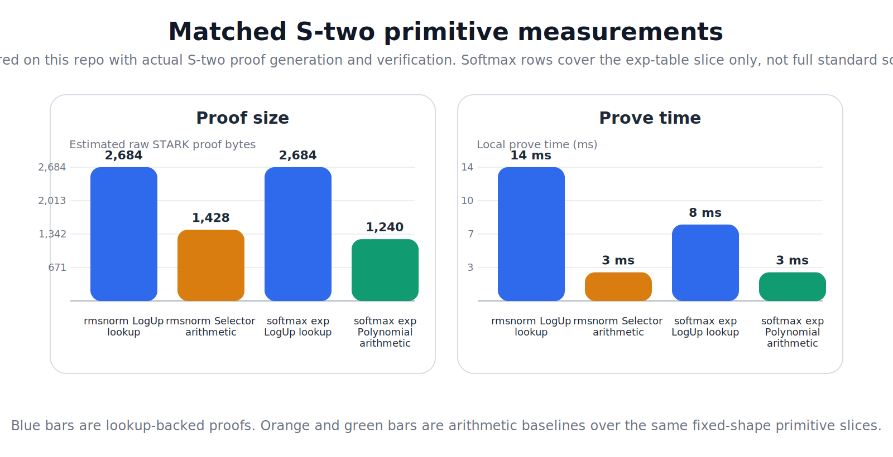
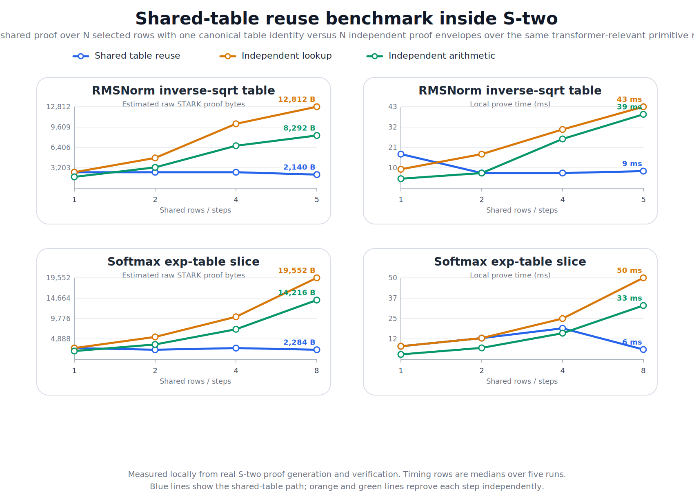
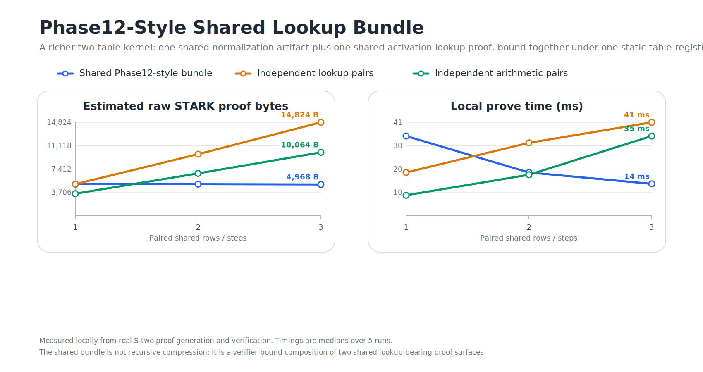
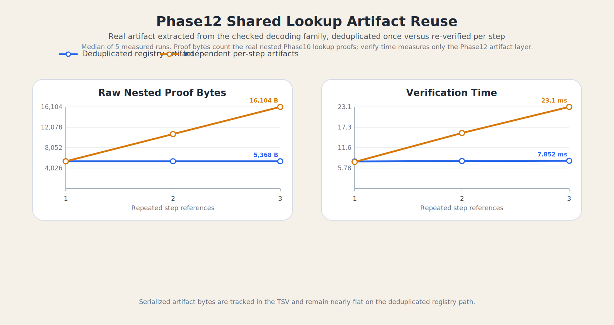
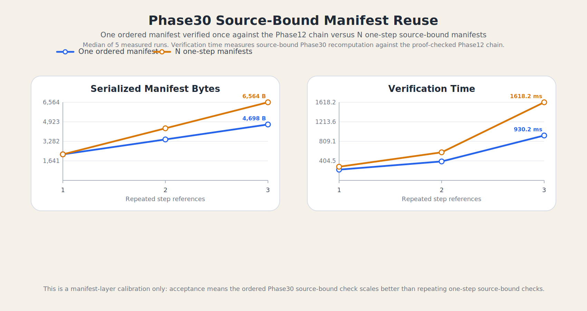
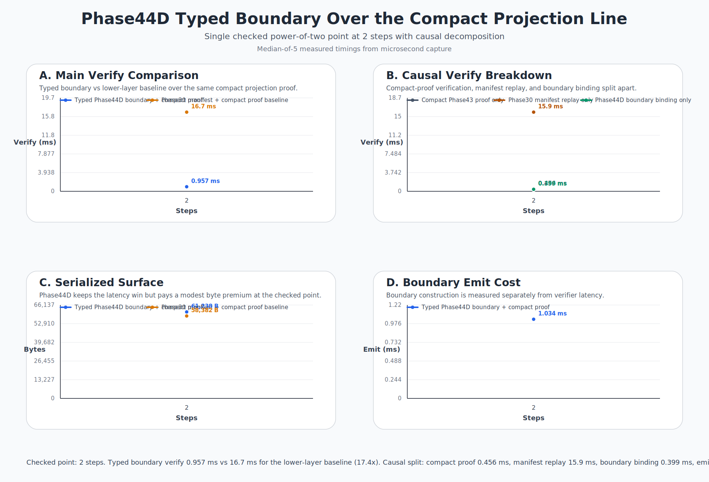
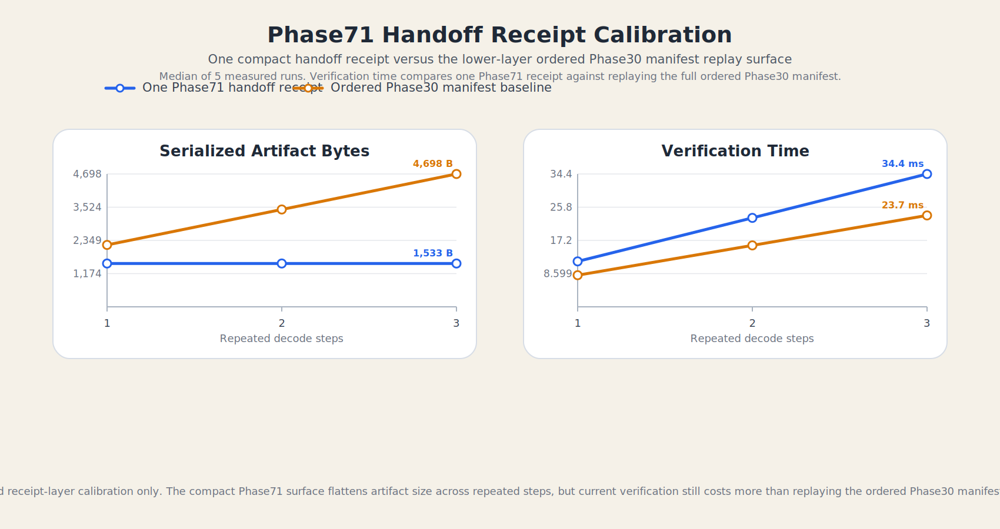

# On the Structural Fit of Transformer Workloads and STARK Proof Systems

<p><strong>Abdelhamid Bakhta</strong><br>
StarkWare</p>

<p><strong>Omar Espejel</strong><br>
Starknet Foundation</p>

*April 2026*

## Abstract

This paper studies why transformer workloads are structurally legible to trace-based
proof systems, and where that fit may matter for zkML. We give a closed-form symbolic
model that separates dense arithmetic from lookup-like non-arithmetic terms. In a
GPT-2-small worked example (`d = 768`, `T = 1024`, `H = 12`, `L = 12`), the model gives
about `157.8B` symbolic SNARK constraints versus `106.5B` symbolic STARK rows (`1.48x`)
and shows that the dense-context ratio approaches a finite architecture-dependent
ceiling. These are symbolic predictions, not wall-clock dominance claims.

We pair the model with `provable-transformer-vm`, a reproducible artifact corpus
whose paper-facing line now runs through S-two transformer-shaped bundles, verifier-bound
carried-state checkpoints, and repeated-reuse benchmark surfaces. Reference [30] pins
the Phase 63-65 carried-state checkpoint specifically; newer paper-facing bundles are
pinned separately where they are used, for example the shared-normalization primitive
[40], proof-carrying aggregation bundle [46], and transformer-shaped bundle [49].
The artifacts expose
carried-state boundaries, shared lookup-table identity, and pre-recursive
proof-carrying packaging on narrow relations. They do not prove full standard-softmax
inference, recursive cryptographic compression, recursive shared-table accumulation, or
production-scale zkML deployment. The contribution is therefore a cost-model-and-artifact
baseline for the STARK side, with explicit non-claims.

______________________________________________________________________

## 1. Introduction

Verifiable inference matters because model outputs are operational inputs. Where outputs
trigger trades or onchain actions, computational integrity is the core requirement.

The ecosystem already shows feasibility: modern systems can prove substantial inference
workloads, and public materials report progress on both SNARK-heavy and STARK-native
paths [24, 25, 26, 28, 29, 33]. Percepta's transformer-computer line provides a
complementary conceptual motivation for treating transformer-shaped execution as a
meaningful computational object [13].

The question addressed here is therefore narrower and more useful than “can transformers
be proved?” The question is: **which proof architecture compounds most cleanly as
transformer workloads scale in model size, sequence length, and deployment complexity?**

This paper makes three claims:

1. **Analytic claim.** Under a stated transformer cost model, non-arithmetic operations
   such as softmax, LayerNorm, and GELU can shift prover economics in favor of
   STARK-native systems.
2. **Systems claim.** Deterministic execution of transformer-relevant programs can be
   compiled into traces that are directly consumable as AIR witnesses, and can be
   organized as a parameterized proof-carrying decode relation with carried-state
   boundaries that survive statement-preserving chain, segment, interval, rollup,
   matrix, and pre-recursive aggregation layers.
3. **Infrastructure claim.** The S-two / Starknet stack makes this direction
   increasingly practical, while the reference repository now exposes a narrower
   S-two-only artifact line centered on carried-state and repeated-reuse surfaces.

Here a frozen tier means an immutable artifact snapshot with command logs, content
hashes, and proof artifacts. The main paper-facing narrative now runs through the
`stwo` artifact ladder, verifier-bound carried-state bundles, and repeated-reuse
benchmark evidence; Section 5.4 gives the detailed artifact boundary.

The supporting artifact is the paper's systems hinge: it is where the symbolic pressure
points of Section 4 are turned into explicit carried-state proof objects with frozen
evidence tiers and pre-recursive aggregation boundaries. The systems claim is
artifact-backed; the analytic claim remains model-based rather than a matched benchmark
on identical hardware; and the infrastructure claim is supported by current public
releases without implying full implementation closure in the repository. This is an
architecture-and-systems thesis, not a final empirical verdict.

The contributions are threefold: an exact symbolic model separating arithmetic from
non-arithmetic work; a repository-backed artifact that materializes proof-carrying
decoding with explicit carried-state boundaries and pre-recursive aggregation objects;
and an infrastructure reading of S-two/Starknet that is current enough to matter without
overstating implementation maturity.

The paper is organized accordingly. Section 4 develops the symbolic cost model and its
worked examples. Section 5 then anchors the systems claim in a repository artifact that
exposes two evidence tiers together with a broader proof-carrying decoding path and
pre-recursive carried-state packaging ladder. Sections 6-8 place those results in the
current S-two/Starknet landscape and identify the next cryptographic milestones beyond
the present artifact boundary.

______________________________________________________________________

## 2. Background

### 2.1 STARKs, AIR, and Circle STARKs

STARKs arithmetize computation as execution traces with low-degree transition
constraints and FRI-style proximity testing [1, 2, 3, 4].

Circle STARKs specialize this direction to Mersenne-31 (`2^31 - 1`). StarkWare positions
S-two for recursion and Starknet integration [17, 18, 20], with a March 31, 2026 update
reporting verification-path reduction from roughly one minute to roughly three seconds
[19]. These are engineering/product claims, not archival benchmark results.

### 2.2 SNARKs, GKR, and modern zkML

Modern zkML systems combine multiple techniques: GKR/sumcheck for large linear algebra,
and lookups/custom circuits for non-polynomial functions [5, 6, 7, 10, 11]. The
practical comparison is therefore whole-system architecture, not “R1CS vs AIR” in
isolation.

The model below does **not** claim all SNARK stacks pay one naive non-arithmetic cost;
it uses representative constants to isolate sensitivity to non-arithmetic handling.

### 2.3 LogUp and lookup-heavy workloads

Lookup arguments are central because transformer bottlenecks include non-polynomial
components (softmax, LayerNorm, GELU), not only matrix multiplies [8, 10, 38, 39].

______________________________________________________________________

## 3. Transformer Operation Count

We consider a standard transformer block with model dimension `d`, sequence length `T`,
number of heads `H`, head dimension `d_k = d / H`, and feedforward expansion `4d` [12].

### 3.1 Arithmetic operations

Arithmetic work per layer is:

- QKV projection: `3Td^2`
- Attention scores: `T^2 d`
- Value aggregation: `T^2 d`
- Output projection: `Td^2`
- Feedforward network: `8Td^2`
- LayerNorm linear scaling: `2Td`

Summing the dominant arithmetic components gives:

```text
12Td^2 + 2T^2d + 2Td
```

### 3.2 Non-arithmetic operations

Non-arithmetic work per layer is:

- Softmax: `T^2 H`
- LayerNorm nonlinear component: `2Td`
- GELU: `4Td`

Summing these terms gives:

```text
T^2H + 6Td
```

The `8Td^2` feedforward term is the GPT-2-style dense-MLP case (`4d` expansion); Section
4.6 switches to the Gemma/GeGLU-style form `3Tdm`.

______________________________________________________________________

## 4. A Transformer-Specific Cost Model

This section is a **model-based** comparison of symbolic proving work, not a controlled
benchmark of complete production systems. SNARK constraints and STARK rows are treated
as symbolic proxies, not equal runtime units.

### 4.1 SNARK-side symbolic cost

Using stylized worked-example constants for non-arithmetic operations,

- `C_exp = 300`
- `C_norm = 30`
- `C_nonlin = 150`

we model the per-layer SNARK-side cost as:

```text
C_SNARK = 12Td^2 + 2T^2d + 2Td + T^2H * C_exp + 2Td * C_norm + 4Td * C_nonlin
```

This keeps the arithmetic term shared with the STARK side and makes explicit where the
non-arithmetic amplification enters.

The constants `C_exp`, `C_norm`, and `C_nonlin` are **stylized worked-example
constants**, not normalized measurements from one prover/hardware stack. Their role is
to expose sensitivity; Appendix B sweeps `C_exp` across `50, 100, 300, 500`.

The model isolates softmax-related non-arithmetic cost; backend-specific lowerings are
not modeled separately.

Because softmax dominates the non-arithmetic budget in this model, `C_exp` is the
highest-leverage constant. On the GPT-2-small instantiation, moving `C_exp` from `50` to
`500` changes the overall ratio from about `1.13x` to `1.77x`, while comparable sweeps
over `C_norm` and `C_nonlin` move it only modestly. Full sensitivities are in Appendix
B; this is a model stress test, not a deployed benchmark.

### 4.2 STARK-side symbolic cost

For the STARK side, we keep the exact expression:

```text
L_STARK = 12Td^2 + 2T^2d + T^2H + 8Td
```

A naive approximation such as `12Td^2 + 3T^2d` is not justified for GPT-2 small because
`H << d` (`H = 12`, `d = 768`), which would materially inflate the STARK side.

This lookup treatment is also optimistic: real lookup-backed implementations pay
overhead in auxiliary columns, interaction phases, and commitments. The
one-row-per-symbolic-lookup abstraction is a modeling choice; higher lookup overhead
would narrow the symbolic gap.

**Proposition 1.** Under the symbolic model of Sections 4.1 and 4.2, with `T, d, H > 0`
and `C_exp, C_norm, C_nonlin >= 1`,

```text
C_SNARK - L_STARK = T^2H(C_exp - 1) + 2Td(C_norm - 1) + 4Td(C_nonlin - 1) >= 0.
```

Equality holds only when `C_exp = C_norm = C_nonlin = 1`. For fixed `d`, `H`, and
constants with at least one strict inequality, the gap grows monotonically in `T`.

Rearranging the same expression gives the exact break-even surface:

```text
T^2H(C_exp - 1) + 2Td(C_norm - 1) + 4Td(C_nonlin - 1) = 0.
```

For fixed `C_norm` and `C_nonlin`, this yields

```text
C_exp^* = 1 - (2d / TH)[(C_norm - 1) + 2(C_nonlin - 1)].
```

If `C_norm = C_nonlin = 1`, the break-even reduces to `C_exp = 1`. On the GPT-2-small
instantiation with `C_norm = 30` and `C_nonlin = 150`, the threshold is
`C_exp^* = -39.875`, so no positive `C_exp` removes the modeled symbolic gap.

For the dense GPT-style case, the ratio also has a finite large-context asymptote.
Writing

```text
R(T) = C_SNARK / L_STARK,
```

and keeping `d`, `H`, and the non-arithmetic constants fixed gives

```text
lim_{T -> ∞} R(T) = (2d + H C_exp) / (2d + H) = (2d_h + C_exp) / (2d_h + 1).
```

For GPT-2-small, `d_h = 64`, so under `C_exp = 300` the dense asymptote is approximately
`3.32x`. The ratio rises over practical ranges and then saturates at a finite ceiling.

### 4.3 Concrete analysis: GPT-2 small

Instantiating the model with GPT-2 small parameters (`d = 768`, `T = 1024`, `H = 12`,
`L = 12`) gives the following.

#### Table 2. GPT-2 small symbolic work under the stated cost model

| Component         | SNARK (constraints) | STARK (trace rows) | Ratio |
| ----------------- | ------------------: | -----------------: | ----: |
| Arithmetic        |       8,859,942,912 |      8,859,942,912 | 1.00x |
| Softmax           |       3,774,873,600 |         12,582,912 |  300x |
| LayerNorm         |          47,185,920 |          1,572,864 |   30x |
| GELU              |         471,859,200 |          3,145,728 |  150x |
| Total per layer   |      13,153,861,632 |      8,877,244,416 | 1.48x |
| Total (12 layers) |     157,846,339,584 |    106,526,932,992 | 1.48x |

Under this cost model, the non-arithmetic overhead adds about `4.29B` SNARK constraints
versus about `17.3M` STARK rows per layer at `T = 1024`. Softmax alone contributes about
`87.9%` of the SNARK non-arithmetic overhead. Scaling the same model to `T = 4096`
yields an overall ratio of about `2.13x`, so the qualitative claim that the gap widens
with context length remains intact.

### 4.4 Interpretation

This analysis does **not** prove that every STARK system is faster than every SNARK
system. It supports a narrower claim: once both sides handle large linear algebra
efficiently, differences are increasingly driven by lookup handling, recursion, field
arithmetic, and commitments.

The model also abstracts each activation/normalized value as one algebraic object; it
does not model quantization layouts, packing strategies, or backend-specific
decompositions.

Appendix B2 shows the same model on a wider Llama-2-7B-style dense reference [37]. Under
the exact formula, a wider production-style dense model can remain near parity at
shorter contexts under lower softmax constants while still widening materially at longer
windows.

Recent implementation-level comparisons reinforce that boundary. A December 2025
Groth16-vs-STARK comparison on consumer ARM hardware reports faster proving and smaller
proofs for the Groth16 side, alongside faster verification and transparency/post-quantum
advantages for the STARK side [34].

Threats to validity concentrate in four places: quantization/packing strategy,
lookup-table reuse and non-arithmetic lowering, recursion/compression strategy, and
hardware parallelism.

These caveats do not remove the structural result; they bound its interpretation. In
this paper, symbolic counts are used to locate architectural pressure points, not to
predict wall-clock performance for any one deployed prover stack.

The repository now also contains a first matched within-S-two primitive benchmark at
`docs/paper/evidence/stwo-primitive-lookup-vs-naive-2026-04.tsv`. It measures four real
proof paths over the current codebase: RMSNorm `lookup_logup` versus
`naive_selector_arithmetic`, and `softmax_exp_q8` `lookup_logup` versus
`polynomial_interpolation`. The point of this measurement is calibration, not a
dominance claim. The quoted timings are representative values from one checked local run,
and the checked-in TSV is the canonical source for this branch; that TSV was generated on
2026-04-23 on an arm64 macOS 26.4.1 development host, and those millisecond values will
drift with host hardware and implementation changes even when the semantic relation stays
the same. On these tiny fixed-shape slices, the lookup-backed paths are currently somewhat
larger and somewhat slower than the naive arithmetic alternatives for both measured
primitive pairs, as recorded in the canonical TSV and Figure 3. Here, "proof bytes" means
the estimated raw STARK proof size, not the enclosing JSON wrapper. That does not
overturn the symbolic model; it identifies where a small matched empirical anchor and a
long-context symbolic stress model are describing different regimes.

The complementary benchmark now checked at
`docs/paper/evidence/stwo-shared-table-reuse-2026-04.tsv` measures the regime the
paper actually attributes to lookup-friendly STARKs: repeated reuse of one canonical
table identity across several steps. The checked TSV is the canonical source for this
branch and records the median of five repeated local runs; the millisecond values remain
host-dependent representative timings rather than portable wall-clock guarantees. Here
the qualitative picture changes. For RMSNorm
at five shared rows, the shared-table path records `2,140` raw proof bytes and `11 ms`
of proving, versus `12,812` bytes and `59 ms` for five independent lookup envelopes and
`8,292` bytes and `48 ms` for five independent selector-arithmetic proofs. For the
softmax exp-table slice at eight shared rows, the shared-table path records `2,284`
bytes and `7 ms`, versus `19,552` bytes and `57 ms` for independent lookup proofs and
`14,216` bytes and `40 ms` for independent selector-arithmetic proofs. The same pattern
now appears on the next slice widened under this exact standard: for the binary-step
activation table at three shared rows, the shared-table path records `2,684` bytes and
`5 ms`, versus `7,380` bytes and `18 ms` for independent lookup proofs and `5,172`
bytes and `18 ms` for independent selector-arithmetic proofs. This is still not a full
attention-kernel or recursive-compression result, but it is the reuse-aware regime the
symbolic model was trying to isolate: once one canonical table identity is made
verifier-visible across repeated steps, proof growth can flatten sharply instead of
scaling with the number of independent envelopes.

Read together, Figures 3, 4, 4B, 4E, and 4F give the external-calibration boundary the
paper should actually claim. Figure 3 is the honest one-shot anchor: on tiny isolated
primitive proofs, the current lookup-backed paths are still somewhat larger and slower
than the arithmetic baselines. Figure 4 is the reuse-sensitive single-table anchor:
once the verifier-visible statement carries one canonical table identity across repeated
rows, the shared-table path can flatten sharply while the independent baselines
continue to scale with `N`. Figure 4B shows that the same reuse-sensitive behavior
survives in a verifier-bound two-table bundle. Figures 4E and 4F then sharpen the
higher-layer story: the typed Phase44D boundary helps local verification latency, while
the Phase71 handoff receipt helps serialized handoff compactness. External comparisons
should therefore track regime, not backend branding: `Phase12` is a proving-surface
calibration, `Phase44D` is a latency calibration, and `Phase71` is a compact-object
calibration. The one-shot rows calibrate current implementation constants; the
repeated-step rows calibrate the architectural claim about carried lookup identity and
higher-layer packaging tradeoffs.

### 4.5 Inference layer versus settlement layer

The right 2026 architecture is not necessarily "prove every transformer operation as
one flat AIR." Modern zkML systems increasingly separate the inference proof layer from
the settlement layer. GKR/sumcheck-style protocols are attractive for layered tensor
computation because they can verify large structured arithmetic relations without
committing to every intermediate state in the same way a flat trace-oriented view would
suggest [7, 50]. STARKs then remain valuable as the transparent, recursion-friendly, and
onchain-verifiable settlement layer: a verifier can check that the inference proof or
its verifier execution was accepted, while the public statement stays small and
field-native for Starknet/S-two deployment [19, 20, 51].

This distinction sharpens rather than weakens the paper's claim. The symbolic model
above should be read as a pressure model for the non-arithmetic and settlement-facing
parts of transformer proving, not as a mandate that every production implementation
must be a pure all-STARK tensor prover. The production-relevant question is a layered
one:

```text
inference proof layer:      tensor arithmetic, GKR/sumcheck, lookup-heavy kernels
settlement proof layer:     transparent STARK, recursion/compression, public verifier
```

Under that reading, a STARK-native direction is compelling when it makes the settlement
layer simple, transparent, recursive, and cheap to verify while preserving the
lookup-heavy tensor semantics produced by the inference layer. BitSage's public
recursive-STARK design states the same pattern directly: the GKR verifier becomes the
STARK witness, and the onchain verifier checks the resulting STARK rather than
replaying the full GKR proof [51]. This repository does not implement that recursive
closure; it provides the smaller cost-model and artifact baseline needed to state that
future comparison honestly.

Figure 1 makes the symbolic-work decomposition behind that sensitivity visible for both
the GPT-2-small worked example and a wider dense reference.


**Figure 1.** Symbolic-work decomposition versus context. Each configuration is shown as
paired SNARK and STARK stacked bars using the exact dense formulas from Sections 4.1 and
4.2. The GPT-2-small bars make the softmax-driven sensitivity of the model visually
obvious, while the Llama-2-7B-style bars show the narrower short-context regime and the
later widening discussed in Appendix B2.

### 4.6 Analytic extension to released Gemma 3 architectures

GPT-2-small keeps the algebra transparent, but newer deployments motivate a sparse
long-context extension. Public materials report Gemma-3-class requirements including
GQA, alternating local/global attention, RMSNorm, and GeGLU [14, 15, 16, 25].

This subsection asks whether the same symbolic logic still shows divergence under
released sparse long-context patterns.

For Gemma-style layers, let `n_q` be query heads, `n_kv` key/value heads, `d_h` head
dimension, `q = n_q d_h`, `k = n_kv d_h`, `m` MLP intermediate size, `L_g`
global-attention layers, `L_l` local-attention layers, and `W_eff(T) = min(T, W)`. Using
the same constants, the model becomes:

```text
A_Gemma(T) = L[Td(q + 2k) + Tdq + 3Tdm] + 2q[L_g T^2 + L_l T W_eff(T)]
S_Gemma(T) = n_q[L_g T^2 + L_l T W_eff(T)]
C_SNARK^Gemma(T) = A_Gemma(T) + S_Gemma(T) * C_exp + 2LTd * C_norm + LTm * C_nonlin
L_STARK^Gemma(T) = A_Gemma(T) + S_Gemma(T) + 2LTd + LTm
```

Gemma-style sparsity is a harder test for this thesis than GPT-2-small because
local/global attention suppresses long-context cost. It tempers the gap but does not
erase the direction: as context grows, non-arithmetic share remains structurally
important.

With fixed local window `W` and nonzero global-layer fraction, the long-context ratio
remains finite. In the representative `5:1` schedule used in Figure 2, the ratio still
rises toward a finite ceiling.

**Corollary.** For a fixed positive global-attention fraction and fixed local window
`W`, the representative sparse long-context ratio has the same large-context ceiling as
the dense case:

```text
lim_{T -> ∞} R_sparse(T) = (2d_h + C_exp) / (2d_h + 1).
```

The local `T W_eff(T)` terms are lower order than global `T^2` terms at large `T`, so
sparsity delays the approach to the ceiling rather than lowering it.

Figure 2 visualizes that distinction. The dense curve uses the GPT-2-small model from
Sections 4.1-4.3, and the sparse curve is a representative Gemma-style `5:1`
local/global schedule with `W = 1024` under the same constants.


**Figure 2.** `SNARK/STARK` symbolic ratio versus context length. The sparse curve is
representative, not tied to one exact checkpoint. The dashed line is the dense
asymptotic ceiling from Section 4.2. Reproducibility metadata and exact point generation
details are recorded in the supplementary scaling appendix and committed figure
script/TSV.

The symbolic analysis above identifies the architectural pressure points. The artifact
below shows which parts of that structure already survive a real proof workflow as
reproducible carried-state proof objects, and which parts still remain pre-recursive
engineering boundaries rather than cryptographic compression layers.

Figure 3 visualizes that measured anchor directly from the checked TSV.



**Figure 3.** Matched S-two primitive measurements from
`docs/paper/evidence/stwo-primitive-lookup-vs-naive-2026-04.tsv`. All four rows are
real proof-generation and verification runs on this repository, not symbolic estimates.
The RMSNorm pair compares the existing shared-normalization LogUp proof against a one-hot
selector-arithmetic proof over the same fixed table rows. The softmax pair is narrower:
it measures the exp-table slice of softmax rather than full standard-softmax inference.
These results are intentionally used as a calibration anchor for the paper’s symbolic
model, not as a claim that the current implementation already demonstrates lookup-backed
wall-clock dominance.

Figure 4 visualizes the complementary reuse-sensitive benchmark directly from the
checked TSV.



**Figure 4.** Shared-table reuse benchmark from
`docs/paper/evidence/stwo-shared-table-reuse-2026-04.tsv`. The blue rows are single
shared proof objects that bind multiple selected rows to one canonical table identity,
while the orange and green baselines reprove the same steps independently. The point is
not that every one-shot lookup is already cheaper than every arithmetic alternative. The
point is that the lookup path begins to flatten once reuse is made verifier-visible.
Figure 4 now widens that comparison across three table families: RMSNorm inverse-sqrt,
the softmax exp-table slice, and the binary-step activation table already used by the
decode-side shared activation proofs. The timing rows in this figure are medians over
five repeated local runs.

______________________________________________________________________

## 5. Repository Artifact: Evidence Boundary

The supporting implementation is `omarespejel/provable-transformer-vm`; reference [30]
pins the Phase 63-65 carried-state bridge checkpoint, while later benchmark and bundle
rows are cited by their own artifact indices. In this paper it is treated as a
**semantics-and-proof artifact**: deterministic
transformer-relevant execution is compiled into AIR-consumable traces and then organized
into proof-carrying decoding artifacts with explicit carried-state boundaries. Here,
"proof-carrying" means that each artifact carries enough public boundary data and proof
references for a verifier to replay continuity checks across the declared relation; it
is **not** a claim of recursive proof-carrying data or compressed recursive
verification. Likewise, terms such as `chain`, `segment`, `rollup`, `interval bundle`,
and `pre-recursive aggregation boundary` are used in an **artifact-layer sense**. Unless
explicitly stated otherwise, they do **not** denote recursive cryptographic accumulation
schemes, compressed proof systems, or CCS-/IVC-style folding protocols in the sense of
systems such as HyperNova, NeutronNova, or ProtoStar [43-45]. The point of this section
is narrower: to show that a stable proof-carrying decode relation with carried KV and
lookup state can already be materialized as reproducible proof artifacts over the
current repository surfaces.

### 5.1 Positive evidence

The artifact provides:

- a deterministic transformer-shaped VM with a statement-versioned proof claim,
- frozen `stwo` evidence tiers spanning transformer-shaped bundles, shared-table
  primitive bundles, and proof-carrying verifier surfaces,
- a parameterized proof-carrying decode relation,
- statement-preserving pre-recursive packaging objects over that same decode relation,
- a bounded multi-runtime semantic-agreement artifact together with hardened verifier
  kernels.

The central systems property is stable statement structure: the same decode relation
survives progressively richer manifest and packaging layers without changing the
underlying public boundary semantics. In concrete terms, the repository already exposes
reusable block-shaped execution proofs and, on its experimental `stwo` tooling surface,
step-level proof artifacts whose public boundary schema and statement semantics remain
stable across those richer artifact layers.

That experimental `stwo` surface now also has one measured primitive-benchmark artifact
family rather than only narrative intent. The benchmark files
`docs/paper/evidence/stwo-primitive-lookup-vs-naive-2026-04.tsv`,
`docs/paper/evidence/stwo-primitive-lookup-vs-naive-2026-04.json`, and Figure 3 are
generated from the checked CLI path `bench-stwo-primitive-lookup-vs-naive`. This matters
because it gives the paper one reproducible bridge between the symbolic model in Section
4 and a concrete local measurement surface inside S-two itself. It is still narrow: the
measured softmax row is an exp-table slice, not a full attention kernel, and the
benchmark does not compare against external SNARK systems. But it is no longer a
hypothetical next step.

The next checked CLI path, `bench-stwo-shared-table-reuse --capture-timings`, measures the production-
relevant reuse axis directly. Its evidence files
`docs/paper/evidence/stwo-shared-table-reuse-2026-04.tsv`,
`docs/paper/evidence/stwo-shared-table-reuse-2026-04.json`, and Figure 4 compare one
shared proof over `N` selected rows against `N` independent lookup or arithmetic proofs
over the same canonical RMSNorm, softmax-exp, and binary-step activation tables. Unlike
the one-shot calibration rows in Figure 3, these rows already show the reuse-sensitive
behavior the paper claims matters: proof bytes and prove time on the shared-table path
stay nearly flat while the independent baselines scale roughly linearly with `N`.

That timing capture is opt-in on purpose. The default shared-table benchmark report keeps
`prove_ms` and `verify_ms` at `0`, so the deterministic report surface and the
host-dependent measurement surface remain distinct.

The next checked CLI path, `bench-stwo-phase12-shared-lookup-bundle-reuse --capture-timings`,
lifts the same measurement one level up to a richer two-table kernel. Its evidence files
`docs/paper/evidence/stwo-phase12-shared-lookup-bundle-reuse-2026-04.tsv`,
`docs/paper/evidence/stwo-phase12-shared-lookup-bundle-reuse-2026-04.json`, and Figure 4B
track a Phase12-style shared bundle that combines one shared normalization artifact and
one shared activation lookup proof under the same static lookup-table registry
commitment. This is still not recursive accumulation or a full decode-step proof object.
It is narrower and cleaner: both nested proofs still verify, and the verifier still
checks the shared registry commitment rather than merely reusing JSON bytes. The first
paired row is pure overhead, but the reuse-sensitive crossover is already visible by the
second and third rows. At three paired rows the shared bundle remains at `4,968` raw
proof bytes and `13 ms`, versus `14,824` and `39 ms` for independent lookup pairs and
`10,064` and `33 ms` for independent arithmetic pairs. So the current evidence now says
something more precise than “shared tables help”: the win survives when the proof surface
moves from one table to a verifier-bound two-table bundle closer to the Phase12
shared-lookup artifact family.



**Figure 4B.** Phase12-style shared lookup bundle benchmark from
`docs/paper/evidence/stwo-phase12-shared-lookup-bundle-reuse-2026-04.tsv`. The blue line
is one verifier-bound bundle combining a shared normalization artifact, a shared
activation lookup proof, and one static table registry commitment. The orange and green
lines reprove the same normalization-plus-activation pairs independently. The useful
regime only starts after the first pair: once the shared bundle carries more than one
paired row, raw proof bytes flatten sharply, and by three paired rows local prove time
beats both independent baselines.

The next checked calibration row narrows the scope again, this time onto the exact
checked-in `Phase12SharedLookupArtifact` type instead of the benchmark-only bundle. Its
evidence files `docs/paper/evidence/stwo-phase12-shared-lookup-artifact-reuse-2026-04.tsv`,
`docs/paper/evidence/stwo-phase12-shared-lookup-artifact-reuse-2026-04.json`, and Figure
4C extract the real artifact from a proof-checked parameterized decoding chain, then
compare one deduplicated registry artifact against independent per-step artifact
verification. This benchmark is intentionally narrower than Figure 4B: it does not claim
an execution-proof proving win, and it does not compare against arithmetic baselines. It
measures only the artifact layer the live Phase12 chain already reuses. At one repeated
reference the registry path is basically a wash, with slightly higher serialized bytes due
to the registry wrapper. By two and three repeated references the shape is the one the
chain actually wants: the deduplicated path stays at `5,368` raw nested proof bytes and
roughly `7.8 ms` verification, while independent per-step artifact verification rises to
`10,736` / `16,104` raw bytes and `15.725 ms` / `23.120 ms`. Serialized artifact bytes
show the same near-flat versus linear split (`59,344` versus `176,981` by three repeated
references).



**Figure 4C.** Real Phase12 shared lookup artifact reuse benchmark from
`docs/paper/evidence/stwo-phase12-shared-lookup-artifact-reuse-2026-04.tsv`. The blue line
deduplicates one checked `Phase12SharedLookupArtifact` across repeated decoding-step
references. The orange line extracts and verifies the same artifact independently from
each step proof payload. This is an artifact-layer verification calibration only, but it
confirms the same reuse-sensitive direction on the exact artifact type the parameterized
Phase12 chain already carries.

The next checked calibration row moves one level higher again, from the
Phase12 artifact surface to the actual ordered Phase30 decode-envelope surface. Its
evidence files `docs/paper/evidence/stwo-phase30-source-bound-manifest-reuse-2026-04.tsv`,
`docs/paper/evidence/stwo-phase30-source-bound-manifest-reuse-2026-04.json`, and Figure
4D compare one ordered `Phase30DecodingStepProofEnvelopeManifest` against `N`
independent one-step manifests over the same proof-checked Phase12 chain. This is still
not recursion and not proof compression. It is a **source-bound manifest-layer
calibration**: the verifier re-derives Phase30 from the Phase12 chain and checks the
ordered manifest against that source. At one step the byte surface coincides and the
median verification timings stay in the same local range (`12.375 ms` ordered versus
`12.710 ms` independent). By two and three steps the ordered manifest is clearly
smaller and faster than repeating the one-step source-bound check: at three steps the
shared manifest is `4,698` serialized bytes and `36.763 ms` median verification, versus
`6,564` bytes and `86.495 ms` across three independent one-step manifests. The result is
narrow but useful. It says the reuse-sensitive advantage now survives not only at the
table and artifact layers, but also at the first ordered decode-manifest layer that
preserves source-chain commitment, layout commitment, and boundary continuity together.



**Figure 4D.** Phase30 source-bound manifest reuse benchmark from
`docs/paper/evidence/stwo-phase30-source-bound-manifest-reuse-2026-04.tsv`. The blue line
verifies one ordered Phase30 manifest against the proof-checked Phase12 chain. The
orange line verifies the same step ranges as separate one-step manifests against that
same chain. This is a manifest-layer calibration only, but it shows that once the
ordered decode-envelope surface is used as intended, repeated source-bound verification
is cheaper than recomputing a one-step manifest for every step independently.

The next checked calibration row moves above the ordered Phase30 manifest surface and
onto the first typed source-emission boundary that the compact projection line can
currently support. Its evidence files
`docs/paper/evidence/stwo-phase44d-source-emission-2026-04.tsv`,
`docs/paper/evidence/stwo-phase44d-source-emission-2026-04.json`, and Figure 4E compare
one `Phase44DHistoryReplayProjectionSourceChainPublicOutputBoundary` against the lower
source-bound baseline of verifying the same compact Phase43 projection proof and then
replaying the ordered Phase30 manifest. This is still not a fake curve. The benchmark now
includes a causal decomposition row and separate boundary-emission timing, but the current
execution-proof surface honestly gives us only one checked power-of-two point at two steps:
at four steps and above, the proof-checked source chain aborts with `overflowing arithmetic
is not supported by the current execution-proof surface`. That means Figure 4E remains a
single-point calibration rather than a scaling line. The point is still useful because the
cause is now explicit. The typed boundary is slightly larger (`61,238` serialized bytes
versus `58,382` for the lower-layer baseline), but median verification latency collapses
from `16.688 ms` to `0.957 ms`, while boundary emission itself costs `1.034 ms`. The
causal subrows show where the baseline spends time: the compact Phase43 proof alone is
`0.456 ms`, the ordered Phase30 manifest replay alone is `15.856 ms`, and typed boundary
binding after prior compact-proof verification is only `0.399 ms`. So the Phase44D
source-emission layer is not a byte win. It is a local **verification-latency win** at
the checked point, because it removes manifest replay from the verifier-facing surface
while preserving the same compact source-root claim.



**Figure 4E.** Phase44D typed source-emission boundary calibration from
`docs/paper/evidence/stwo-phase44d-source-emission-2026-04.tsv`. The blue bar is one
typed `Phase44DHistoryReplayProjectionSourceChainPublicOutputBoundary` accepted against
the real compact Phase43 projection proof. The orange bar is the lower-layer baseline
that verifies that same compact proof and then replays the ordered Phase30 manifest
against the proof-checked Phase12 chain. The gray, amber, and green causal rows isolate
compact-proof verification, manifest replay, and typed-boundary binding respectively.
The current checked point is still only two steps, and the figure now makes the
restriction explicit: this benchmark does not currently scale past two steps because the
underlying execution-proof surface overflows at four.

The next checked calibration row moves one layer higher again, from the typed
source-emission boundary to the actual Phase71 handoff receipt surface. Its evidence
files `docs/paper/evidence/stwo-phase71-handoff-receipt-2026-04.tsv`,
`docs/paper/evidence/stwo-phase71-handoff-receipt-2026-04.json`, and Figure 4F compare
one `Phase71ActualStwoStepEnvelopeHandoffReceipt` against replaying the full ordered
Phase30 manifest over the same proof-checked Phase12 chain. This benchmark gives the
mirror image of Figure 4E. The handoff receipt wins clearly on serialized surface and
keeps that surface flat across repeated steps (`1,533` bytes at one, two, and three
steps, versus `2,188`, `3,443`, and `4,698` for the manifest baseline). But the receipt
does **not** win on verification time: by three steps it verifies in `34.613 ms` versus
`23.795 ms` for the direct Phase30 replay baseline. So the Phase71 layer is not a local
latency win. It is a **receipt-size win** that preserves a smaller source-bound handoff
surface while still paying more verification work than the lower layer on the current
path.



**Figure 4F.** Phase71 handoff receipt calibration from
`docs/paper/evidence/stwo-phase71-handoff-receipt-2026-04.tsv`. The blue line verifies
one compact Phase71 handoff receipt against the proof-checked Phase12 chain and the
ordered Phase30 manifest it summarizes. The orange line verifies the full ordered Phase30
manifest directly as the lower-layer baseline. The receipt surface is much smaller and
stays flat across repeated steps, but current verification still costs more than replaying
the ordered manifest directly. Taken together, Figures 4E and 4F make the higher-layer
story more precise: different carried-state packaging layers improve different costs.

#### Threat model and soundness boundary

The paper's adversary is a probabilistic polynomial-time prover or artifact producer who
can choose arbitrary serialized inputs, reorder claimed rows, swap table identities,
splice stale nested artifacts, and relabel backend or version metadata. For the direct
S-two proof rows in Figures 3, 4, and 4B, acceptance means the upstream S-two proof object
verifies under the implemented relation and the repository-local verifier checks the
canonical-table and claimed-row binding required by that surface. Figure 4C is narrower:
acceptance there means the real `Phase12SharedLookupArtifact` verifies under the
repository-local artifact verifier and the repeated-step registry view does not
re-interpret the artifact beyond deduplicating repeated references. The benchmark report's
declared semantic scope and benchmark version are checked at the report layer, not by the
direct proof verifiers themselves. For the Phase 92 shared-normalization artifact, the
proof surface additionally checks the static lookup registry commitment and the ordered
claimed-row list; for Figure 4B's Phase12-style shared bundle, the second nested proof
surface is the binary-step activation lookup envelope paired with that Phase 92 artifact,
and the verifier checks the canonical activation rows, the shared static-table registry
commitment, and the ordered step-claim list for the combined bundle. Figure 4D is again
narrower: acceptance there means the ordered Phase30 manifest re-derives exactly from the
supplied proof-checked Phase12 chain, including source-chain commitment, layout
commitment, and boundary continuity, and that the one-step comparison path repeats that
same source-bound derivation for each range independently. Figure 4E is narrower again:
acceptance there means the typed Phase44D source-chain public-output boundary is accepted
against the same compact Phase43 projection proof it embeds, including the source-root,
terminal-boundary, and public-output checks performed by the repository-local verifier,
without replaying the ordered Phase30 manifest inside that benchmark surface. Figure 4F
is the receipt-layer analogue: acceptance means the
`Phase71ActualStwoStepEnvelopeHandoffReceipt` verifies against the supplied proof-checked
Phase12 chain and the ordered Phase30 manifest it summarizes, preserving the source-bound
handoff relation without claiming recursive compression or standalone receipt soundness
independent of those sources. This is a concrete soundness boundary, not a new asymptotic
theorem: the paper relies on upstream S-two cryptographic assumptions for proof soundness
and on deterministic repository-local checks for metadata, table identity, source-bound
artifact structure, typed public-output binding, and receipt/source consistency. It does
not claim recursive compression, full standard-softmax inference soundness, or a
universal security theorem for every row in the experimental S-two tier.

#### Tablero statement-preservation theorem

The current paper can make one stronger formal claim about the typed-boundary
pattern without overclaiming a new proof-system theorem.

Let `R` be the underlying compact-proof relation, `V_R(c, π)` the upstream S-two
verifier for compact claim `c` and proof `π`, `σ` the heavier replay surface
that the baseline verifier would inspect directly, `U(σ, c)` the replay-derived
public surface reconstructed from `σ`, and `β = Emit(σ, c)` a typed boundary
artifact emitted from that same source surface. Let `Bind(β, c)` be the
repository-local binding predicate that checks the fields of `β` which replace
replay work: source-root binding, typed public-output binding, ordered
public-input binding where applicable, replay-flag checks, and nested
commitment consistency. The Tablero verifier shape is then

```text
TableroVerify(β, c, π) := Validate(β) and V_R(c, π) and Bind(β, c).
```

**Theorem 3 (Tablero statement preservation).** Assume: (1) upstream S-two
soundness for `V_R`, (2) binding of the local Blake2b-based commitment surfaces,
and (3) that the source side emits the proof-native fields that `Bind(β, c)`
checks. Then accepting `(β, c, π)` through `TableroVerify` does not widen the
accepted statement set relative to the replay verifier that checks `V_R(c, π)`
and reconstructs the same public surface from `σ` directly, except with the sum
of the upstream proof-system soundness error and the local commitment-collision
probability.

**Proof sketch.** If `V_R(c, π)` accepts, then by upstream S-two soundness the
compact claim `c` is valid except with negligible probability. `Validate(β)`
ensures the typed object itself is canonical for its layer: version, semantic
scope, replay-elimination flags, and self-commitment are all checked. `Bind(β,
c)` then checks that the fields of `β` that replace replay are the same fields
the replay baseline would have derived from `σ` for the same compact claim `c`.
Under the local commitment-binding assumption, the adversary cannot splice a
different nested object under the same commitments except with negligible
probability. So replacing replay with `β` changes verifier cost, but not the
accepted compact statement. This is a statement-preservation theorem, not a new
recursive-compression or proof-system soundness theorem.

That final precondition matters. The theorem does not automatically make every
candidate boundary real. The earlier Phase43 prototype was a bounded no-go
because the source side it exercised did not yet emit the proof-native
commitments and public inputs needed to make `Bind(β, c)` complete without
full-trace replay. The current emitted Phase43 source boundary clears that
precondition, so the theorem now explains both outcomes in the repository: why
the earlier prototype was only partial, and why the emitted Phase43 boundary is
now a real second typed-boundary result.

For shared lookup evidence, the artifact binds normalization and activation table
identity into a static lookup-table registry commitment inside the shared lookup
artifact; this is table-identity and provenance binding, not recursive cross-step
shared-table accumulation.

On the current proof-carrying state line, this boundary is made more explicit by three
test-covered verifier surfaces. Phase 63 binds one shared lookup-table identity across
the Phase 62 step envelopes, the proof-carrying steps on this line; Phase 64 introduces
a small typed carried-state boundary
that exposes the state, lookup identity, tensor handle, KV-cache handle, and token handle
checked at each step; and Phase 65 binds those typed boundaries to a relation-kind-bound
transformer-shaped transition artifact backed by the Phase 60 runtime relation witness.
The Phase 63-65 checkpoint is pinned in the April 20 verifier-surface index at
`docs/paper/artifacts/phase63-65-proof-carrying-artifact-v1-2026-04-20/`, with source
files, validation commands, reviewer status, and non-claims recorded there. This is
stronger systems evidence for the proof surface, but it is still not a claim of
standard-softmax transformer inference, recursive verification, or compressed
shared-table accumulation.

### 5.2 Carried-state relation

The carried-state claim can be stated as a compact relation.

**Definition 1 (Carried-state boundary).** A carried-state boundary at decode step `t`
is the public tuple

```text
Σ_t = (ℓ_t, p_t, h_t^KV, f_t^KV, h_t^L, f_t^L, c_t^in, c_t^out)
```

where `ℓ_t` identifies the layout/template, `p_t` records public step-position metadata,
`h_t^KV` and `f_t^KV` are the KV cumulative and frontier commitments, `h_t^L` and
`f_t^L` are the lookup cumulative and frontier commitments, and `c_t^in`, `c_t^out` are
execution-boundary commitments.

Let `R_decode` denote the repository's parameterized proof-carrying decode relation
over carried-state boundaries:

```text
R_decode(Σ_t, w_t, Σ_{t+1})
```

where `w_t` contains the step witness and proof-bearing artifact material checked by the
repository verifier.

In this terminology, an interval bundle packages contiguous decode prefixes between the
segment and rollup layers. The pinned aggregation-bundle index records the concrete
artifact mapping [46].

**Definition 2 (Packaging-layer validity).** A chain, segment, interval bundle, rollup,
matrix, or pre-recursive aggregation boundary is valid if its member order is declared,
each nested proof artifact verifies under the stated backend and statement profile, and
every adjacent pair of carried-state boundaries satisfies the continuity constraints
required by the decode relation.

The following proposition records the invariant that the repository artifact is intended
to preserve across its pre-recursive packaging layers.

**Proposition 2.** If each step proof in a chain verifies under `statement-v1`, and
every adjacent pair satisfies `c_t^out = c_{t+1}^in` together with the corresponding KV
and lookup frontier-continuity checks, then the resulting segment, interval bundle,
rollup, matrix, or pre-recursive aggregation boundary preserves the same start-state to
end-state relation as the underlying verified chain.

**Proof sketch.** Each packaging layer records the first public state, last public
state, member commitments, and declared member order. Its verifier replay-checks the
nested members and rejects non-contiguous or template-incompatible boundaries. Induction
over the ordered members gives the same start-to-end relation for the packaged object.
This is a statement-preservation invariant, not a recursive proof-compression theorem.

Figure 5 summarizes the object flow and the two carried commitment lanes.


**Figure 5.** Carried-state packaging ladder over the parameterized decode relation. A
verified `decoding_step_v2` chain is packaged into segments, interval bundles, rollups,
a multi-layout matrix, and a pre-recursive aggregation boundary. The two carried lanes
represent the KV-side cumulative/frontier commitments and the lookup-side
cumulative/frontier commitments. The figure is architectural: it describes
statement-preserving artifact layers in the repository, not a recursive cryptographic
compression pipeline.

### 5.3 Negative evidence

The repository remains deliberately narrow in four ways. First, the current experimental
`stwo` path is still a bounded artifact tier rather than a broad production zkML
surface. Second, the main proved transformer relation still uses `average-hard`
rather than full standard softmax. Third, the current repository already binds shared
lookup-table identity inside public artifacts and across those Phase 62 proof-carrying
step envelopes, and Figures 4 and 4B show that this can flatten proof growth across
repeated selected rows and a richer two-table bundle, but it still does not yet expose recursive cross-step shared-table
accumulation as a compressed proof object. Fourth, the decode overlays, semantic-agreement artifacts,
and pre-recursive
aggregation boundaries are
statement-preserving packaging layers, not recursive cryptographic wrappers, SMT-backed
implementation-equivalence proofs, or production-scale learned-model zkML claims.

These limits are intentional scope discipline: the artifact supports structural systems
evidence, pre-recursive carried-state claims, and narrow experimental packaging
artifacts, but not full softmax-plus-recursion closure. This boundary also matches the
current zkML landscape: systems such as zkLLM introduce dedicated lookup-heavy
machinery for non-arithmetic tensor operations and attention (`tlookup`, `zkAttn`)
rather than treating those kernels as an incidental detail [10].

### 5.4 Reproducibility tiers

The publication-facing reproducibility surface now runs through the later
transformer-shaped and repeated-reuse `stwo` bundles: a shared-normalization primitive
with verifier-enforced table identity [40], a transformer-shaped
translated-composition bundle with concrete prepare/verify/artifact metrics [49], and
the surrounding proof-carrying aggregation bundles. This keeps the publication surface
aligned with the repository's current naming and scope discipline: current rows use the
`linear_block`/transformer-shaped framing rather than the earlier Gemma-inspired
placeholder terminology. Older April snapshots remain archival provenance [31], not the
active paper-facing comparison surface.

Finally, a post-freeze April 20 verifier-surface index records the Phase 63-65
proof-carrying bridge merged at checkpoint `03cc77f371275c8d9ef5f4244a23d3e35c98a41b`.
That index is not a new timing or proof-size benchmark. It is the citation-facing
implementation checkpoint for the claim that shared lookup identity and typed carried
state are now verifier-visible across a transformer-shaped proof-carrying artifact line
[30].

A later April 21 `stwo` bundle now freezes one reproducible transformer-shaped artifact at
`docs/paper/artifacts/stwo-transformer-shaped-v1-2026-04-21/`. It records a five-step
source chain, two translated segment manifests, `28s` prepare, `9s` verify,
`9,348,044` artifact bytes, and a package-count reduction from `5` naive per-step
packages to `2` composed translated segments. This is narrower than a recursive or full
standard-softmax claim, but it does convert the translated composition line from prose
only into one reproducible, source-bound `stwo` artifact with concrete metrics [49].

### 5.5 Pre-recursive aggregation boundary

The present aggregation layer is statement-preserving and pre-recursive: it packages
verified carried-state artifacts into merge-compatible boundaries, but it is not yet a
recursive cryptographic accumulator or verifier-closed compression layer. This is a
bridge artifact, not a backend benchmark row. The dedicated aggregation-bundle index is
cited directly as systems evidence for this layer [46]. It does not support a recursive
compression claim or recursive cross-step shared-table accumulation beyond the public
lookup-accumulator artifact [30, 40, 46]. The broader carried-state ladder is documented
in the repository's supplementary design and README materials and is cited here as
commit-pinned systems evidence rather than as a recursive compression result.

### 5.6 Semantic-agreement and provenance boundaries

The repository also contains a bounded multi-runtime semantic-agreement artifact
motivated by implementation-equivalence work on large-model graphs [47]. It
lockstep-executes a fixed program across transformer/native/Burn/ONNX paths, records
relation witnesses, and binds observed transitions by per-runtime hashes plus a
canonical transition hash. This is deterministic bounded relation evidence, not a
general e-graph/SMT equivalence prover. It addresses a practical systems risk: proof
artifacts should not silently rely on informal claims that distinct frontend/runtime
paths are semantically identical. For reproducibility rather than proof semantics, the
artifact set also includes a release-provenance manifest for model, tokenizer, ONNX,
and safetensors identity data. This is a packaging guardrail, not part of the proof
relation.

### 5.7 Why this artifact matters

This artifact narrows the gap between analytic and systems claims by showing:

1. transformer-relevant traces can be proved directly,
2. bounded semantic-equivalence evidence can be checked across runtimes before
   proving and exposed as transition-relation hashes rather than prose-only
   assertions,
3. one parameterized decode relation preserves carried state and shared lookup identity
   across layouts, Phase 62 proof-carrying step envelopes, and packaging layers,
4. carried-state packages can be aggregated as pre-recursive statements without changing
   the underlying decode relation,
5. reproducibility can be anchored in immutable bundles and commit-pinned artifacts.

The central systems fact is that one parameterized decode relation now survives richer
artifact boundaries without changing the public commitments that later recursive or
accumulation work would need to preserve.

In other words, the artifact does not merely show that transformer-relevant traces can
be proved; it shows that one parameterized decode relation can be lifted into reusable
carried-state proof objects that later recursive or accumulation layers can consume
without changing the underlying boundary semantics.

______________________________________________________________________

## 6. Infrastructure Context: S-two and Starknet

The infrastructure context matters because recursion and onchain verification determine
whether trace-level artifacts can become practical verifiable inference systems.

### 6.1 S-two, recursion, and Starknet integration

StarkWare’s public materials position S-two as a next-generation open-source prover
around Circle STARKs over M31. The March 31, 2026 recursion update matters because
aggregation is required once workloads become large or modular [19].

For this paper, the key distinction is: **S-two progress strengthens the roadmap, while
the repository now collapses its public proof surface to the `stwo` artifact line
discussed in Section 5.**

Verifier cost and proof size remain part of that roadmap. Earlier local proof objects
were still multi-megabyte on tiny fixtures, so aggregation/compression remains
necessary for practical onchain use [19, 34].

The supporting artifact nevertheless exposes meaningful S-two evidence through a narrow
experimental tier and a carried-state aggregation path, which is why the paper frames
the repository evidence as a bridge rather than a finished recursion system.

### 6.2 Starknet proof verification and privacy

Starknet `0.14.2` public materials list in-protocol S-two verification, and `SNIP-36`
describes proof-carrying transaction structure (`proof_facts`) [22, 23]. Starknet’s
account model remains relevant to this integration boundary [32]. Starknet’s March 10,
2026 STRK20 announcement adds privacy relevance by stating any ERC-20 on Starknet can
now be private [21].

______________________________________________________________________

## 7. Related Systems and Competitive Landscape

### 7.1 DeepProve as a strong SNARK counterexample

DeepProve is a direct counterexample to sweeping anti-SNARK claims: public Lagrange
materials report full GPT-2 inference and later Gemma-class progress with specialized
non-arithmetic handling [24, 25]. The relevant conclusion is narrower: SNARK systems can
prove transformer workloads, but with different prover-side economics.

### 7.2 Jolt Atlas and lookup-native SNARK convergence

Jolt Atlas reaches a lookup-centric architecture from the SNARK side, extending Jolt to
ONNX tensor operations and emphasizing non-linear workload handling [38]. The main
relevance is convergence around lookup-heavy non-arithmetic handling. Related SNARK-side
lines such as zkCNN and compiler-driven proving systems reinforce that non-arithmetic
handling remains a central systems concern even when benchmark setups differ [9, 35,
36].

### 7.3 NANOZK and zkLLM on layerwise and attention-specific specialization

NANOZK and zkLLM reinforce the same trend: layerwise decomposition and
attention/nonlinearity specialization with lookup-heavy machinery [10, 39]. In
particular, zkLLM introduces `tlookup`, a parallelized lookup argument for
non-arithmetic tensor operations in deep learning, and builds `zkAttn` as a dedicated
attention proof component [10]. That does not make zkLLM a direct implementation
ancestor of this repository, and it is not evidence that one proof family has already
"won." It is useful here for a narrower reason: it independently identifies the same
pressure points emphasized by the symbolic model in this paper, namely that transformer
proving stress concentrates in repeated non-arithmetic machinery such as softmax,
normalization, and attention-specific lookup structure. Here they are architectural
evidence, not matched benchmarks.

### 7.4 BitSage Obelyzk (obelyzk.rs) as the closest public STARK-native comparator

BitSage Obelyzk is the closest public STARK-native comparator. According to the docs.rs
`0.3.0` crate page and the accompanying paper PDF, it combines
GKR/sumcheck/LogUp-style machinery on an S-two/STWO path with a deployed Starknet
Sepolia recursive verifier [26, 27]. The public verifier page now pins an exact recursive verifier contract,
`0x1c208a5fe731c0d03b098b524f274c537587ea1d43d903838cc4a2bf90c40c7`, an exact verified
Sepolia transaction,
`0x276c6a448829c0f3975080914a89c2a9611fc41912aff1fddfe29d8f3364ddc`, and a `942`-felt
recursive calldata object for a 30-layer `SmolLM2-135M` proof. The same source reports
`3.55s` recursive compression on top of a `102s` GKR proof on `A10G` (`~106s` total),
while the paper separately reports `~280K` gas for one-layer GKR verification and
`~2.5M` gas (`~$0.01`) for the full 40-layer Starknet Sepolia path [26, 27]. This is
stronger public deployment evidence than a repo README benchmark line, but it is still
not a matched comparison to this repository's `Phase44D` or `Phase71` rows: the public
Obelyzk object is a recursive settlement proof over a GKR stack, while this
repository's frozen rows remain narrower pre-recursive artifact surfaces. The same
public materials still show uneven component maturity (`Attention` remains listed as
`Prover only`).

The pinned contract address, transaction hash, calldata width, paper gas figures, and
the exact verification handles used for this comparator are recorded in the checked-in
evidence note `docs/paper/evidence/obelyzk-sepolia-comparator-note-2026-04-25.md`.

### 7.5 LuminAIR and the custom-AIR path

LuminAIR shows a different STARK-native path: custom AIR compilation for computational
graphs rather than a transformer-VM-first substrate [28, 29]. The contest is therefore
also between STARK-native architectures.

### 7.6 A more defensible comparative claim

The most defensible comparative claim is therefore:

> Once large linear algebra is handled efficiently on both sides, the remaining contest
> is dominated by lookup handling, transparent recursion, field arithmetic, and
> commitment backend. On those axes, STARK-native stacks remain highly compelling.

This is stronger than “STARKs have already won” because it is narrower and better
evidenced. A supplementary appendix summarizes comparison details.
The compact literature-facing snapshot is also pinned in
`docs/paper/evidence/published-zkml-numbers-2026-04.tsv`; it should be read as
workload-scope calibration, not as a matched primitive or end-to-end benchmark table.
That snapshot now includes three local rows on different internal surfaces: a `Phase12`
proving row, a `Phase44D` typed-boundary latency row, and a `Phase71`
handoff-receipt compactness row. If one narrower external comparator is forced, the
only honest pairing already pinned in that snapshot is the compact-object regime: the
`NANOZK` abstract layer-proof row [39] against the local `Phase71` handoff-receipt row.
Use that pairing as compact-object calibration only. It is explicitly not a matched
workload benchmark, but it is still informative: the local receipt surface is smaller,
while the public `NANOZK` compact proof verifies faster.

A follow-up `d=128` track now makes the next comparison target explicit without
turning it into an end-to-end benchmark. It pins a `d=128`, `ff_dim=512`
RMSNorm-SwiGLU-residual target, proves six local slice surfaces, and composes
them into one statement-bound block receipt over `197504` checked rows. A
separate aggregated-proof-object feasibility gate then records the next boundary
honestly: the receipt is a valid aggregation target, but the outer
proof/accumulator backend and verifier handle that would bind
`block_receipt_commitment`, `statement_commitment`, and
`range_policy_commitment` as public inputs do not yet exist. The feasibility
gate rejects `40 / 40` commitment-drift, public-input-drift,
fake-proof-artifact, fake-public-input-binding, and metric-smuggling mutations.
That is a GO for the local statement-bound receipt and a bounded NO-GO for
local full-block proof size, verifier time, or proof-generation time.
Engineering evidence is recorded in
`docs/engineering/zkai-d128-aggregated-proof-object-feasibility-2026-05-03.md`,
`docs/engineering/evidence/zkai-d128-aggregated-proof-object-feasibility-2026-05.json`,
and
`docs/engineering/evidence/zkai-d128-aggregated-proof-object-feasibility-2026-05.tsv`.
This is the correct shape of the next comparison: define and bind the layerwise
object first, then measure only after the proof object exists.

The same d128 track also surfaces a range-policy lesson that is easy to miss in
a smaller fixture. The d64 chain happens to keep all non-remainder tensors inside
the old `+/-1024` q8 semantic range. The checked d128 block does not: projection
outputs, post-SwiGLU hidden activations, residual deltas, and final outputs
exceed that bound while remaining valid under their signed-M31 or
quotient/remainder policies. The range-policy gate records this as a
per-tensor statement requirement and rejects `10 / 10` policy-relabeling and
source-drift mutations. The conclusion is narrow but important for zkML
systems: the verifier must bind tensor identity and numeric range policy
together; a global q8 assumption is not a safe statement rule at larger width.
The refreshed d128 block receipt and full-block accumulator now bind this
`range_policy_commitment` as verifier-relevant public statement data rather
than treating it as explanatory metadata.
Evidence is recorded in
`docs/engineering/zkai-d128-range-policy-discipline-2026-05-03.md` and
`docs/engineering/evidence/zkai-d128-range-policy-discipline-2026-05.json`.

The next narrowing step has also landed as a two-slice spike. It projects only
the d128 `rmsnorm_public_rows` and `rmsnorm_projection_bridge` verifier checks
into a `256`-row outer-proof target and binds that target with
`two_slice_target_commitment =
blake2b-256:5ac2c8571967d011d6854cd0ebb7cf14e29fd2bc2fc9867a7afa062b153003a6`.
The gate rejects `40 / 40` source-drift, target-drift, selected-slice,
fake-artifact, fake-public-input-binding, and metric-smuggling mutations, but
it still records a bounded NO-GO for executable recursive/PCD proof-object
existence because no recursive outer proof backend exists for even the
two-slice target. A future recursive GO on this target must bind the target
commitment, selected slice statements, and selected source evidence hashes as
public inputs. This is useful negative evidence: the current recursive blocker
is not merely six-slice scale; it is the missing recursive outer proof-object
backend surface. Until that backend exists, proof size, verifier time, and
proof-generation time for a recursive/compressed two-slice or full-block
artifact remain blocked metrics rather than reported results.
Evidence is recorded in
`docs/engineering/zkai-d128-two-slice-outer-proof-object-spike-2026-05-03.md`
and
`docs/engineering/evidence/zkai-d128-two-slice-outer-proof-object-spike-2026-05.json`.

The next issue `#409` follow-up then lands the non-recursive branch for that
same target. It builds a verifier-facing accumulator with accumulator
commitment
`blake2b-256:873a71894de4b208b606a1b86bca525ed767fd1e853ec5269dfc90cefc5d167d`
and verifier-handle commitment
`blake2b-256:8dd18b7b5b8d0a5399535f0a02f9a1fe4128211bad8f3e69bb44c92cdf07a131`.
The accumulator validates the two selected source slice evidence files with
their slice-local validators and binds the target commitment, selected
statement commitments, and selected source evidence hashes. It rejects `37 / 37`
binding, relabeling, verifier-domain, verifier-handle, recursive-claim, and recursive
metric-smuggling mutations. This is an honest GO for accumulator integrity, not
a recursive proof-compression result. Evidence is recorded in
`docs/engineering/zkai-d128-two-slice-accumulator-backend-2026-05-03.md` and
`docs/engineering/evidence/zkai-d128-two-slice-accumulator-backend-2026-05.json`.

The issue `#411` backend audit then tests the exact upgrade that would make the
two-slice target a recursive result. It records
`NO_GO_EXECUTABLE_RECURSIVE_PCD_OUTER_PROOF_BACKEND_MISSING`: no nested
verifier program/AIR/circuit can express the two selected d128 slice verifier
checks. The gate rejects
`31 / 31` source-accumulator, candidate-inventory, fake-backend,
fake-public-input-binding, metric-smuggling, blocker-removal, weakened-GO drift,
unknown-field injection, and parser/schema mutations. The important point is
the claim boundary: the accumulator is a real
statement-preserving verifier-facing object, but it is not a recursive proof.
Evidence is recorded in
`docs/engineering/zkai-d128-two-slice-recursive-pcd-backend-2026-05-03.md` and
`docs/engineering/evidence/zkai-d128-two-slice-recursive-pcd-backend-2026-05.json`.

A follow-up proof-native compression gate then tests a smaller target without
changing the claim boundary. It compresses the same two-slice
transcript/public-input contract from an `8,822` byte source accumulator
artifact to a `4,435` byte verifier-facing object and binds the target
commitment, selected slice statements, selected source hashes, selected public
instances, selected proof-native parameter commitments, verifier domain,
backend version, source accumulator commitment, and source verifier-handle
commitment. It rejects `34 / 34` binding, relabeling, compression-metric,
verifier-handle, recursive-claim, and parser/schema mutations. This is useful
systems evidence for smaller pre-recursive statement packaging, but it is still
not recursive aggregation, PCD, STARK-in-STARK, or a public zkML benchmark row.
Evidence is recorded in
`docs/engineering/zkai-d128-proof-native-two-slice-compression-2026-05-03.md`
and
`docs/engineering/evidence/zkai-d128-proof-native-two-slice-compression-2026-05.json`.

The next full-block accumulator gate extends the same non-recursive handoff to
all six d128 slices. It accumulates the checked d128 block receipt over
`197,504` rows, binding `block_receipt_commitment`, `statement_commitment`,
`range_policy_commitment`, `slice_chain_commitment`,
`evidence_manifest_commitment`, every slice statement commitment, and every
source evidence hash. It rejects `52 / 52` source,
public-input, accumulator-artifact, source-manifest, slice-transcript,
verifier-transcript, verifier-domain, verifier-handle, recursive-claim,
recursive-metric-smuggling, parser/schema, validation-command-drift, and
non-claim-removal mutations. This is useful systems evidence for
statement-preserving packaging, but it remains explicitly pre-recursive: no
compressed proof-size, verifier-time, or proof-generation-time metric is
claimed. Evidence is recorded in
`docs/engineering/zkai-d128-full-block-accumulator-backend-2026-05-03.md` and
`docs/engineering/evidence/zkai-d128-full-block-accumulator-backend-2026-05.json`.

Against that external landscape, the remaining question is practical sequencing: which
engineering steps most directly strengthen the next paper without diluting scope
discipline.

______________________________________________________________________

## 8. Discussion

### 8.1 What the paper supports, and what it does not

Taken together, the paper supports: a transformer-specific symbolic argument, a concrete
semantics-and-proof artifact with parameterized carried-state decoding, and a live
infrastructure roadmap.

It does **not** support stronger claims such as “STARKs have conclusively beaten
SNARKs,” full standard-softmax end-to-end inference in this repository, or
production-scale LLM proving evidence.

### 8.2 TEEs and zkML are complements, not substitutes

The strongest practical alternative to zkML is not another proof system; it is trusted
execution. NVIDIA's public materials now position confidential computing for AI models
on Hopper, Blackwell, and Rubin-class systems, with device attestation and
near-unencrypted performance as central product claims [52]. NVIDIA's zero-trust AI
factory architecture frames the infrastructure owner, model owner, and data owner as
mutually distrustful parties and uses hardware-backed TEEs plus attestation to protect
model weights and data during execution [53].

That matters for this paper because TEE-based verifiable AI and zkML answer different
trust questions. A TEE can make private inference practical under a hardware-rooted
trust model. A proof system gives a public verifier a cryptographic statement about a
declared computation without trusting the inference host in the same way. The likely
production architecture is therefore hybrid: TEEs handle fast private execution and
deployment confidentiality, while zkML/STARK settlement handles public auditability,
dispute resolution, onchain verification, and long-lived evidence.

This is another reason not to frame the contribution as "STARKs replace every other
verification mechanism." The narrower claim is more durable: trace-native STARKs are a
strong settlement and reproducibility layer for transformer-shaped proof systems,
especially when the inference layer itself may be GKR/sumcheck-heavy or TEE-assisted.

### 8.3 Highest-leverage next step

Given the current artifact boundary and the external landscape, the highest-leverage
near-term result has shifted again. The primitive lookup benchmarks and shared-table
reuse rows are no longer the only concrete anchors; the repository now also has a
statement-bound `d=128`, `ff_dim=512` RMSNorm-SwiGLU-residual block receipt over
`197,504` checked rows, with a verifier-relevant per-tensor range-policy commitment.

That changes the next research question. The main missing object is no longer another
receipt. It is an executable recursive or proof-carrying-data backend for the smallest
useful checked target. The current two-slice target already isolates
`rmsnorm_public_rows` plus `rmsnorm_projection_bridge`; it binds a
`two_slice_target_commitment` and records a bounded no-go because no nested verifier
program, AIR, or circuit can express those two slice-verifier checks today. A real GO on
that target would be a qualitatively stronger result than another receipt wrapper:
it would produce an outer proof or PCD artifact, bind the selected slice statements and
source evidence hashes as public inputs, and only then report proof size, verifier time,
and proof-generation time.

Generic folding and accumulation work remains relevant to the eventual backend
choice [41, 43, 44, 45], and formal-verification practice plus distributed
proving-system engineering remain adjacent hardening directions [42, 48]. But the
local blocker is more concrete: express the selected slice verifiers inside an
executable outer proof surface without weakening the public-input contract.

The second priority is a matched external artifact watchlist rather than a premature
leaderboard. Public systems such as DeepProve, NANOZK, Jolt Atlas, zkLLM, EZKL,
Obelyzk, LuminAIR, RISC Zero, and SP1 occupy different points in the design space:
model-scale proving, layerwise compact objects, statement binding, zkVM receipts, and
recursive/onchain settlement. The correct comparator for the next local result depends
on which object exists. A d128 receipt should be compared as a receipt. A d128 outer
proof should be compared as a proof object. A Starknet verifier should be compared only
against another deployment or settlement path.

That artifact watchlist is now checked rather than prose-only. It records EZKL,
snarkjs, and JSTprove/Remainder as empirical statement-envelope adapter rows; the local
Stwo d128 surface as receipt/accumulator evidence; DeepProve-1, NANOZK, Jolt Atlas, and
Giza/LuminAIR as source-backed context; Obelyzk as deployment calibration; and RISC
Zero, SP1, and SNIP-36 as receipt or settlement watchlist rows. The gate rejects
promotion of source-backed systems into matched benchmarks unless proof bytes, verifier
inputs, public statement fields, and mutation tests are reproducible. Evidence is
recorded in `docs/engineering/zkai-sota-artifact-watchlist-2026-05-03.md` and
`docs/engineering/evidence/zkai-sota-artifact-watchlist-2026-05.json`, with the TSV
summary at `docs/engineering/evidence/zkai-sota-artifact-watchlist-2026-05.tsv`.

The third priority is to make state and numeric policy first-class. The d128 result
shows that a global q8 rule that happens to hold for a d64 fixture is not a safe
statement rule at larger width; tensor identity and range policy must be bound together.
The attention/KV receipt shows the same principle for autoregressive state:
output binding alone is not enough if prior and next state can be relabeled. A
follow-up RISC Zero receipt computes one tiny integer-argmax KV transition
inside a zkVM guest. A later RISC Zero sequence receipt carries that state across
three transitions, and a scaled follow-up carries the same discipline across a
fixed eight-step/two-wide integer-argmax sequence ending in a ten-row KV cache.
Those zkVM rows reject deletion, reordering, and intermediate-state relabeling,
but they remain controls: they are not native Stwo attention arithmetic,
Softmax, long-context inference, recursion/PCD, or agent correctness.

The next step is now no longer just a plan. In the opt-in native Stwo backend
lane, built with `--features stwo-backend`, a follow-up proves a fixed
eight-step `d=8` causal-prefix masked integer-argmax attention/KV sequence
directly as an AIR: `52` public score rows, a `64`-row trace, selected positions
`0, 2, 3, 3, 5, 5, 7, 9`, ten final KV rows, and a `24394`-byte proof. The
current route selector now also includes single-head plus two-head/four-head/
eight-head/sixteen-head implementation-exact quantized Softmax-table receipts, a
separate two-head long-sequence fused Softmax-table/LogUp proof, and a d16
width-axis fused Softmax-table/LogUp proof, a d16 two-head fused
Softmax-table/LogUp proof, plus a d16 implementation-exact quantized
Softmax-table receipt; it rejects `80 / 80`
route-selector mutations. Evidence is the checked envelope
at `docs/engineering/evidence/zkai-attention-kv-stwo-native-masked-sequence-proof-2026-05.envelope.json`;
the minimal verifier command is `cargo +nightly-2025-07-14 run --locked --features stwo-backend --bin zkai_attention_kv_native_masked_sequence_proof -- verify docs/engineering/evidence/zkai-attention-kv-stwo-native-masked-sequence-proof-2026-05.envelope.json`.
Backend identity is `stwo-attention-kv-d8-causal-mask-sequence-v1`, proof version
is `stwo-attention-kv-d8-causal-mask-sequence-air-proof-v1`, and timings are
single-run local engineering measurements rather than benchmark rows. This is
still tiny, feature-gated engineering evidence rather than default-lane shipped
behavior, not real-valued Softmax, not long-context inference, and not a
benchmark row. But it is important because it moves the carried-state attention
result from external controls into the STARK-native lane and then checks the
pinned integer table/floor-division kernel across single-head, two-head,
four-head, eight-head, and d16 fixtures. It is exactly the kind of evidence this
paper needs:
not a claim that STARKs have already won, but a concrete proof surface showing
why transformer decode looks like trace-friendly carried state.

The first scale follow-up now exists along the sequence axis. The same native
Stwo verifier accepts a sixteen-step `d=8` causal-prefix masked sequence with
`168` public score rows, a `256`-row trace, eighteen final KV rows, selected
positions `0, 2, 3, 3, 5, 5, 7, 9, 7, 3, 7, 3, 7, 5, 7, 16`, a `32444`-byte
proof, a `464351`-byte checked envelope, and `16 / 16` scale-gate mutation
rejections. Evidence is
`docs/engineering/evidence/zkai-attention-kv-stwo-native-seq16-masked-sequence-proof-2026-05.envelope.json`
and
`docs/engineering/evidence/zkai-attention-kv-stwo-native-seq16-scale-gate-2026-05.json`.
The minimal verifier command is `cargo +nightly-2025-07-14 run --locked --features stwo-backend --bin zkai_attention_kv_native_masked_sequence_proof -- verify docs/engineering/evidence/zkai-attention-kv-stwo-native-seq16-masked-sequence-proof-2026-05.envelope.json`.
Backend identity is `stwo-attention-kv-d8-causal-mask-seq16-v1`, proof version
is `stwo-attention-kv-d8-causal-mask-seq16-air-proof-v1`, and timings remain
single-run local engineering measurements rather than benchmark rows. This is
sequence-length scaling, not width scaling: it keeps `d=8`, integer argmax,
causal masking, and public score rows fixed. Its value is that the native STARK
surface is no longer only one tiny eight-step point; it survives a larger
carried-state trace under the same statement-binding rules.

The second scale follow-up now exists along the width axis. Holding sequence
length fixed at eight steps, the same native Stwo verifier accepts a `d=16`
causal-prefix masked integer-argmax attention/KV sequence with `52` public score
rows over a `64`-row trace, ten final KV rows, selected positions
`1, 1, 3, 1, 5, 3, 1, 3`, a `31621`-byte proof, a `358124`-byte checked
envelope, and `16 / 16` width-gate mutation rejections. Evidence is
`docs/engineering/evidence/zkai-attention-kv-stwo-native-d16-masked-sequence-proof-2026-05.envelope.json`
and
`docs/engineering/evidence/zkai-attention-kv-stwo-native-d16-width-gate-2026-05.json`.
The minimal verifier command is `cargo +nightly-2025-07-14 run --locked --features stwo-backend --bin zkai_attention_kv_native_masked_sequence_proof -- verify docs/engineering/evidence/zkai-attention-kv-stwo-native-d16-masked-sequence-proof-2026-05.envelope.json`.
Backend identity is `stwo-attention-kv-d16-causal-mask-sequence-v1`, proof
version is `stwo-attention-kv-d16-causal-mask-sequence-air-proof-v1`, and
timings remain single-run local engineering measurements rather than benchmark
rows. This is width scaling, not Softmax, not multi-head attention, not
long-context inference, not a full transformer block, and not recursion/PCD. Its
value is that the native STARK surface now survives both a longer carried-state
trace and a wider vector fixture under the same statement-binding rules.

The third scale follow-up now exists along the head axis. Holding per-head width
and per-head sequence length fixed, the same native Stwo verifier accepts a
two-head `d=8` causal-prefix masked integer-argmax attention/KV sequence with
`104` public score rows over a `128`-row trace, twenty final KV rows, selected
positions `1, 1, 1, 1, 0, 2, 2, 4, 0, 0, 7, 2, 2, 5, 6, 2`, a `25453`-byte
proof, a `343719`-byte checked envelope, and `18 / 18` two-head gate mutation
rejections. Evidence is
`docs/engineering/evidence/zkai-attention-kv-stwo-native-two-head-masked-sequence-proof-2026-05.envelope.json`
and
`docs/engineering/evidence/zkai-attention-kv-stwo-native-two-head-gate-2026-05.json`.
The minimal verifier command is `cargo +nightly-2025-07-14 run --locked --features stwo-backend --bin zkai_attention_kv_native_masked_sequence_proof -- verify docs/engineering/evidence/zkai-attention-kv-stwo-native-two-head-masked-sequence-proof-2026-05.envelope.json`.
Backend identity is `stwo-attention-kv-d8-causal-mask-two-head-v1`, proof
version is `stwo-attention-kv-d8-causal-mask-two-head-air-proof-v1`, and
timings remain single-run local engineering measurements rather than benchmark
rows. This is explicit head-state binding, not Softmax, not long-context
inference, not a full transformer block, not proof aggregation across heads, and
not recursion/PCD. Its value is that the native STARK surface now covers the
three basic attention axes one notch at a time: sequence length, vector width,
and head multiplicity.

The fourth follow-up moves from hard argmax selection to bounded weighted
attention at the same `d=8` carried-state shape as the first native attention
proof. The verifier recomputes candidate scores, max scores, monotone
score-derived weights
`weight = 2 ** (4 - min(max_score - score, 4))`, denominators, weighted
numerators, floor outputs, and remainders. The AIR checks dot-product rows,
score and causal gap bit decompositions, weight-value products, and
quotient/remainder relations. The checked fixture has `52` public score/weight
rows over a `64`-row trace, ten final KV rows, eight weighted output vectors, a
`36769`-byte proof, a `386078`-byte checked envelope, and `15 / 15` mutation
rejections. Evidence is
`docs/engineering/evidence/zkai-attention-kv-stwo-native-d8-bounded-weighted-proof-2026-05.envelope.json`
and
`docs/engineering/evidence/zkai-attention-kv-stwo-native-d8-bounded-weighted-gate-2026-05.json`.
The minimal verifier command is `cargo +nightly-2025-07-14 run --locked --features stwo-backend --bin zkai_attention_kv_native_d8_bounded_weighted_proof -- verify docs/engineering/evidence/zkai-attention-kv-stwo-native-d8-bounded-weighted-proof-2026-05.envelope.json`.
Backend identity is `stwo-attention-kv-d8-causal-mask-bounded-weighted-v1`, proof
version is `stwo-attention-kv-d8-causal-mask-bounded-weighted-air-proof-v1`, and
timings remain single-run local engineering measurements rather than benchmark
rows. This is bounded weighted attention, not exact Softmax, not exp/div
semantics, not full inference, not long-context evidence, and not recursion/PCD.
Its value is that attention-like weighted reads from carried KV state are now
native to the STARK trace at the same width as the first native attention/KV
fixture.

The fifth follow-up now combines the two axes that were previously separate:
two-head carried state and bounded weighted attention. The native Stwo verifier
accepts a two-head, eight-step-per-head `d=8` causal-prefix bounded weighted
attention/KV proof with `104` public score/weight rows over a `128`-row trace,
twenty final KV rows, sixteen weighted output vectors, a `41175`-byte proof, a
`512060`-byte checked envelope, and `16 / 16` synthesis-gate mutation rejections.
Evidence is
`docs/engineering/evidence/zkai-attention-kv-stwo-native-two-head-bounded-weighted-proof-2026-05.envelope.json`
and
`docs/engineering/evidence/zkai-attention-kv-stwo-native-two-head-bounded-weighted-gate-2026-05.json`.
The minimal verifier command is `cargo +nightly-2025-07-14 run --locked --features stwo-backend --bin zkai_attention_kv_native_two_head_bounded_weighted_proof -- verify docs/engineering/evidence/zkai-attention-kv-stwo-native-two-head-bounded-weighted-proof-2026-05.envelope.json`.
Backend identity is `stwo-attention-kv-d8-causal-mask-two-head-bounded-weighted-v1`,
proof version is
`stwo-attention-kv-d8-causal-mask-two-head-bounded-weighted-air-proof-v1`, and
timings remain single-run local engineering measurements rather than benchmark
rows. This is not exact Softmax, not head aggregation, not long-context
inference, not full transformer inference, and not recursion/PCD. Its value is
that the native STARK surface now supports multi-head carried KV state and a
monotone weighted-read policy in the same checked proof object.

The sixth follow-up, again in the opt-in `stwo-backend` lane, now fuses the
bounded Softmax-table attention arithmetic and LogUp table-membership relation
into single native Stwo proof objects. The
four-head route checks `208` lookup claims against the same nine-row
statement-bound table, has a `53468`-byte raw proof inside a `797717`-byte
checked envelope, and rejects `30 / 30` relabeling, commitment-drift,
split-route-injection, metric-smuggling, proof-byte, and exact-Softmax-overclaim
mutations. Before fusion, the corresponding arithmetic proof plus LogUp sidecar
used `74529` raw proof bytes; the fused route uses `0.7174120141153109x` of that
source-plus-sidecar budget. The next head-count point checks eight heads:
`416` lookup claims over a `512`-row trace, a `59375`-byte raw proof, a
`1210413`-byte checked envelope, and `16 / 16` gate mutation rejections. Issue
`#514` adds the matched eight-head source-plus-sidecar comparator: the source
proof plus LogUp sidecar is `74086` raw proof bytes, so the fused proof is
`14711` bytes smaller (`0.801433x` of the matched control). This converts the
eight-head route from proof-existence evidence into checked matched-comparator
evidence. The matched sidecar control is checked by
`docs/engineering/evidence/zkai-attention-kv-stwo-native-eight-head-softmax-table-logup-sidecar-gate-2026-05.json`
with gate commitment
`blake2b-256:c2fd393134133fd36e8dfa7f583ea1a12fd09287707851242c34fad43d66ad9f`;
the fused gate is
`docs/engineering/evidence/zkai-attention-kv-stwo-native-eight-head-fused-softmax-table-gate-2026-05.json`
with fused-envelope commitment
`blake2b-256:3dc2baac1aea885fd10366aa509a3f2e68bf1c3a9cd6d9bd6df6b34c73101917`.
The follow-up sixteen-head point sharpens the head-axis interpretation. Issue
`#516` first showed that exact four-to-eight sidecar flatness does not persist:
the detached sidecar constrains `832` lookup claims with a `28062`-byte proof,
so eight-to-sixteen doubles lookup claims while sidecar proof bytes grow
`1.293537x`. Issue `#519` then closes the stronger fused route: one native Stwo
proof checks the same sixteen-head attention arithmetic and LogUp membership for
`832` lookup claims over a `1024`-row trace. The fused proof is `65006` raw bytes
inside a `1994648`-byte checked envelope, rejects `16 / 16` gate mutations, and
is `23705` bytes smaller than the matched source-plus-sidecar control (`88711`
bytes, `0.732784x`). The sidecar data is still local engineering proof-byte
accounting, not an asymptotic flatness claim; the fused result is the stronger
head-axis evidence because it removes the second proof object at the checked
sixteen-head point.

The same fusion also survives a separate sequence-axis point. Holding `d=8` and
two heads fixed, the long-sequence route doubles per-head sequence length to
sixteen steps. It checks `336` lookup claims over a `512`-row trace, has a
`60502`-byte raw proof inside a `1050248`-byte checked envelope, and rejects
`19 / 19` proof/statement/relabeling/overclaim mutations. Lookup claims grow
from `104` on the fixed two-head fused route to `336` (`3.230769x`) while fused
raw proof bytes grow from `49508` to `60502` (`1.222064x`). Issue `#500` now
adds the matched long-sequence source-plus-sidecar control: the source proof plus
LogUp sidecar is `79444` raw proof bytes, so the fused proof is `18942` bytes
smaller (`0.761568x` of the matched control). This is now one of the strongest native Stwo attention signals in the artifact
set: lookup membership no longer has to live as a detached sidecar for the
checked bounded fixture, and the fused object survives sixteen-head, longer-
sequence, width-axis, and combined width/head scale points.

A width-axis follow-up keeps the score-row count fixed at `52` and doubles
key/value width from `8` to `16`. The d16 source arithmetic proof is `61516`
raw bytes, the matched LogUp sidecar is `13445` raw bytes, and the fused proof
is `64503` raw bytes inside a `666515`-byte checked envelope. The fused d16
route is `10458` bytes smaller than the matched source-plus-sidecar pair
(`74961` raw bytes, `0.860487x`) and rejects `26 / 26` fused-gate mutations.
This adds a separate width-scaling check to the native attention ladder. It is
not a claim that proof size is independent of width; it says the same fused
attention-arithmetic-plus-table-membership construction still works after the
width increase and still removes the second proof object.

The newest native Stwo follow-up combines width and head count in one checked
fixture. The `d16` two-head fused route checks `104` lookup claims over a
`128`-row trace, with a `73508`-byte source arithmetic proof, an `18088`-byte
LogUp sidecar, and a `78211`-byte fused proof inside a `921008`-byte checked
envelope. The fused proof is `13385` bytes smaller than the matched
source-plus-sidecar control (`91596` bytes, `0.853869x`) and rejects `30 / 30`
statement, source-input, table-multiplicity, proof-byte, proof-injection, and
exact-Softmax-overclaim mutations. This is not a full transformer proof or a
public benchmark row; it is evidence that the bounded attention/lookup route can
compose two transformer-relevant axes in one native Stwo proof object.

The fused ladder remains opt-in native Stwo backend evidence and bounded table
evidence, not default-lane shipped behavior, not real-valued Softmax, not
exp/div semantics, not implementation-exact model Softmax, not full inference,
not a public long-context benchmark, not on-chain verifier evidence, not a
public benchmark row, not a timing result, and not recursion/PCD.

Reproducibility anchors for these follow-ups are deliberately local and concrete:
backend/profile is Rust `nightly-2025-07-14` with `--features stwo-backend`,
Cargo.lock-pinned CLI verification via `--locked`, and timing mode
`proof_existence_and_byte_accounting_only_not_public_benchmark`. The eight-head
matched-control evidence paths are
`docs/engineering/evidence/zkai-attention-kv-stwo-native-eight-head-bounded-softmax-table-proof-2026-05.json`,
`docs/engineering/evidence/zkai-attention-kv-stwo-native-eight-head-bounded-softmax-table-proof-2026-05.envelope.json`,
`docs/engineering/evidence/zkai-attention-kv-stwo-native-eight-head-softmax-table-logup-sidecar-proof-2026-05.envelope.json`,
`docs/engineering/evidence/zkai-attention-kv-stwo-native-eight-head-softmax-table-logup-sidecar-gate-2026-05.json`,
`docs/engineering/evidence/zkai-attention-kv-stwo-native-eight-head-fused-softmax-table-proof-2026-05.envelope.json`,
and
`docs/engineering/evidence/zkai-attention-kv-stwo-native-eight-head-fused-softmax-table-gate-2026-05.json`.
The eight-head sidecar verifier command is
`cargo +nightly-2025-07-14 run --locked --features stwo-backend --bin zkai_attention_kv_native_eight_head_softmax_table_lookup_proof -- verify docs/engineering/evidence/zkai-attention-kv-stwo-native-eight-head-softmax-table-logup-sidecar-proof-2026-05.envelope.json`;
the eight-head fused verifier command is
`cargo +nightly-2025-07-14 run --locked --features stwo-backend --bin zkai_attention_kv_native_eight_head_fused_softmax_table_proof -- verify docs/engineering/evidence/zkai-attention-kv-stwo-native-eight-head-fused-softmax-table-proof-2026-05.envelope.json`.
The sixteen-head matched-control and fused evidence paths are
`docs/engineering/evidence/zkai-attention-kv-stwo-native-sixteen-head-bounded-softmax-table-proof-2026-05.json`,
`docs/engineering/evidence/zkai-attention-kv-stwo-native-sixteen-head-bounded-softmax-table-proof-2026-05.envelope.json`,
`docs/engineering/evidence/zkai-attention-kv-stwo-native-sixteen-head-softmax-table-logup-sidecar-proof-2026-05.envelope.json`,
`docs/engineering/evidence/zkai-attention-kv-stwo-native-sixteen-head-softmax-table-logup-sidecar-gate-2026-05.json`,
`docs/engineering/evidence/zkai-attention-kv-stwo-native-sixteen-head-fused-softmax-table-proof-2026-05.envelope.json`,
and
`docs/engineering/evidence/zkai-attention-kv-stwo-native-sixteen-head-fused-softmax-table-gate-2026-05.json`.
The sixteen-head sidecar verifier command is
`cargo +nightly-2025-07-14 run --locked --features stwo-backend --bin zkai_attention_kv_native_sixteen_head_softmax_table_lookup_proof -- verify docs/engineering/evidence/zkai-attention-kv-stwo-native-sixteen-head-softmax-table-logup-sidecar-proof-2026-05.envelope.json`;
the sixteen-head fused verifier command is
`cargo +nightly-2025-07-14 run --locked --features stwo-backend --bin zkai_attention_kv_native_sixteen_head_fused_softmax_table_proof -- verify docs/engineering/evidence/zkai-attention-kv-stwo-native-sixteen-head-fused-softmax-table-proof-2026-05.envelope.json`.
The long-sequence evidence paths are
`docs/engineering/evidence/zkai-attention-kv-stwo-native-two-head-longseq-bounded-softmax-table-proof-2026-05.json`,
`docs/engineering/evidence/zkai-attention-kv-stwo-native-two-head-longseq-bounded-softmax-table-proof-2026-05.envelope.json`,
`docs/engineering/evidence/zkai-attention-kv-stwo-native-two-head-longseq-softmax-table-logup-sidecar-proof-2026-05.envelope.json`,
`docs/engineering/evidence/zkai-attention-kv-stwo-native-two-head-longseq-fused-softmax-table-proof-2026-05.envelope.json`,
and
`docs/engineering/evidence/zkai-attention-kv-stwo-native-two-head-longseq-fused-softmax-table-gate-2026-05.json`.
The d16 width-axis fused evidence paths are
`docs/engineering/evidence/zkai-attention-kv-stwo-native-d16-bounded-softmax-table-proof-2026-05.json`,
`docs/engineering/evidence/zkai-attention-kv-stwo-native-d16-bounded-softmax-table-proof-2026-05.envelope.json`,
`docs/engineering/evidence/zkai-attention-kv-stwo-native-d16-softmax-table-logup-sidecar-proof-2026-05.envelope.json`,
`docs/engineering/evidence/zkai-attention-kv-stwo-native-d16-fused-softmax-table-proof-2026-05.envelope.json`,
and
`docs/engineering/evidence/zkai-attention-kv-stwo-native-d16-fused-softmax-table-gate-2026-05.json`.
The minimal verification command is
`cargo +nightly-2025-07-14 run --locked --features stwo-backend --bin zkai_attention_kv_native_two_head_longseq_fused_softmax_table_proof -- verify docs/engineering/evidence/zkai-attention-kv-stwo-native-two-head-longseq-fused-softmax-table-proof-2026-05.envelope.json`;
the gate command is
`python3 scripts/zkai_attention_kv_two_head_longseq_fused_softmax_table_native_gate.py --write-json docs/engineering/evidence/zkai-attention-kv-stwo-native-two-head-longseq-fused-softmax-table-gate-2026-05.json --write-tsv docs/engineering/evidence/zkai-attention-kv-stwo-native-two-head-longseq-fused-softmax-table-gate-2026-05.tsv`.
For the d16 width-axis point, the corresponding minimal verifier command is
`cargo +nightly-2025-07-14 run --locked --features stwo-backend --bin zkai_attention_kv_native_d16_fused_softmax_table_proof -- verify docs/engineering/evidence/zkai-attention-kv-stwo-native-d16-fused-softmax-table-proof-2026-05.envelope.json`;
the gate command is
`python3 scripts/zkai_attention_kv_d16_fused_softmax_table_native_gate.py --write-json docs/engineering/evidence/zkai-attention-kv-stwo-native-d16-fused-softmax-table-gate-2026-05.json --write-tsv docs/engineering/evidence/zkai-attention-kv-stwo-native-d16-fused-softmax-table-gate-2026-05.tsv`.

The credible sequencing is therefore: first scale this native attention/KV AIR
one notch at a time; second fuse the lookup-heavy pieces when the arithmetic and
table-membership claims share a statement boundary; third profile the observed
row-count/proof-size behavior under a stronger timing policy; fourth keep matched
external rows only when public proof artifacts and verifier inputs make baseline
verification and metadata mutation reproducible; fifth return to recursive/PCD
compression only once the small native surfaces are stable. That keeps the next
contribution technically attributable and prevents the paper from comparing
unlike objects.

______________________________________________________________________

## 9. Conclusion

This paper does not argue that SNARKs cannot prove transformers or that STARKs have
already won. It argues a narrower point: transformer workloads emphasize lookup-heavy
nonlinearities, recursion, and field/commitment design choices where STARK-native
systems may compound advantages.

The checked empirical surface now makes that narrower claim more precise. One-shot matched
primitive rows remain an honest calibration anchor rather than a dominance claim, but the
shared-table reuse benchmark now shows the same carried-identity effect across
normalization, softmax-exp, and activation slices: once one canonical lookup identity is
carried across repeated rows inside the verifier-visible statement, proof growth can
flatten substantially inside the current S-two surface.

The repository contributes evidence at two layers: trace semantics and pre-recursive
carried state. It shows direct proving of transformer-relevant traces, semantic checks
across runtimes, and a parameterized decode relation that preserves commitments across
chains, segments, interval bundles, rollups, layout matrices, and pre-recursive
aggregation boundaries.

The frontier is no longer “can transformers be proved?” It is: **which architecture
scales most cleanly to long-context, production verifiable inference while preserving
transparency/post-quantum properties and compressing repeated transformer structure
without losing semantic discipline?**

______________________________________________________________________

## Acknowledgments

This paper uses the maintained repository `omarespejel/provable-transformer-vm`, which
consolidates the current artifact bundles and the earlier `llm-provable-computer` line.

______________________________________________________________________

## References

01. Eli Ben-Sasson, Iddo Bentov, Yinon Horesh, and Michael Riabzev. “Scalable,
    Transparent, and Post-Quantum Secure Computational Integrity.” *IACR Cryptology
    ePrint Archive*, Paper 2018/046, 2018. <https://eprint.iacr.org/2018/046>
02. Eli Ben-Sasson, Iddo Bentov, Yinon Horesh, and Michael Riabzev. “Fast Reed-Solomon
    Interactive Oracle Proofs of Proximity.” In *Proceedings of the 45th International
    Colloquium on Automata, Languages, and Programming (ICALP)*, 2018.
03. Eli Ben-Sasson, Lior Goldberg, Swastik Kopparty, and Shubhangi Saraf. “DEEP-FRI:
    Sampling Outside the Box Improves Soundness.” In *Proceedings of the 11th
    Innovations in Theoretical Computer Science Conference (ITCS)*, 2020.
04. Ulrich Haböck, David Levit, and Shahar Papini. “Circle STARKs.” *IACR Cryptology
    ePrint Archive*, Paper 2024/278, 2024. <https://eprint.iacr.org/2024/278>
05. Jens Groth. “On the Size of Pairing-Based Non-interactive Arguments.” In *Advances
    in Cryptology - EUROCRYPT 2016*, 2016.
06. Ariel Gabizon, Zachary J. Williamson, and Oana Ciobotaru. “PLONK: Permutations over
    Lagrange-bases for Oecumenical Noninteractive Arguments of Knowledge.” *IACR
    Cryptology ePrint Archive*, Paper 2019/953, 2019. <https://eprint.iacr.org/2019/953>
07. Shafi Goldwasser, Yael Tauman Kalai, and Guy N. Rothblum. “Delegating Computation:
    Interactive Proofs for Muggles.” *Journal of the ACM* 62(4), 2015.
08. Ulrich Haböck. “Multivariate Lookups Based on Logarithmic Derivatives.” *IACR
    Cryptology ePrint Archive*, Paper 2022/1530, 2022.
    <https://eprint.iacr.org/2022/1530>
09. Tianxiang Liu, Xiang Xie, and Yupeng Zhang. “zkCNN: Zero Knowledge Proofs for
    Convolutional Neural Network Predictions and Accuracy.” In *Proceedings of the 2021
    ACM SIGSAC Conference on Computer and Communications Security (CCS)*, 2021.
10. Haochen Sun, Jason Li, and Hongyang Zhang. “zkLLM: Zero Knowledge Proofs for Large
    Language Models.” *arXiv preprint* arXiv:2404.16109, 2024.
    <https://arxiv.org/abs/2404.16109>
11. Daniel Balbás, Dario Fiore, et al. “Modular Sumcheck Proofs with Applications to
    Machine Learning and Image Processing.” In *Proceedings of the 2023 ACM SIGSAC
    Conference on Computer and Communications Security (CCS)*, 2023.
12. Ashish Vaswani, Noam Shazeer, Niki Parmar, et al. “Attention Is All You Need.” In
    *Advances in Neural Information Processing Systems 30 (NeurIPS)*, 2017.
13. Percepta Labs. “Can LLMs Be Computers?” *Percepta Blog*, March 2026.
    <https://percepta.ai/blog/can-llms-be-computers>
14. Gemma Team. “Gemma 3 Technical Report.” Technical report, March 25, 2025.
    <https://storage.googleapis.com/deepmind-media/gemma/Gemma3Report.pdf>
15. Google AI for Developers. “Gemma 3 Model Card.” Official model documentation.
    Accessed April 6, 2026. <https://ai.google.dev/gemma/docs/core/model_card_3>
16. Google Developers Blog. “Gemma explained: An overview of Gemma model family
    architectures.” August 15, 2024.
    <https://developers.googleblog.com/en/gemma-explained-overview-gemma-model-family-architectures/>
17. StarkWare. “Introducing S-two: The Fastest Prover for Real-world ZK Applications.”
    *StarkWare Blog*, May 26, 2025. <https://starkware.co/blog/s-two-prover/>
18. StarkWare. “S-two 2.0.0 Is a Developer-Friendly, Fully Open-Source Toolkit.”
    *StarkWare Blog*, January 27, 2026.
    <https://starkware.co/blog/s-two-2-0-0-prover-for-developers/>
19. StarkWare. “Minutes to Seconds: Efficiency Gains with Recursive Circuit Proving.”
    *StarkWare Blog*, March 31, 2026.
    <https://starkware.co/blog/minutes-to-seconds-efficiency-gains-with-recursive-circuit-proving/>
20. Starknet Docs. “S-two Book: Introduction.” *Starknet Documentation*. Accessed April
    5, 2026. <https://docs.starknet.io/learn/S-two-book/introduction>
21. Starknet. “Make All ERC-20 Tokens Private with STRK20.” *Starknet Blog*, March 10,
    2026\. <https://www.starknet.io/blog/make-all-erc-20-tokens-private-with-strk20/>
22. Starknet. “Version Releases.” *Starknet Documentation*. Accessed April 5, 2026.
    <https://www.starknet.io/developers/version-releases/>
23. Starknet Community Forum. “SNIP-36: In-protocol Proof Verification.” Specification
    discussion. Accessed April 5, 2026.
    <https://community.starknet.io/t/snip-36-in-protocol-proof-verification/116123>
24. Lagrange. “DeepProve-1.” *Lagrange Blog*, August 18, 2025.
    <https://www.lagrange.dev/blog/deepprove-1>
25. Lagrange. “Engineering Update: September 2025.” *Lagrange Engineering Update*,
    published October 20, 2025.
    <https://www.lagrange.dev/engineering-updates/september-2025>
26. BitSage Network. *obelyzk* `0.3.0`. Docs.rs crate page. Accessed April 25, 2026.
    <https://docs.rs/crate/obelyzk/0.3.0>
27. BitSage Network. “ObelyZK: Verifiable Linear-Trace Inference via GKR.”
    Paper PDF distributed with `obelyzk` `0.3.0`. Accessed April 25, 2026.
    <https://docs.rs/crate/obelyzk/0.3.0/source/obelyzk-paper.pdf>
28. Giza. *LuminAIR*. GitHub repository. Accessed April 5, 2026.
    <https://github.com/gizatechxyz/LuminAIR>
29. StarkWare. “Giza x S-two: Powering Verifiable ML with LuminAIR.” *StarkWare Blog*.
    Accessed April 5, 2026.
    <https://starkware.co/blog/giza-x-s-two-powering-verifiable-ml-with-luminair/>
30. `omarespejel/provable-transformer-vm`. “Staging Repository Snapshot Discussed in
    Sections 5 and 8.” GitHub repository snapshot (pinned Phase 63-65
    proof-carrying artifact checkpoint), commit
    `03cc77f371275c8d9ef5f4244a23d3e35c98a41b`. This is an archival checkpoint for
    the Phase 63-65 carried-state bridge, not the citation target for later April
    benchmark and bundle rows, which are cited by their own artifact indices.
    <https://github.com/omarespejel/provable-transformer-vm/tree/03cc77f371275c8d9ef5f4244a23d3e35c98a41b>
31. `omarespejel/provable-transformer-vm`. “Appendix Artifact Index (Production V1).”
    GitHub artifact snapshot, commit `8d435d540b8e3cf33ec4381bb820a00b6fe7aae6`, with
    command logs, hashes, and proof artifacts for the archived `production-v1` reproducibility snapshot.
    <https://github.com/omarespejel/provable-transformer-vm/blob/8d435d540b8e3cf33ec4381bb820a00b6fe7aae6/docs/paper/artifacts/production-v1-2026-04-04/APPENDIX_ARTIFACT_INDEX.md>
32. Starknet Docs. “Accounts.” *Starknet Documentation*. Accessed April 5, 2026.
    <https://docs.starknet.io/architecture/accounts>
33. Zhizhi Peng, Chonghe Zhao, Taotao Wang, Guofu Liao, Zibin Lin, Yifeng Liu, Bin Cao,
    Long Shi, Qing Yang, and Shengli Zhang. “A Survey of Zero-Knowledge Proof-Based
    Verifiable Machine Learning.” *Artificial Intelligence Review* (accepted
    manuscript), arXiv:2502.18535v2, 2026. <https://arxiv.org/abs/2502.18535>
34. Ayush Nainwal, Atharva Kamble, and Nitin Awathare. “A Comparative Analysis of
    zk-SNARKs and zk-STARKs: Theory and Practice.” *arXiv preprint* arXiv:2512.10020,
    2025\. <https://arxiv.org/abs/2512.10020>
35. Jiajun Wang, Xiaowen Wang, Zekun Wen, Linyan Lyu, Wei Wang, Yuxin Wang, Yanjiang
    Yang, Jian Liu, Jiaheng Zhang, Chao Li, and Qianhui Wang. “zkPyTorch: Verifiable
    Training and Inference with Zero-Knowledge Proofs.” *IACR Cryptology ePrint
    Archive*, Paper 2025/535, 2025. <https://eprint.iacr.org/2025/535>
36. Polyhedra Network. “zkPyTorch.” *Polyhedra Product Page*. Accessed April 6, 2026.
    <https://polyhedra.network/zkPyTorch>
37. Hugo Touvron, Louis Martin, Kevin Stone, et al. “Llama 2: Open Foundation and
    Fine-Tuned Chat Models.” *arXiv preprint* arXiv:2307.09288, 2023.
    <https://arxiv.org/abs/2307.09288>
38. Wyatt Benno, Alberto Centelles, Antoine Douchet, and Khalil Gibran. “Jolt Atlas:
    Verifiable Inference via Lookup Arguments in Zero Knowledge.” *arXiv preprint*
    arXiv:2602.17452, 2026. <https://arxiv.org/abs/2602.17452>
39. Zhaohui Geoffrey Wang. “NANOZK: Layerwise Zero-Knowledge Proofs for Verifiable Large
    Language Model Inference.” *arXiv preprint* arXiv:2603.18046, 2026.
    <https://arxiv.org/abs/2603.18046>
40. `omarespejel/provable-transformer-vm`. “Appendix Artifact Index (S-two
    Shared-Normalization Primitive V1).” GitHub artifact snapshot, commit
    `56ebe51f40095916522e7f04dc0e187f1e90f4b6`,
    at
    `docs/paper/artifacts/stwo-shared-normalization-primitive-v1-2026-04-21/APPENDIX_ARTIFACT_INDEX.md`.
    <https://github.com/omarespejel/provable-transformer-vm/blob/56ebe51f40095916522e7f04dc0e187f1e90f4b6/docs/paper/artifacts/stwo-shared-normalization-primitive-v1-2026-04-21/APPENDIX_ARTIFACT_INDEX.md>
41. Wilson Nguyen and Srinath Setty. “Neo: Lattice-based folding scheme for CCS over
    small fields and pay-per-bit commitments.” *IACR Cryptology ePrint Archive*, Paper
    2025/294, 2025. <https://eprint.iacr.org/2025/294>
42. StarkWare. “How StarkWare Uses Formal Verification to Prove Tech Soundness.”
    *StarkWare Blog*, March 5, 2026.
    <https://starkware.co/blog/starkwares-gold-standard-of-soundness-with-formal-verification/>
43. Abhiram Kothapalli and Srinath Setty. “HyperNova: Recursive Arguments for
    Customizable Constraint Systems.” *IACR Cryptology ePrint Archive*, Paper 2023/573,
    2023\. <https://eprint.iacr.org/2023/573>
44. Abhiram Kothapalli and Srinath Setty. “NeutronNova: Folding Everything that Reduces
    to Zero-Check.” *IACR Cryptology ePrint Archive*, Paper 2024/1606, 2024.
    <https://eprint.iacr.org/2024/1606>
45. Abhiram Kothapalli and Srinath Setty. “ProtoStar: Generic Efficient
    Accumulation/Folding for Special Sound Protocols.” *IACR Cryptology ePrint Archive*,
    Paper 2023/620, 2023. <https://eprint.iacr.org/2023/620>
46. `omarespejel/provable-transformer-vm`. “Appendix Artifact Index (S-two
    Proof-Carrying Aggregation V1).” GitHub artifact snapshot, commit
    `6bb8cab99092203217d64951c3af61488aa2c58e`, at
    `docs/paper/artifacts/stwo-proof-carrying-aggregation-v1-2026-04-11/APPENDIX_ARTIFACT_INDEX.md`.
    <https://github.com/omarespejel/provable-transformer-vm/blob/6bb8cab99092203217d64951c3af61488aa2c58e/docs/paper/artifacts/stwo-proof-carrying-aggregation-v1-2026-04-11/APPENDIX_ARTIFACT_INDEX.md>
47. Qi Zhan, Xing Hu, Xin Xia, and Shanping Li. “Verify Implementation Equivalence of
    Large Models.” *arXiv preprint* arXiv:2603.21851, 2026.
    <https://arxiv.org/abs/2603.21851>
48. Lagrange. “Engineering Update: July 2025.” *Lagrange Engineering Update*, published
    July 24, 2025. <https://www.lagrange.dev/engineering-updates/july-2025>
49. `omarespejel/provable-transformer-vm`. “Appendix Artifact Index (S-two
    Transformer-Shaped V1).” GitHub artifact snapshot, commit
    `4f89f0b607210e0cd42034d0e622696411f2a1c2`, at
    `docs/paper/artifacts/stwo-transformer-shaped-v1-2026-04-21/APPENDIX_ARTIFACT_INDEX.md`.
    <https://github.com/omarespejel/provable-transformer-vm/blob/4f89f0b607210e0cd42034d0e622696411f2a1c2/docs/paper/artifacts/stwo-transformer-shaped-v1-2026-04-21/APPENDIX_ARTIFACT_INDEX.md>
50. Vitalik Buterin. “A GKR Tutorial.” *vitalik.eth.limo*, October 19, 2025.
    Accessed April 23, 2026. <https://vitalik.eth.limo/general/2025/10/19/gkr.html>
51. BitSage Network. “Recursive STARK Composition.” GitHub documentation file in
    *obelyzk.rs*. Accessed April 23, 2026.
    <https://github.com/Bitsage-Network/obelyzk.rs/blob/main/engine/docs/RECURSIVE_STARK.md>
52. NVIDIA. “NVIDIA Confidential Computing.” Official product documentation. Accessed
    April 23, 2026.
    <https://www.nvidia.com/en-us/data-center/solutions/confidential-computing/>
53. NVIDIA. “Building a Zero-Trust Architecture for Confidential AI Factories.”
    *NVIDIA Technical Blog*. Accessed April 23, 2026.
    <https://developer.nvidia.com/blog/building-a-zero-trust-architecture-for-confidential-ai-factories/>
