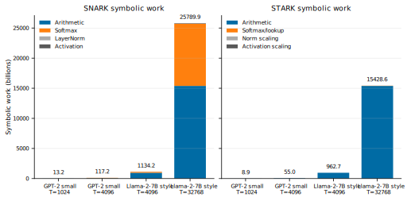
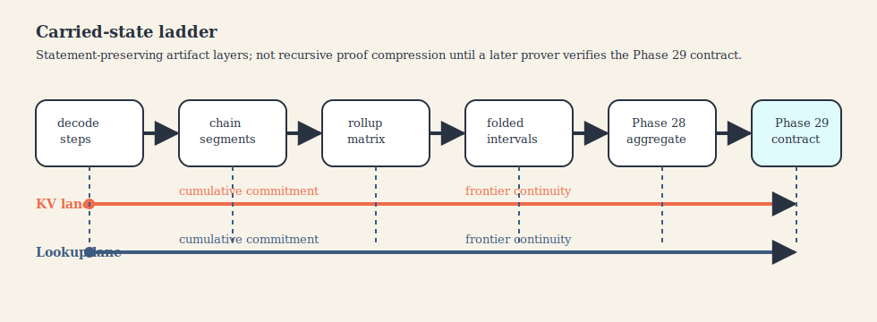

# On the Structural Fit of Transformer Workloads and STARK Proof Systems

**Abdelhamid Bakhta**\
StarkWare

**Omar Espejel**\
Starknet Foundation

*April 2026*

## Abstract

This paper studies the structural fit between transformer workloads and STARK proof
systems using a symbolic cost model together with a repository-backed proof artifact.
Under a worked example with `C_exp = 300`, `C_norm = 30`, and `C_nonlin = 150`, GPT-2
small (`d = 768`, `T = 1024`, `H = 12`, `L = 12`) yields about `157.8B` symbolic SNARK
constraints versus `106.5B` symbolic STARK rows across 12 layers (`1.48x`); over
practical context ranges, the ratio rises and then approaches a finite
architecture-dependent ceiling. These counts are symbolic proxies for prover-side work,
not matched runtime measurements.

We pair that analysis with `provable-transformer-vm` [30], a supporting artifact that
provides a frozen vanilla reproducibility tier, a frozen narrow experimental `stwo`
tier, and a broader proof-carrying decoding path with explicit carried-state boundaries,
shared lookup-table identity, reusable block- and step-level proof objects, and a
pre-recursive aggregation boundary. The repository does not yet provide full
standard-softmax inference on S-two, recursive cryptographic compression/verification
closure, recursive shared-table accumulation across decode steps as a compressed proof
object, or production-scale zkML deployment. The narrower claim is that transformer
workloads expose the design pressures under which STARK-native systems may compound
advantages, while current artifacts already support a concrete bridge from execution
traces to pre-recursive proof objects.

______________________________________________________________________

## 1. Introduction

Verifiable inference matters because model outputs are operational inputs. Where outputs
trigger trades or onchain actions, computational integrity is the core requirement.

The ecosystem already shows feasibility: modern systems can prove substantial inference
workloads, and public materials report progress on both SNARK-heavy and STARK-native
paths [24, 25, 26, 28, 29, 33]. Percepta's transformer-computer line provides a
complementary conceptual motivation for treating transformer-shaped execution as a
meaningful computational object [13].

The question addressed here is therefore narrower and more useful than “can transformers
be proved?” The question is: **which proof architecture compounds most cleanly as
transformer workloads scale in model size, sequence length, and deployment complexity?**

This paper makes three claims:

1. **Analytic claim.** Under a stated transformer cost model, non-arithmetic operations
   such as softmax, LayerNorm, and GELU can shift prover economics in favor of
   STARK-native systems.
2. **Systems claim.** Deterministic execution of transformer-relevant programs can be
   compiled into traces that are directly consumable as AIR witnesses, and can be
   organized as a parameterized proof-carrying decoding relation with carried-state
   boundaries that survive statement-preserving chain, segment, interval, rollup,
   matrix, and pre-recursive aggregation layers.
3. **Infrastructure claim.** The S-two / Starknet stack makes this direction
   increasingly practical, even though the reference repository used here still relies
   on the vanilla backend for its default artifact bundle and primary transformer proof
   relation while exposing `stwo` through a narrow experimental evidence tier.

Here a frozen tier means an immutable artifact snapshot with command logs, content
hashes, and proof artifacts. The `production-v1` tier is the vanilla-backend
reproducibility baseline, while `stwo-experimental-v1` is a narrow S-two evidence tier
for representative fixtures; Section 5.4 gives the detailed artifact boundary.

The supporting artifact is the paper's systems hinge: it is where the symbolic pressure
points of Section 4 are turned into explicit carried-state proof objects with frozen
evidence tiers and pre-recursive aggregation boundaries. The systems claim is
artifact-backed; the analytic claim remains model-based rather than a matched benchmark
on identical hardware; and the infrastructure claim is supported by current public
releases without implying full implementation closure in the repository. This is an
architecture-and-systems thesis, not a final empirical verdict.

The contributions are threefold: an exact symbolic model separating arithmetic from
non-arithmetic work; a repository-backed artifact that materializes proof-carrying
decoding with explicit carried-state boundaries and pre-recursive aggregation objects;
and an infrastructure reading of S-two/Starknet that is current enough to matter without
overstating implementation maturity.

The paper is organized accordingly. Section 4 develops the symbolic cost model and its
worked examples. Section 5 then anchors the systems claim in a repository artifact that
exposes two evidence tiers together with a broader proof-carrying decoding path and
pre-recursive carried-state packaging ladder. Sections 6-8 place those results in the
current S-two/Starknet landscape and identify the next cryptographic milestones beyond
the present artifact boundary.

______________________________________________________________________

## 2. Background

### 2.1 STARKs, AIR, and Circle STARKs

STARKs arithmetize computation as execution traces with low-degree transition
constraints and FRI-style proximity testing [1, 2, 3, 4].

Circle STARKs specialize this direction to Mersenne-31 (`2^31 - 1`). StarkWare positions
S-two for recursion and Starknet integration [17, 18, 20], with a March 31, 2026 update
reporting verification-path reduction from roughly one minute to roughly three seconds
[19]. These are engineering/product claims, not archival benchmark results.

### 2.2 SNARKs, GKR, and modern zkML

Modern zkML systems combine multiple techniques: GKR/sumcheck for large linear algebra,
and lookups/custom circuits for non-polynomial functions [5, 6, 7, 10, 11]. The
practical comparison is therefore whole-system architecture, not “R1CS vs AIR” in
isolation.

The model below does **not** claim all SNARK stacks pay one naive non-arithmetic cost;
it uses representative constants to isolate sensitivity to non-arithmetic handling.

### 2.3 LogUp and lookup-heavy workloads

Lookup arguments are central because transformer bottlenecks include non-polynomial
components (softmax, LayerNorm, GELU), not only matrix multiplies [8, 10, 38, 39].

______________________________________________________________________

## 3. Transformer Operation Count

We consider a standard transformer block with model dimension `d`, sequence length `T`,
number of heads `H`, head dimension `d_k = d / H`, and feedforward expansion `4d` [12].

### 3.1 Arithmetic operations

Arithmetic work per layer is:

- QKV projection: `3Td^2`
- Attention scores: `T^2 d`
- Value aggregation: `T^2 d`
- Output projection: `Td^2`
- Feedforward network: `8Td^2`
- LayerNorm linear scaling: `2Td`

Summing the dominant arithmetic components gives:

```text
12Td^2 + 2T^2d + 2Td
```

### 3.2 Non-arithmetic operations

Non-arithmetic work per layer is:

- Softmax: `T^2 H`
- LayerNorm nonlinear component: `2Td`
- GELU: `4Td`

Summing these terms gives:

```text
T^2H + 6Td
```

The `8Td^2` feedforward term is the GPT-2-style dense-MLP case (`4d` expansion); Section
4.5 switches to the Gemma/GeGLU-style form `3Tdm`.

______________________________________________________________________

## 4. A Transformer-Specific Cost Model

This section is a **model-based** comparison of symbolic proving work, not a controlled
benchmark of complete production systems. SNARK constraints and STARK rows are treated
as symbolic proxies, not equal runtime units.

### 4.1 SNARK-side symbolic cost

Using stylized worked-example constants for non-arithmetic operations,

- `C_exp = 300`
- `C_norm = 30`
- `C_nonlin = 150`

we model the per-layer SNARK-side cost as:

```text
C_SNARK = 12Td^2 + 2T^2d + 2Td + T^2H * C_exp + 2Td * C_norm + 4Td * C_nonlin
```

This keeps the arithmetic term shared with the STARK side and makes explicit where the
non-arithmetic amplification enters.

The constants `C_exp`, `C_norm`, and `C_nonlin` are **stylized worked-example
constants**, not normalized measurements from one prover/hardware stack. Their role is
to expose sensitivity; Appendix B sweeps `C_exp` across `50, 100, 300, 500`.

The model isolates softmax-related non-arithmetic cost; backend-specific lowerings are
not modeled separately.

Because softmax dominates the non-arithmetic budget in this model, `C_exp` is the
highest-leverage constant. On the GPT-2-small instantiation, moving `C_exp` from `50` to
`500` changes the overall ratio from about `1.13x` to `1.77x`, while comparable sweeps
over `C_norm` and `C_nonlin` move it only modestly. Full sensitivities are in Appendix
B; this is a model stress test, not a deployed benchmark.

### 4.2 STARK-side symbolic cost

For the STARK side, we keep the exact expression:

```text
L_STARK = 12Td^2 + 2T^2d + T^2H + 8Td
```

A naive approximation such as `12Td^2 + 3T^2d` is not justified for GPT-2 small because
`H << d` (`H = 12`, `d = 768`), which would materially inflate the STARK side.

This lookup treatment is also optimistic: real lookup-backed implementations pay
overhead in auxiliary columns, interaction phases, and commitments. The
one-row-per-symbolic-lookup abstraction is a modeling choice; higher lookup overhead
would narrow the symbolic gap.

**Proposition 1.** Under the symbolic model of Sections 4.1 and 4.2, with `T, d, H > 0`
and `C_exp, C_norm, C_nonlin >= 1`,

```text
C_SNARK - L_STARK = T^2H(C_exp - 1) + 2Td(C_norm - 1) + 4Td(C_nonlin - 1) >= 0.
```

Equality holds only when `C_exp = C_norm = C_nonlin = 1`. For fixed `d`, `H`, and
constants with at least one strict inequality, the gap grows monotonically in `T`.

Rearranging the same expression gives the exact break-even surface:

```text
T^2H(C_exp - 1) + 2Td(C_norm - 1) + 4Td(C_nonlin - 1) = 0.
```

For fixed `C_norm` and `C_nonlin`, this yields

```text
C_exp^* = 1 - (2d / TH)[(C_norm - 1) + 2(C_nonlin - 1)].
```

If `C_norm = C_nonlin = 1`, the break-even reduces to `C_exp = 1`. On the GPT-2-small
instantiation with `C_norm = 30` and `C_nonlin = 150`, the threshold is
`C_exp^* = -39.875`, so no positive `C_exp` removes the modeled symbolic gap.

For the dense GPT-style case, the ratio also has a finite large-context asymptote.
Writing

```text
R(T) = C_SNARK / L_STARK,
```

and keeping `d`, `H`, and the non-arithmetic constants fixed gives

```text
lim_{T -> ∞} R(T) = (2d + H C_exp) / (2d + H) = (2d_h + C_exp) / (2d_h + 1).
```

For GPT-2-small, `d_h = 64`, so under `C_exp = 300` the dense asymptote is approximately
`3.32x`. The ratio rises over practical ranges and then saturates at a finite ceiling.

### 4.3 Concrete analysis: GPT-2 small

Instantiating the model with GPT-2 small parameters (`d = 768`, `T = 1024`, `H = 12`,
`L = 12`) gives the following.

#### Table 2. GPT-2 small symbolic work under the stated cost model

| Component         | SNARK (constraints) | STARK (trace rows) | Ratio |
| ----------------- | ------------------: | -----------------: | ----: |
| Arithmetic        |       8,859,942,912 |      8,859,942,912 | 1.00x |
| Softmax           |       3,774,873,600 |         12,582,912 |  300x |
| LayerNorm         |          47,185,920 |          1,572,864 |   30x |
| GELU              |         471,859,200 |          3,145,728 |  150x |
| Total per layer   |      13,153,861,632 |      8,877,244,416 | 1.48x |
| Total (12 layers) |     157,846,339,584 |    106,526,932,992 | 1.48x |

Under this cost model, the non-arithmetic overhead adds about `4.29B` SNARK constraints
versus about `17.3M` STARK rows per layer at `T = 1024`. Softmax alone contributes about
`87.9%` of the SNARK non-arithmetic overhead. Scaling the same model to `T = 4096`
yields an overall ratio of about `2.13x`, so the qualitative claim that the gap widens
with context length remains intact.

### 4.4 Interpretation

This analysis does **not** prove that every STARK system is faster than every SNARK
system. It supports a narrower claim: once both sides handle large linear algebra
efficiently, differences are increasingly driven by lookup handling, recursion, field
arithmetic, and commitments.

The model also abstracts each activation/normalized value as one algebraic object; it
does not model quantization layouts, packing strategies, or backend-specific
decompositions.

Appendix B2 shows the same model on a wider Llama-2-7B-style dense reference [37]. Under
the exact formula, a wider production-style dense model can remain near parity at
shorter contexts under lower softmax constants while still widening materially at longer
windows.

Recent implementation-level comparisons reinforce that boundary. A December 2025
Groth16-vs-STARK comparison on consumer ARM hardware reports faster proving and smaller
proofs for the Groth16 side, alongside faster verification and transparency/post-quantum
advantages for the STARK side [34].

Threats to validity concentrate in four places: quantization/packing strategy,
lookup-table reuse and non-arithmetic lowering, recursion/compression strategy, and
hardware parallelism.

These caveats do not remove the structural result; they bound its interpretation. In
this paper, symbolic counts are used to locate architectural pressure points, not to
predict wall-clock performance for any one deployed prover stack.

Figure 1 makes the symbolic-work decomposition behind that sensitivity visible for both
the GPT-2-small worked example and a wider dense reference.



**Figure 1.** Symbolic-work decomposition versus context. Each configuration is shown as
paired SNARK and STARK stacked bars using the exact dense formulas from Sections 4.1 and
4.2. The GPT-2-small bars make the softmax-driven sensitivity of the model visually
obvious, while the Llama-2-7B-style bars show the narrower short-context regime and the
later widening discussed in Appendix B2.

### 4.5 Analytic extension to released Gemma 3 architectures

GPT-2-small keeps the algebra transparent, but newer deployments motivate a sparse
long-context extension. Public materials report Gemma-3-class requirements including
GQA, alternating local/global attention, RMSNorm, and GeGLU [14, 15, 16, 25].

This subsection asks whether the same symbolic logic still shows divergence under
released sparse long-context patterns.

For Gemma-style layers, let `n_q` be query heads, `n_kv` key/value heads, `d_h` head
dimension, `q = n_q d_h`, `k = n_kv d_h`, `m` MLP intermediate size, `L_g`
global-attention layers, `L_l` local-attention layers, and `W_eff(T) = min(T, W)`. Using
the same constants, the model becomes:

```text
A_Gemma(T) = L[Td(q + 2k) + Tdq + 3Tdm] + 2q[L_g T^2 + L_l T W_eff(T)]
S_Gemma(T) = n_q[L_g T^2 + L_l T W_eff(T)]
C_SNARK^Gemma(T) = A_Gemma(T) + S_Gemma(T) * C_exp + 2LTd * C_norm + LTm * C_nonlin
L_STARK^Gemma(T) = A_Gemma(T) + S_Gemma(T) + 2LTd + LTm
```

Gemma-style sparsity is a harder test for this thesis than GPT-2-small because
local/global attention suppresses long-context cost. It tempers the gap but does not
erase the direction: as context grows, non-arithmetic share remains structurally
important.

With fixed local window `W` and nonzero global-layer fraction, the long-context ratio
remains finite. In the representative `5:1` schedule used in Figure 2, the ratio still
rises toward a finite ceiling.

**Corollary.** For a fixed positive global-attention fraction and fixed local window
`W`, the representative sparse long-context ratio has the same large-context ceiling as
the dense case:

```text
lim_{T -> ∞} R_sparse(T) = (2d_h + C_exp) / (2d_h + 1).
```

The local `T W_eff(T)` terms are lower order than global `T^2` terms at large `T`, so
sparsity delays the approach to the ceiling rather than lowering it.

Figure 2 visualizes that distinction. The dense curve uses the GPT-2-small model from
Sections 4.1-4.3, and the sparse curve is a representative Gemma-style `5:1`
local/global schedule with `W = 1024` under the same constants.


**Figure 2.** `SNARK/STARK` symbolic ratio versus context length. The sparse curve is
representative, not tied to one exact checkpoint. The dashed line is the dense
asymptotic ceiling from Section 4.2. Reproducibility metadata and exact point generation
details are recorded in the supplementary scaling appendix and committed figure
script/TSV.

The symbolic analysis above identifies the architectural pressure points. The artifact
below shows which parts of that structure already survive a real proof workflow as
reproducible carried-state proof objects, and which parts still remain pre-recursive
engineering boundaries rather than cryptographic compression layers.

______________________________________________________________________

## 5. Repository Artifact: Evidence Boundary

The supporting implementation is `omarespejel/provable-transformer-vm` [30]. In this
paper it is treated as a **semantics-and-proof artifact**: deterministic
transformer-relevant execution is compiled into AIR-consumable traces and then organized
into proof-carrying decoding artifacts with explicit carried-state boundaries. Here,
"proof-carrying" means that each artifact carries enough public boundary data and proof
references for a verifier to replay continuity checks across the declared relation; it
is **not** a claim of recursive proof-carrying data or compressed recursive
verification. Likewise, terms such as `chain`, `segment`, `rollup`, `interval bundle`,
and `pre-recursive aggregation boundary` are used in an **artifact-layer sense**. Unless
explicitly stated otherwise, they do **not** denote recursive cryptographic accumulation
schemes, compressed proof systems, or CCS-/IVC-style folding protocols in the sense of
systems such as HyperNova, NeutronNova, or ProtoStar [43-45]. The point of this section
is narrower: to show that a stable proof-carrying decoding relation with carried KV and
lookup state can already be materialized as reproducible proof artifacts over the
current repository surfaces.

### 5.1 Positive evidence

The artifact provides:

- a deterministic transformer-shaped VM with a statement-versioned proof claim,
- two frozen evidence tiers: a vanilla reproducibility tier and a narrow experimental
  `stwo` tier,
- a parameterized proof-carrying decoding relation over explicit carried-state
  boundaries,
- statement-preserving pre-recursive packaging objects over that same decode relation,
- a bounded multi-runtime semantic-agreement artifact.

The central systems property is stable statement structure: the same decode relation
survives progressively richer manifest and packaging layers without changing the
underlying public boundary semantics. In concrete terms, the repository already exposes
reusable block-shaped execution proofs and, on its experimental `stwo` tooling surface,
step-level proof objects whose public boundary schema and statement semantics remain
stable across those richer artifact layers.

For shared lookup evidence, the artifact binds normalization and activation table
identity into a static lookup-table registry commitment inside the shared lookup
artifact; this is table-identity and provenance binding, not recursive cross-step
shared-table accumulation.

### 5.2 Carried-state relation

The carried-state claim can be stated as a compact relation.

**Definition 1 (Carried-state boundary).** A carried-state boundary at decode step `t`
is the public tuple

```text
Σ_t = (ℓ_t, p_t, h_t^KV, f_t^KV, h_t^L, f_t^L, c_t^in, c_t^out)
```

where `ℓ_t` identifies the layout/template, `p_t` records public step-position metadata,
`h_t^KV` and `f_t^KV` are the KV cumulative and frontier commitments, `h_t^L` and
`f_t^L` are the lookup cumulative and frontier commitments, and `c_t^in`, `c_t^out` are
execution-boundary commitments.

Let `R_decode` denote the repository's parameterized proof-carrying decoding relation
over carried-state boundaries:

```text
R_decode(Σ_t, w_t, Σ_{t+1})
```

where `w_t` contains the step witness and proof-bearing artifact material checked by the
repository verifier.

In this terminology, an interval bundle packages contiguous decode prefixes between the
segment and rollup layers. The pinned aggregation-bundle index records the concrete
artifact mapping [46].

**Definition 2 (Packaging-layer validity).** A chain, segment, interval bundle, rollup,
matrix, or pre-recursive aggregation boundary is valid if its member order is declared,
each nested proof artifact verifies under the stated backend and statement profile, and
every adjacent pair of carried-state boundaries satisfies the continuity constraints
required by the decode relation.

The following proposition records the invariant that the repository artifact is intended
to preserve across its pre-recursive packaging layers.

**Proposition 2.** If each step proof in a chain verifies under `statement-v1`, and
every adjacent pair satisfies `c_t^out = c_{t+1}^in` together with the corresponding KV
and lookup frontier-continuity checks, then the resulting segment, interval bundle,
rollup, matrix, or pre-recursive aggregation boundary preserves the same start-state to
end-state relation as the underlying verified chain.

**Proof sketch.** Each packaging layer records the first public state, last public
state, member commitments, and declared member order. Its verifier replay-checks the
nested members and rejects non-contiguous or template-incompatible boundaries. Induction
over the ordered members gives the same start-to-end relation for the packaged object.
This is a statement-preservation invariant, not a recursive proof-compression theorem.

Figure 3 summarizes the object flow and the two carried commitment lanes.



**Figure 3.** Carried-state packaging ladder over the parameterized decoding relation. A
verified `decoding_step_v2` chain is packaged into segments, interval bundles, rollups,
a multi-layout matrix, and a pre-recursive aggregation boundary. The two carried lanes
represent the KV-side cumulative/frontier commitments and the lookup-side
cumulative/frontier commitments. The figure is architectural: it describes
statement-preserving artifact layers in the repository, not a recursive cryptographic
compression pipeline.

### 5.3 Negative evidence

The repository remains deliberately narrow in four ways. First, the default
reproducibility tier and primary transformer relation still live on the vanilla backend,
while the `stwo` path remains a bounded experimental tier rather than a broad production
zkML surface. Second, the main proved transformer relation still uses `average-hard`
rather than full standard softmax. Third, the current repository already binds shared
lookup-table identity inside public artifacts, but it does not yet expose recursive
cross-step shared-table accumulation as a compressed proof object. Fourth, the decode
overlays, semantic-agreement artifacts, and pre-recursive aggregation boundaries are
statement-preserving packaging layers, not recursive cryptographic wrappers, SMT-backed
implementation-equivalence proofs, or production-scale learned-model zkML claims.

These limits are intentional scope discipline: the artifact supports structural systems
evidence, pre-recursive carried-state claims, and narrow experimental packaging
artifacts, but not full softmax-plus-recursion closure.

### 5.4 Reproducibility tiers

The vanilla `production-v1` tier is the primary reproducibility baseline. It is
documented in an immutable artifact snapshot with command logs, hashes, and proof
artifacts [31]. Timings and sizes are treated as reproducibility evidence, not
performance evidence.

The `stwo-experimental-v1` tier is the narrow S-two evidence tier. It contains command
logs, wall-clock timings, SHA-256 hashes, and proof artifacts for four representative
outputs: an arithmetic `statement-v1` proof (`addition`), a shared-table normalization
lookup proof envelope, a Gemma-inspired fixed-shape proof (`gemma_block_v4`) with shared
lookup bindings, and a three-step proof-carrying decoding chain [40]. Taken together,
these four artifacts illustrate representative proof outputs across the repository's
current public artifact inventory: a `statement-v1` arithmetic proof, a shared-table
lookup proof envelope, a block-shaped execution proof, and a carried-state decode chain.
The broader repository artifact inventory also includes bounded multi-runtime
semantic-agreement artifacts and pre-recursive aggregation bundles. Appendix C1 compares
the two backend-facing tiers.

### 5.5 Pre-recursive aggregation boundary

The present aggregation layer is statement-preserving and pre-recursive: it packages
verified carried-state artifacts into merge-compatible boundaries, but it is not yet a
recursive cryptographic accumulator or verifier-closed compression layer. This is a
bridge artifact, not a backend benchmark row. The dedicated aggregation-bundle index is
cited directly as systems evidence for this layer [46]. It does not support a recursive
compression claim or recursive cross-step shared-table accumulation beyond the public
lookup-accumulator artifact [30, 40, 46]. The broader carried-state ladder is documented
in the repository's supplementary design and README materials and is cited here as
commit-pinned systems evidence rather than as a recursive compression result.

### 5.6 Semantic-agreement and provenance boundaries

The repository also contains a bounded multi-runtime semantic-agreement artifact
motivated by implementation-equivalence work on large-model graphs [47]. It
lockstep-executes a fixed program across transformer/native/Burn/ONNX paths, records
relation witnesses, and binds observed transitions by per-runtime hashes plus a
canonical transition hash. This is deterministic bounded relation evidence, not a
general e-graph/SMT equivalence prover. It addresses a practical systems risk: proof
artifacts should not silently rely on informal claims that distinct frontend/runtime
paths are semantically identical. Separately, a release-provenance manifest can bind
model and tokenizer identifiers, local tokenizer/transcript files, safetensors hashes,
optional ONNX export hashes, and model-card/DOI/dataset metadata. That manifest is a
reproducibility guardrail, not part of the proof relation.

### 5.7 Why this artifact matters

This artifact narrows the gap between analytic and systems claims by showing:

1. transformer-relevant traces can be proved directly,
2. semantic equivalence can be checked across runtimes before proving and exposed as
   transition-relation hashes rather than prose-only assertions,
3. one parameterized decode relation preserves carried state across layouts and
   packaging layers,
4. carried-state packages can be aggregated as pre-recursive statements without changing
   the underlying decode relation,
5. reproducibility can be anchored in immutable bundles and commit-pinned artifacts.

The central systems fact is that one parameterized decode relation now survives richer
artifact boundaries without changing the public commitments that later recursive or
accumulation work would need to preserve.

In other words, the artifact does not merely show that transformer-relevant traces can
be proved; it shows that one parameterized decode relation can be lifted into reusable
carried-state proof objects that later recursive or accumulation layers can consume
without changing the underlying boundary semantics.

______________________________________________________________________

## 6. Infrastructure Context: S-two and Starknet

The infrastructure context matters because recursion and onchain verification determine
whether trace-level artifacts can become practical verifiable inference systems.

### 6.1 S-two, recursion, and Starknet integration

StarkWare’s public materials position S-two as a next-generation open-source prover
around Circle STARKs over M31. The March 31, 2026 recursion update matters because
aggregation is required once workloads become large or modular [19].

For this paper, the key distinction is: **S-two progress strengthens the roadmap, while
the repository still keeps its default artifact bundle and primary transformer relation
on the vanilla backend.**

Verifier cost and proof size remain part of that roadmap. The frozen vanilla tier still
produces multi-megabyte proofs for tiny fixtures, so aggregation/compression remains
necessary for practical onchain use [19, 34].

The supporting artifact nevertheless exposes meaningful S-two evidence through a narrow
experimental tier and a carried-state aggregation path, which is why the paper frames
the repository evidence as a bridge rather than a finished recursion system.

### 6.2 Starknet proof verification and privacy

Starknet `0.14.2` public materials list in-protocol S-two verification, and `SNIP-36`
describes proof-carrying transaction structure (`proof_facts`) [22, 23]. Starknet’s
account model remains relevant to this integration boundary [32]. Starknet’s March 10,
2026 STRK20 announcement adds privacy relevance by stating any ERC-20 on Starknet can
now be private [21].

______________________________________________________________________

## 7. Related Systems and Competitive Landscape

### 7.1 DeepProve as a strong SNARK counterexample

DeepProve is a direct counterexample to sweeping anti-SNARK claims: public Lagrange
materials report full GPT-2 inference and later Gemma-class progress with specialized
non-arithmetic handling [24, 25]. The relevant conclusion is narrower: SNARK systems can
prove transformer workloads, but with different prover-side economics.

### 7.2 Jolt Atlas and lookup-native SNARK convergence

Jolt Atlas reaches a lookup-centric architecture from the SNARK side, extending Jolt to
ONNX tensor operations and emphasizing non-linear workload handling [38]. The main
relevance is convergence around lookup-heavy non-arithmetic handling. Related SNARK-side
lines such as zkCNN and compiler-driven proving systems reinforce that non-arithmetic
handling remains a central systems concern even when benchmark setups differ [9, 35,
36].

### 7.3 NANOZK and zkLLM on layerwise and attention-specific specialization

NANOZK and zkLLM reinforce the same trend: layerwise decomposition and
attention/nonlinearity specialization with lookup-heavy machinery [10, 39]. Here they
are architectural evidence, not matched benchmarks.

### 7.4 BitSage obelyzk.rs (formerly stwo-ml) as the closest public STARK-native comparator

BitSage obelyzk.rs (formerly stwo-ml) is the closest public STARK-native comparator.
According to current project-reported public materials, it combines
GKR/sumcheck/LogUp-style machinery on an S-two/STWO path with Starknet verification
paths, including a single-transaction recursive STARK verification claim for a 30-layer
SmolLM2-135M proof and a six-step streaming verification path for a Qwen2-0.5B one-layer
model [26, 27]. These remain project-reported evidence, not normalized benchmarks, and
the same public materials still show uneven component maturity (`Attention` remains
listed as `Prover only`).

### 7.5 LuminAIR and the custom-AIR path

LuminAIR shows a different STARK-native path: custom AIR compilation for computational
graphs rather than a transformer-VM-first substrate [28, 29]. The contest is therefore
also between STARK-native architectures.

### 7.6 A more defensible comparative claim

The most defensible comparative claim is therefore:

> Once large linear algebra is handled efficiently on both sides, the remaining contest
> is dominated by lookup handling, transparent recursion, field arithmetic, and
> commitment backend. On those axes, STARK-native stacks remain highly compelling.

This is stronger than “STARKs have already won” because it is narrower and better
evidenced. A supplementary appendix summarizes comparison details.

Against that external landscape, the remaining question is practical sequencing: which
engineering steps most directly strengthen the next paper without diluting scope
discipline.

______________________________________________________________________

## 8. Discussion

### 8.1 What the paper supports, and what it does not

Taken together, the paper supports: a transformer-specific symbolic argument, a concrete
semantics-and-proof artifact with parameterized carried-state decoding, and a live
infrastructure roadmap.

It does **not** support stronger claims such as “STARKs have conclusively beaten
SNARKs,” full standard-softmax end-to-end inference in this repository, or
production-scale LLM proving evidence.

### 8.2 Highest-leverage next step

Given the parameterized decoding bridge and the pre-recursive carried-state aggregation
ladder, the highest-leverage next result is **recursive cryptographic carried-state
compression and accumulation** over the existing decode relation.

The methodological reason is simple: the statement boundary is already explicit. The
cleanest next paper is therefore one that keeps the same decode relation and
carried-state commitments while improving proof-size and verifier-cost behavior through
accumulation/compression, rather than changing the execution relation and the
aggregation mechanism at the same time.

More generic folding and recursive-argument frameworks already cover much of the broad
abstraction space [41, 43, 44, 45]. The sharper contribution available here is
transformer-specific carried-state accumulation over a fixed decode relation. Within
that boundary, the most credible near-term strengthening is to keep the public decode
relation unchanged while making the carried-state kernels more reusable: stable shared
lookup-table identity and reuse across decode artifacts, explicit block and step proof
envelopes with machine-readable carried-state and lookup boundaries, bounded
multi-runtime semantic-agreement kernels over fixed operator surfaces, and continued
verifier hardening on the experimental `stwo` route all sharpen the same fixed relation
rather than replacing it [38, 39, 42, 47, 48]. A supplementary appendix maps those
external influences to the current repository realization and the explicit future-work
boundary they motivate.

That direction keeps the next contribution transformer-specific and technically
attributable: gains can be read as accumulation/compression gains over a fixed public
boundary, not as a consequence of moving the underlying claim.

______________________________________________________________________

## 9. Conclusion

This paper does not argue that SNARKs cannot prove transformers or that STARKs have
already won. It argues a narrower point: transformer workloads emphasize lookup-heavy
nonlinearities, recursion, and field/commitment design choices where STARK-native
systems may compound advantages.

The repository contributes evidence at two layers: trace semantics and pre-recursive
carried state. It shows direct proving of transformer-relevant traces, semantic checks
across runtimes, and a parameterized decode relation that preserves commitments across
chains, segments, interval bundles, rollups, layout matrices, and pre-recursive
aggregation boundaries.

The frontier is no longer “can transformers be proved?” It is: **which architecture
scales most cleanly to long-context, production verifiable inference while preserving
transparency/post-quantum properties and compressing repeated transformer structure
without losing semantic discipline?**

______________________________________________________________________

## Acknowledgments

This paper uses the maintained repository `omarespejel/provable-transformer-vm`, which
consolidates the current artifact bundles and the earlier `llm-provable-computer` line.

______________________________________________________________________

## References

01. Eli Ben-Sasson, Iddo Bentov, Yinon Horesh, and Michael Riabzev. “Scalable,
    Transparent, and Post-Quantum Secure Computational Integrity.” *IACR Cryptology
    ePrint Archive*, Paper 2018/046, 2018. <https://eprint.iacr.org/2018/046>
02. Eli Ben-Sasson, Iddo Bentov, Yinon Horesh, and Michael Riabzev. “Fast Reed-Solomon
    Interactive Oracle Proofs of Proximity.” In *Proceedings of the 45th International
    Colloquium on Automata, Languages, and Programming (ICALP)*, 2018.
03. Eli Ben-Sasson, Lior Goldberg, Swastik Kopparty, and Shubhangi Saraf. “DEEP-FRI:
    Sampling Outside the Box Improves Soundness.” In *Proceedings of the 11th
    Innovations in Theoretical Computer Science Conference (ITCS)*, 2020.
04. Ulrich Haböck, David Levit, and Shahar Papini. “Circle STARKs.” *IACR Cryptology
    ePrint Archive*, Paper 2024/278, 2024. <https://eprint.iacr.org/2024/278>
05. Jens Groth. “On the Size of Pairing-Based Non-interactive Arguments.” In *Advances
    in Cryptology - EUROCRYPT 2016*, 2016.
06. Ariel Gabizon, Zachary J. Williamson, and Oana Ciobotaru. “PLONK: Permutations over
    Lagrange-bases for Oecumenical Noninteractive Arguments of Knowledge.” *IACR
    Cryptology ePrint Archive*, Paper 2019/953, 2019. <https://eprint.iacr.org/2019/953>
07. Shafi Goldwasser, Yael Tauman Kalai, and Guy N. Rothblum. “Delegating Computation:
    Interactive Proofs for Muggles.” *Journal of the ACM* 62(4), 2015.
08. Ulrich Haböck. “Multivariate Lookups Based on Logarithmic Derivatives.” *IACR
    Cryptology ePrint Archive*, Paper 2022/1530, 2022.
    <https://eprint.iacr.org/2022/1530>
09. Tianxiang Liu, Xiang Xie, and Yupeng Zhang. “zkCNN: Zero Knowledge Proofs for
    Convolutional Neural Network Predictions and Accuracy.” In *Proceedings of the 2021
    ACM SIGSAC Conference on Computer and Communications Security (CCS)*, 2021.
10. Haochen Sun, Jason Li, and Hongyang Zhang. “zkLLM: Zero Knowledge Proofs for Large
    Language Models.” *arXiv preprint* arXiv:2404.16109, 2024.
    <https://arxiv.org/abs/2404.16109>
11. Daniel Balbás, Dario Fiore, et al. “Modular Sumcheck Proofs with Applications to
    Machine Learning and Image Processing.” In *Proceedings of the 2023 ACM SIGSAC
    Conference on Computer and Communications Security (CCS)*, 2023.
12. Ashish Vaswani, Noam Shazeer, Niki Parmar, et al. “Attention Is All You Need.” In
    *Advances in Neural Information Processing Systems 30 (NeurIPS)*, 2017.
13. Percepta Labs. “Can LLMs Be Computers?” *Percepta Blog*, March 2026.
    <https://percepta.ai/blog/can-llms-be-computers>
14. Gemma Team. “Gemma 3 Technical Report.” Technical report, March 25, 2025.
    <https://storage.googleapis.com/deepmind-media/gemma/Gemma3Report.pdf>
15. Google AI for Developers. “Gemma 3 Model Card.” Official model documentation.
    Accessed April 6, 2026. <https://ai.google.dev/gemma/docs/core/model_card_3>
16. Google Developers Blog. “Gemma explained: An overview of Gemma model family
    architectures.” August 15, 2024.
    <https://developers.googleblog.com/en/gemma-explained-overview-gemma-model-family-architectures/>
17. StarkWare. “Introducing S-two: The Fastest Prover for Real-world ZK Applications.”
    *StarkWare Blog*, May 26, 2025. <https://starkware.co/blog/s-two-prover/>
18. StarkWare. “S-two 2.0.0 Is a Developer-Friendly, Fully Open-Source Toolkit.”
    *StarkWare Blog*, January 27, 2026.
    <https://starkware.co/blog/s-two-2-0-0-prover-for-developers/>
19. StarkWare. “Minutes to Seconds: Efficiency Gains with Recursive Circuit Proving.”
    *StarkWare Blog*, March 31, 2026.
    <https://starkware.co/blog/minutes-to-seconds-efficiency-gains-with-recursive-circuit-proving/>
20. Starknet Docs. “S-two Book: Introduction.” *Starknet Documentation*. Accessed April
    5, 2026. <https://docs.starknet.io/learn/S-two-book/introduction>
21. Starknet. “Make All ERC-20 Tokens Private with STRK20.” *Starknet Blog*, March 10,
    2026\. <https://www.starknet.io/blog/make-all-erc-20-tokens-private-with-strk20/>
22. Starknet. “Version Releases.” *Starknet Documentation*. Accessed April 5, 2026.
    <https://www.starknet.io/developers/version-releases/>
23. Starknet Community Forum. “SNIP-36: In-protocol Proof Verification.” Specification
    discussion. Accessed April 5, 2026.
    <https://community.starknet.io/t/snip-36-in-protocol-proof-verification/116123>
24. Lagrange. “DeepProve-1.” *Lagrange Blog*, August 18, 2025.
    <https://www.lagrange.dev/blog/deepprove-1>
25. Lagrange. “Engineering Update: September 2025.” *Lagrange Engineering Update*,
    published October 20, 2025.
    <https://www.lagrange.dev/engineering-updates/september-2025>
26. BitSage Network. *obelyzk.rs* (formerly *stwo-ml*). GitHub repository. Accessed
    April 9, 2026. <https://github.com/Bitsage-Network/obelyzk.rs>
27. BitSage Network. “elo-cairo-verifier/README.md.” GitHub documentation file in
    *obelyzk.rs*. Accessed April 9, 2026.
    <https://github.com/Bitsage-Network/obelyzk.rs/blob/main/elo-cairo-verifier/README.md>
28. Giza. *LuminAIR*. GitHub repository. Accessed April 5, 2026.
    <https://github.com/gizatechxyz/LuminAIR>
29. StarkWare. “Giza x S-two: Powering Verifiable ML with LuminAIR.” *StarkWare Blog*.
    Accessed April 5, 2026.
    <https://starkware.co/blog/giza-x-s-two-powering-verifiable-ml-with-luminair/>
30. `omarespejel/provable-transformer-vm`. “Staging Repository Snapshot Discussed in
    Sections 5 and 8.” GitHub repository snapshot (pinned carried-state evidence
    commit), commit `6ff972ddda4051d73dc65c92a88c0d00683ec8c7`. This commit remains the
    citation target until the final publication repository and release tag are cut.
    <https://github.com/omarespejel/provable-transformer-vm/tree/6ff972ddda4051d73dc65c92a88c0d00683ec8c7>
31. `omarespejel/provable-transformer-vm`. “Appendix Artifact Index (Production V1).”
    GitHub artifact snapshot, commit `8d435d540b8e3cf33ec4381bb820a00b6fe7aae6`, with
    command logs, hashes, and proof artifacts for the vanilla reproducibility tier.
    <https://github.com/omarespejel/provable-transformer-vm/blob/8d435d540b8e3cf33ec4381bb820a00b6fe7aae6/docs/paper/artifacts/production-v1-2026-04-04/APPENDIX_ARTIFACT_INDEX.md>
32. Starknet Docs. “Accounts.” *Starknet Documentation*. Accessed April 5, 2026.
    <https://docs.starknet.io/architecture/accounts>
33. Zhizhi Peng, Chonghe Zhao, Taotao Wang, Guofu Liao, Zibin Lin, Yifeng Liu, Bin Cao,
    Long Shi, Qing Yang, and Shengli Zhang. “A Survey of Zero-Knowledge Proof-Based
    Verifiable Machine Learning.” *Artificial Intelligence Review* (accepted
    manuscript), arXiv:2502.18535v2, 2026. <https://arxiv.org/abs/2502.18535>
34. Ayush Nainwal, Atharva Kamble, and Nitin Awathare. “A Comparative Analysis of
    zk-SNARKs and zk-STARKs: Theory and Practice.” *arXiv preprint* arXiv:2512.10020,
    2025\. <https://arxiv.org/abs/2512.10020>
35. Jiajun Wang, Xiaowen Wang, Zekun Wen, Linyan Lyu, Wei Wang, Yuxin Wang, Yanjiang
    Yang, Jian Liu, Jiaheng Zhang, Chao Li, and Qianhui Wang. “zkPyTorch: Verifiable
    Training and Inference with Zero-Knowledge Proofs.” *IACR Cryptology ePrint
    Archive*, Paper 2025/535, 2025. <https://eprint.iacr.org/2025/535>
36. Polyhedra Network. “zkPyTorch.” *Polyhedra Product Page*. Accessed April 6, 2026.
    <https://polyhedra.network/zkPyTorch>
37. Hugo Touvron, Louis Martin, Kevin Stone, et al. “Llama 2: Open Foundation and
    Fine-Tuned Chat Models.” *arXiv preprint* arXiv:2307.09288, 2023.
    <https://arxiv.org/abs/2307.09288>
38. Wyatt Benno, Alberto Centelles, Antoine Douchet, and Khalil Gibran. “Jolt Atlas:
    Verifiable Inference via Lookup Arguments in Zero Knowledge.” *arXiv preprint*
    arXiv:2602.17452, 2026. <https://arxiv.org/abs/2602.17452>
39. Zhaohui Geoffrey Wang. “NANOZK: Layerwise Zero-Knowledge Proofs for Verifiable Large
    Language Model Inference.” *arXiv preprint* arXiv:2603.18046, 2026.
    <https://arxiv.org/abs/2603.18046>
40. `omarespejel/provable-transformer-vm`. “Appendix Artifact Index (S-two Experimental
    V1).” GitHub artifact snapshot, commit `3970277d964a0a9a5326b0db364cf16822c1ccd4`,
    at
    `docs/paper/artifacts/stwo-experimental-v1-2026-04-06/APPENDIX_ARTIFACT_INDEX.md`.
    <https://github.com/omarespejel/provable-transformer-vm/blob/3970277d964a0a9a5326b0db364cf16822c1ccd4/docs/paper/artifacts/stwo-experimental-v1-2026-04-06/APPENDIX_ARTIFACT_INDEX.md>
41. Wilson Nguyen and Srinath Setty. “Neo: Lattice-based folding scheme for CCS over
    small fields and pay-per-bit commitments.” *IACR Cryptology ePrint Archive*, Paper
    2025/294, 2025. <https://eprint.iacr.org/2025/294>
42. StarkWare. “How StarkWare Uses Formal Verification to Prove Tech Soundness.”
    *StarkWare Blog*, March 5, 2026.
    <https://starkware.co/blog/starkwares-gold-standard-of-soundness-with-formal-verification/>
43. Abhiram Kothapalli and Srinath Setty. “HyperNova: Recursive Arguments for
    Customizable Constraint Systems.” *IACR Cryptology ePrint Archive*, Paper 2023/573,
    2023\. <https://eprint.iacr.org/2023/573>
44. Abhiram Kothapalli and Srinath Setty. “NeutronNova: Folding Everything that Reduces
    to Zero-Check.” *IACR Cryptology ePrint Archive*, Paper 2024/1606, 2024.
    <https://eprint.iacr.org/2024/1606>
45. Abhiram Kothapalli and Srinath Setty. “ProtoStar: Generic Efficient
    Accumulation/Folding for Special Sound Protocols.” *IACR Cryptology ePrint Archive*,
    Paper 2023/620, 2023. <https://eprint.iacr.org/2023/620>
46. `omarespejel/provable-transformer-vm`. “Appendix Artifact Index (S-two
    Proof-Carrying Aggregation V1).” GitHub artifact snapshot, commit
    `6bb8cab99092203217d64951c3af61488aa2c58e`, at
    `docs/paper/artifacts/stwo-proof-carrying-aggregation-v1-2026-04-11/APPENDIX_ARTIFACT_INDEX.md`.
    <https://github.com/omarespejel/provable-transformer-vm/blob/6bb8cab99092203217d64951c3af61488aa2c58e/docs/paper/artifacts/stwo-proof-carrying-aggregation-v1-2026-04-11/APPENDIX_ARTIFACT_INDEX.md>
47. Qi Zhan, Xing Hu, Xin Xia, and Shanping Li. “Verify Implementation Equivalence of
    Large Models.” *arXiv preprint* arXiv:2603.21851, 2026.
    <https://arxiv.org/abs/2603.21851>
48. Lagrange. “Engineering Update: July 2025.” *Lagrange Engineering Update*, published
    July 24, 2025. <https://www.lagrange.dev/engineering-updates/july-2025>
