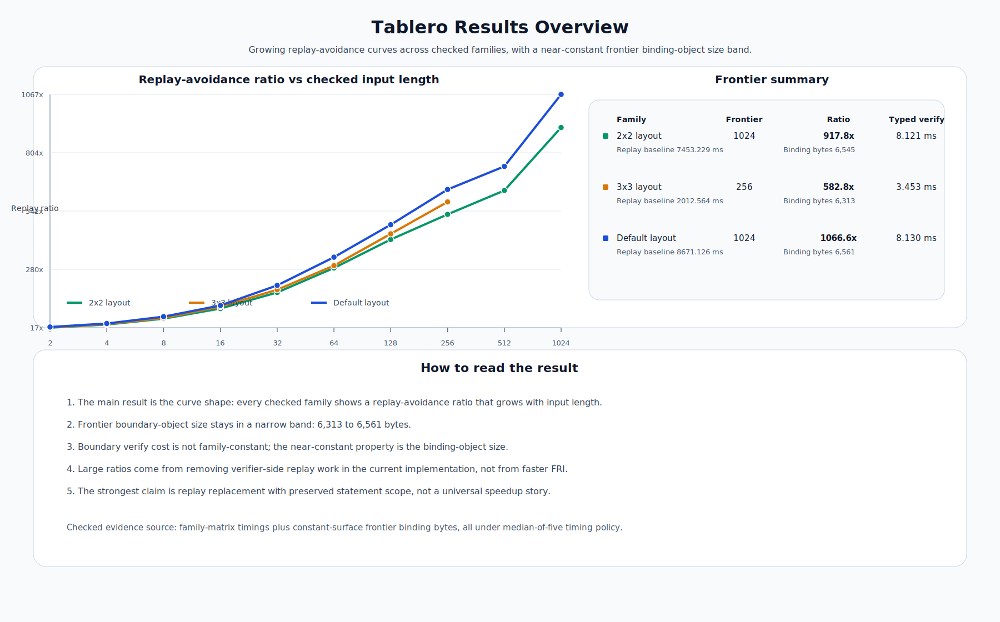
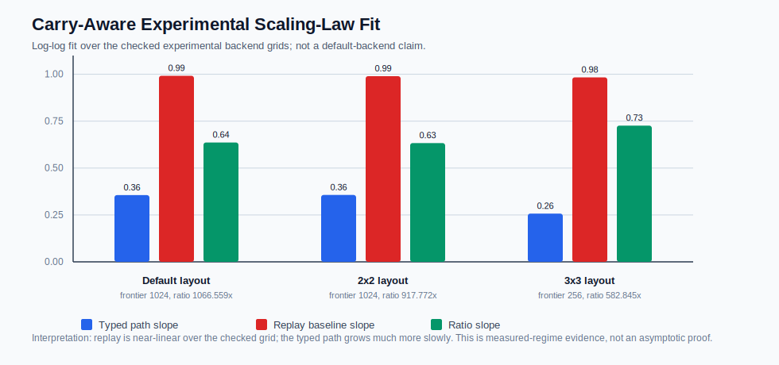
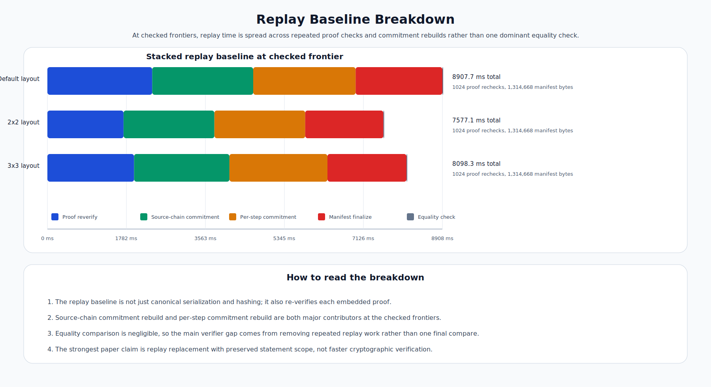

# Tablero: Typed Verifier Boundaries for Layered STARK Systems, with Evidence from STARK-zkML

**Abdelhamid Bakhta**, StarkWare

**Omar Espejel**, Starknet Foundation

*April 2026 draft*

Short submission abstract: [abstract-tablero-2026.md](abstract-tablero-2026.md).

## Abstract

Layered proof systems often pay a verifier-side replay cost long after the core
cryptographic statement has already been fixed. In practice, a verifier may first
check a compact proof and then still spend most of its wall-clock budget
reconstructing ordered manifests, public-input tables, or source-chain summaries.
This paper isolates a design pattern for removing that replay cost without widening
what the verifier accepts. We call the pattern **Tablero**: a typed verifier boundary
that binds the same public facts the replay path would have reconstructed, but does
so through a compact boundary object and explicit commitment checks.

The main technical claim is a statement-preservation theorem: if the underlying
compact proof system is sound, the boundary object is well formed, and the boundary
binding checks are complete for the emitted source facts, then accepting the typed
boundary preserves the same accepted statement set as replaying the heavier source
surface directly. This is not a new STARK theorem and not a recursive-compression
result. It is a theorem about when replay replacement is honest.

We then study the pattern in a transformer-shaped STARK-zkML laboratory. On the
current experimental backend, the main typed-boundary path reproduces across three
layout families. At the checked frontier, the replay-avoidance ratio grows from
`17.7x` to `1011.9x` on the `3x3` family and reaches `1066.6x` on the default family and
`917.8x` on the `2x2` family at `1024` checked steps. The dominant avoided cost is
not faster FRI verification; it is per-step verifier-side replay work over the
source-chain surface. An explicit red-team measurement (median of nine
runs) against an honestly-optimized replay verifier (binary canonical
commitments and no redundant per-step serialization) tightens the headline
ratio at the checked frontier to a host-noise-sensitive band of
`~261x`-`~330x`, isolating an implementation-cost component of
`~3.1x`-`~3.6x` from a structural component of `~261x`-`~330x` that any
honest replay verifier pays. A second typed boundary on a distinct
emitted-source surface also clears as supporting positive evidence at `1.22x`
on the conservative publication row (Table 4); a broader engineering sweep
over the same surface is checked in but is not promoted here as a
paper-facing performance claim. The paper also reports one bounded
compactness no-go: a narrower handoff object that shrinks bytes but not
verifier latency because it compacts a replay-dependent path rather than
eliminating replay.

The contribution is therefore threefold: a reusable verifier-boundary pattern, a
formal statement-preservation criterion for deploying it safely, and an empirical
study showing when and why replay elimination opens a growing latency gap in a layered
STARK stack.

Finally, we use the same boundary discipline as a small statement-binding check
outside the main performance result. External zkAI proof adapters, native Stwo
proof receipts, and two source-backed receipt gates show the same separation:
raw proof verification establishes proof validity, but a typed statement receipt
is needed to bind that proof to the claimed model, input, output, configuration,
numeric range assumptions, setup, verifier domain, and carried state. This is
supporting systems evidence, not a claim that those proof systems are flawed and
not a claim of end-to-end verifiable intelligence.

---

## 1. Introduction

The hardest systems problems in proof engineering often arise above the core proof.
A stack can already have a cryptographically meaningful compact statement and still
force the verifier to replay heavy structure around it: ordered manifests,
derived public-input vectors, source-chain commitments, or receipt wrappers.
Those replay surfaces matter because they are where wall-clock latency,
serialization overhead, and implementation complexity can pile up even when the
core proof relation is already fixed.

This paper studies that layer. The question is not whether recursive STARK systems,
lookup-heavy verifiers, or zkML stacks are possible in principle. The question is
more operational:

**When can a verifier replace an expensive replay surface with a typed boundary object
without changing what it accepts?**

That question matters well beyond zkML. Any layered STARK system with a compact proof
at one layer and replay-heavy verification logic at the next layer can face the same
tradeoff. A typed boundary is attractive because it can compress the verifier-facing
object and remove replay work. But it is only honest if the boundary object is bound
to the same statement the replay path would have enforced.

We use a transformer-shaped STARK-zkML stack as the empirical lab because it makes
these replay surfaces unusually visible. The stack already exposes compact proofs,
source-bound verification paths, bridge objects, handoff receipts, wrapper candidates,
and a hardening program aimed at malformed or stale serialized artifacts. That gives us
a realistic setting in which the replay surface is both large enough to matter and
formal enough to study.

The paper makes four claims.

1. **Design claim.** Tablero is a reusable settlement-layer pattern for layered STARK
  systems: replace verifier-side replay with a typed boundary whose fields are
   commitment-bound to the compact statement.
2. **Formal claim.** Under explicit assumptions, accepting the typed boundary preserves
  the same accepted statement set as replaying the heavier source surface.
3. **Empirical claim.** In the current transformer-shaped empirical lab, the main typed
  boundary reproduces across three layout families and exhibits a growing-in-`N`
   replay-avoidance curve.
4. **Boundary claim.** The pattern is not universal. It only applies where the source
  side emits enough proof-native material and where the replay surface is expensive
   enough to be worth removing. We include one smaller supporting second boundary and
   one bounded compactness no-go to mark that boundary explicitly.

We also state the non-claims up front. This paper does **not** claim a new STARK
soundness theorem, backend independence, recursive proof compression, a full end-to-end
transformer benchmark, or a universal lower bound on replay cost across all
implementations. The empirical demonstrations remain in one transformer-shaped STARK-zkML
lane, and the large latency ratios are implementation-grounded replay-avoidance ratios,
not claims that cryptographic verification itself became hundreds of times faster.
The zkAI adapter checks later in the paper are likewise scoped narrowly: they
show that proof validity and application statement validity are different
verifier layers, not that external proof systems are unsound.

This distinction is important for verifiable AI and agent systems. A proof
verifier can correctly accept a proof while the surrounding application still
misstates which model, input, output, configuration, policy, or action that proof
is meant to support. In that setting, a typed boundary is not only a latency
optimization; it is also a way to make the accepted statement explicit before a
higher-level receipt or settlement layer composes it with other facts.

### 1.1 Research context

Tablero builds on a small set of related arguments that take the
"transformers as computers" premise from architectural intuition to a
checkable execution surface.

The original premise — that a transformer in decode mode behaves like a
computer running a deterministic program — was made concrete by Percepta's
*Can LLMs Be Computers?* [4]. AbdelStark's follow-on note *Can LLMs be
PROVABLE computers?* [5] asked the natural next question: if a transformer
can execute a program, can that execution produce independently checkable
evidence? His framing names the bridge directly: *the trace becomes the
witness*.

A separate argument [6] makes the structural case that STARK trace
structure naturally fits transformer decode because the workload already
exhibits repeated stateful local work over carried context, and that the
proof artifact for one decode step should preserve the carried boundary,
not just the visible output token. That argument establishes the
*architectural fit* between trace-based STARK proving and transformer
decode but does not provide a verifier-side mechanism that exploits it:
it argues that the carried boundary should be made visible, but it does
not provide the verifier that accepts it in lieu of replay.

This paper provides one such mechanism. Tablero is a verifier-side pattern
that lets a layered STARK system accept a typed certificate of the public
boundary facts a replay path would have reconstructed, without the
verifier walking the source-chain surface itself. The structural fit
between STARK traces and transformer decode is treated as a precondition,
not as a result of this paper. We do not contribute a new STARK
construction or a new transformer arithmetization. The contribution is
*systems-level*: a settlement-layer pattern that closes one specific cost
gap between "this execution can be proved" and "the verifier can check
that proof cheaply at deployment scale."

In the surrounding zkML literature, related lines come at the same problem
from different angles. zkLLM-style work introduces lookup machinery for
non-arithmetic tensor operations and attention-specific proving;
Jolt-Atlas brings a lookup-centric SNARK approach to ONNX tensor
operations; NANOZK [1] argues for layerwise zero-knowledge proofs for LLM
inference; Lagrange DeepProve-1 reports full GPT-2 inference proving as a
SNARK-side existence proof; LuminAIR with Giza × S-two demonstrates a
STARK-native graph-to-AIR path. These are predecessors and parallel work
in the broader zkML space. Tablero is orthogonal to them: none of them
gives a verifier-side replay-elimination pattern with a stated soundness
criterion and measured savings on the carried-state surface that
transformer decode naturally exposes.

---

## 2. Replay Surfaces in Layered STARK Systems

Consider a layered verifier with two kinds of work.

- **Compact-proof work.** Verify the claim and proof that define the compact
cryptographic statement.
- **Replay work.** Reconstruct or recheck heavier source-side structure around that
compact statement: ordered manifests, source-chain objects, public-input lists,
receipt wrappers, or other derived commitments.

A verifier that performs both is often logically correct but architecturally
inefficient. The replay path may dominate wall-clock cost even when the compact proof
is relatively small.

That distinction motivates a cleaner abstraction.

A **typed verifier boundary** is a compact object emitted by the source side that carries
exactly the boundary facts the verifier would otherwise derive by replaying the heavier
surface. The verifier then accepts the compact proof together with the typed boundary,
provided it can validate the object and prove that the object's fields bind to the same
compact statement.

The question is not whether a smaller object exists. The question is whether accepting
that smaller object preserves the same statement.

---

## 3. The Tablero Pattern

We now define the pattern in abstract form.

### 3.1 Objects and notation

Let:

- `R` be the underlying compact-proof relation;
- `c` be a public compact claim in relation `R`;
- `π` be a proof for `c`;
- `V_R(c, π)` be the verifier for `R`;
- `σ` be the heavier source surface that a replay baseline would inspect directly;
- `β` be a typed boundary object emitted from `σ` and `c`.

The source surface `σ` can be any structured object whose replay path yields public
facts that the verifier currently depends on: ordered manifests, source-chain summaries,
bridge commitments, or receipt-level derived public inputs.

### 3.2 Definition: typed verifier boundary

**Definition 1 (Typed verifier boundary).** A typed verifier boundary `β` for compact
claim `c` over source surface `σ` is a compact object emitted by the source side such
that:

1. `β` is schema-valid and version-valid,
2. `β` exposes the public boundary facts the replay verifier would otherwise derive
  from `σ`, and
3. `β` carries enough commitment-bound information for the verifier to check that
  those facts belong to the same compact claim `c`.

### 3.3 Definition: Tablero acceptance rule

Let `Validate(β)` be the object-level validation predicate for the typed boundary, and
let `Bind(β, c)` be the repository-local binding predicate that checks boundary-to-claim
consistency.

Then the Tablero acceptance rule is:

```text
TableroVerify(β, c, π) := Validate(β) and V_R(c, π) and Bind(β, c)
```

Intuitively:

- `V_R(c, π)` keeps the compact cryptographic statement honest,
- `Validate(β)` prevents malformed or semantically invalid boundary objects, and
- `Bind(β, c)` prevents stale or mismatched boundary data from being attached to the
wrong compact claim.

### 3.4 When the pattern applies

Tablero is not a universal wrapper trick. It applies only when two conditions hold.

1. **Replay worth removing.** The replay surface is expensive enough that replacing it
  would materially change verifier cost.
2. **Source emission completeness.** The source side emits the proof-native data needed
  for the binding predicate to recreate the same public boundary the replay verifier
   would have enforced.

If either condition fails, the right outcome is not to force the pattern. It is to record
an honest no-go.

---

## 4. Statement Preservation

The formal question is now precise: under what assumptions does replacing replay with a
typed boundary preserve the same accepted statement set?

### 4.1 Assumptions

We assume:

1. **Compact-proof soundness.** If `V_R(c, π)` accepts, then `c` is a true statement in
  relation `R` except with negligible probability `ε_R`.
2. **Commitment binding.** The commitment functions used inside the boundary object and
  its nested objects are collision resistant except with negligible probability `ε_H`.
3. **Emission completeness.** The source side emits enough proof-native data for
  `Bind(β, c)` to check all boundary facts that the replay verifier would otherwise
   derive from `σ`.

These are deliberately ordinary assumptions. The theorem below is not claiming a new
cryptographic primitive. It is a theorem about preserving the same statement under a
replay replacement discipline.

### 4.2 Theorem

**Theorem 1 (Tablero statement preservation).** Let `β` be a typed verifier boundary
emitted from source surface `σ` and compact claim `c`. Suppose:

1. `Validate(β)` accepts,
2. `V_R(c, π)` accepts,
3. `Bind(β, c)` accepts, and
4. the three assumptions above hold.

Then, except with probability at most `ε_R + ε_H`, accepting `(β, c, π)` through
`TableroVerify` does not widen the accepted statement set relative to a verifier that
checks `V_R(c, π)` and reconstructs the same public boundary facts directly from `σ`.

### 4.3 Proof sketch

The proof is straightforward.

1. By compact-proof soundness, `V_R(c, π)` implies that `c` is a valid compact statement
  except with probability `ε_R`.
2. `Validate(β)` guarantees that the boundary object is structurally well formed, uses
  the expected schema and semantic scope, and respects object-level invariants.
3. `Bind(β, c)` guarantees that the public facts carried by `β` are commitment-bound to
  the same compact claim `c` rather than to some stale or semantically different object.
4. By commitment binding, the adversary cannot substitute a semantically different nested
  object under the same commitments except with probability `ε_H`.
5. Therefore the verifier that accepts `β` is accepting the same compact claim and the
  same public boundary facts that the replay verifier would have enforced, but without
   recomputing those facts from `σ` inside the verifier.

So the accepted statement set is preserved up to `ε_R + ε_H`.

### 4.4 What the theorem does not say

The theorem does **not** imply:

- that every replay surface can be replaced honestly,
- that every typed boundary improves cost,
- that a boundary result automatically generalizes across backends,
- that recursive compression has already been achieved.

It says only that when a boundary is emitted completely and bound correctly, replacing
replay with that boundary does not widen the accepted statement set.

---

## 5. Implementation Boundary and Assurance

The empirical laboratory behind this paper is a layered transformer-shaped STARK stack
that already exposes:

- a compact proof path,
- a typed boundary path,
- a public-input bridge,
- a proof-adapter receipt,
- higher wrapper surfaces, and
- a structured source-side replay baseline.

That stack is valuable because it lets us test the pattern under adversarial conditions
rather than only in prose.

The implementation assurance stack used for this paper is intentionally auditor-style.
It includes:

- deterministic tamper tests for malformed, stale, reordered, and semantically drifted
serialized artifacts,
- deterministic tests for witness-discipline failures in the experimental arithmetic
layer,
- bounded model checking on the narrow boundary and wrapper predicates that replace
replay,
- differential fuzzing on serialized boundary and wrapper inputs,
- runtime hardening that converts panic-prone shape assumptions into fail-closed errors
on trusted-core paths.

This assurance stack does not replace the theorem. It complements it. The theorem says
what claim is justified if the boundary path is implemented correctly; the assurance
stack increases confidence that the implementation is not silently violating the
conditions of the theorem.

---

## 6. Empirical Evaluation

### 6.1 Setup and scope

The empirical demonstrations in this paper come from one transformer-shaped STARK-zkML
laboratory. They are not a matched benchmark against external systems. They are measured
median-of-five results on one experimental backend, used to study the behavior of typed
replay replacement under controlled variations in layout geometry. The measurement policy,
reproducibility handles, and public wording rules are summarized in
[appendix-methodology-and-reproducibility.md](appendix-methodology-and-reproducibility.md).

The main comparison is always the same:

- **Typed-boundary path.** Verify the compact proof and accept one typed boundary object.
- **Replay baseline.** Verify the same compact proof and then replay the ordered manifest
that the typed boundary is designed to replace.

The important interpretation rule is simple:

> These ratios measure replay avoidance on the current implementation, not faster FRI
> verification and not a universal lower bound on all possible manifest designs.

### 6.2 Cross-family transferability

The main positive result is not a single large ratio. It is that the same mechanism
reproduces across three layout families with the same growing-in-`N` shape.

#### Table 1. Frontier summary across checked layout families


| Family  | Checked frontier | Replay-avoidance ratio at frontier | Typed-boundary verify | Replay baseline verify |
| ------- | ---------------- | ---------------------------------- | --------------------- | ---------------------- |
| default | `1024`           | `1066.6x`                          | `8.130 ms`            | `8,671.126 ms`         |
| `2x2`   | `1024`           | `917.8x`                           | `8.121 ms`            | `7,453.229 ms`         |
| `3x3`   | `1024`           | `1011.9x`                          | `8.311 ms`            | `8,410.230 ms`         |


The structural claim is the slope difference fitted in Section 6.3, not the
constant-factor headline. The frontier ratios above are
implementation-dependent: a more aggressively optimized honest replay verifier
would tighten the constant. What is *not* implementation-dependent over our
checked grid is that the replay baseline grows near-linearly in `N` while the
typed-boundary path grows sublinearly, so the ratio grows with `N` for
structural reasons rather than because of one favorable endpoint.

- The mechanism survives all three checked families.
- The constants still differ materially.
- The ratio grows with `N` on every checked family.

That means the typed boundary is removing a replay surface that is near-linear over the
checked grid rather than merely shaving a constant factor.

Reproducibility note for Table 1 and Figure 1: the typed-boundary and
replay-baseline frontier rows are taken from the family-matrix evidence at
`docs/paper/evidence/tablero-results-overview-2026-04.tsv`, regenerated by
`python3 scripts/paper/generate_tablero_results_overview.py`. Table 3 below
comes from a separate replay-decomposition harness whose paper-facing rows
live at `docs/paper/evidence/tablero-replay-baseline-breakdown-2026-04.tsv`
and are regenerated by
`python3 scripts/paper/generate_tablero_replay_breakdown.py`. The "Replay
baseline verify" column in Table 1 and the "Replay total" column in Table 3
are therefore two distinct median-of-five measurements at the same `1024`
frontier and can disagree by tens of milliseconds across re-runs of the two
harnesses. They are not expected to match exactly; they are expected to lie
within the same percent-scale band, which they do.



**Figure 1.** The main empirical fact is the curve shape across the three checked
families. The frontier artifact size stays in a narrow band, while verifier cost remains
family dependent.

### 6.3 Checked scaling-law fit

The frontier table is intentionally not the whole argument. We also fit the full checked
curves in log-log space for each family. This is an explicitly labeled carry-aware
experimental-backend artifact: the source evidence is promoted from the engineering lane
with that label preserved in the filename and metadata. It is a measured-regime fit, not
an asymptotic theorem and not a claim about a default backend.

#### Table 2. Log-log slope fit over the checked grids


| Family  | Grid     | Typed-path slope | Replay-baseline slope | Ratio slope | Ratio fit `R^2` |
| ------- | -------- | ---------------- | --------------------- | ----------- | --------------- |
| default | `2-1024` | `0.3559`         | `0.9921`              | `0.6362`    | `0.9706`        |
| `2x2`   | `2-1024` | `0.3567`         | `0.9899`              | `0.6332`    | `0.9704`        |
| `3x3`   | `2-1024` | `0.3508`         | `0.9905`              | `0.6397`    | `0.9695`        |


The replay baseline is near-linear over the checked grids. The typed path grows much
more slowly over the same grids, so the ratio grows for structural reasons in the
measured regime. This is a stronger statement than quoting a single high endpoint.

The replay-baseline log-log fit is tight on every family
(`R^2 ≥ 0.9994`). The typed-path fit is looser, with `R^2` between `0.8872`
(`3x3`) and `0.9018` (default); on `3x3` in particular the slope estimate
carries wider uncertainty than on the other two families. The ratio fit
itself stays in a narrow band (`R^2` between `0.9695` and `0.9706`) because
the replay-baseline term dominates the log-log behavior of the ratio over
this grid.



**Figure 2.** The checked scaling-law fit separates the typed path, the replay baseline,
and the ratio curve on the carry-aware experimental backend. The result supports a
measured-regime scaling claim, not an unbounded asymptotic or default-backend claim.

Reproducibility note for Table 2 and Figure 2: regenerate the machine-readable TSV,
JSON, and SVG with `python3 scripts/paper/generate_tablero_scaling_law.py`. The script
uses only Python 3 standard-library code, reads median-of-five millisecond timing rows
from the checked carry-aware experimental evidence, and requires the step grids
`2-1024`, `2-1024`, and `2-1024` for the three families. Its outputs are
`docs/paper/evidence/tablero-carry-aware-experimental-scaling-law-2026-04.tsv`,
`docs/paper/evidence/tablero-carry-aware-experimental-scaling-law-2026-04.json`, and
`docs/paper/figures/tablero-carry-aware-experimental-scaling-law-2026-04.svg`.

### 6.4 What is constant and what is not

One subtle but important point must be stated explicitly.

Across the checked families, the boundary artifact itself is nearly constant in size:
roughly `6.3-6.6 KB` at the checked frontiers. That is the clean cryptographic property.

The **verify time** of the boundary is **not** family-constant. It varies substantially
because the binding work still depends on the underlying compact path and layout geometry.
So the right sentence is:

> Tablero exposes a near-constant boundary artifact size across checked families, while
> the boundary verify cost remains family dependent.

This distinction matters. If we blur it, a reviewer can correctly object that the data do
not show family-invariant verifier cost.

### 6.5 Causal decomposition

The large ratios are easy to misread if we only quote the frontier numbers. The causal
breakdown shows where the baseline actually spends time.

#### Table 3. Replay baseline decomposition at the checked frontier


| Family           | Proof reverify | Source-chain commitment | Per-step commitment | Manifest finalize | Equality check | Replay total   |
| ---------------- | -------------- | ----------------------- | ------------------- | ----------------- | -------------- | -------------- |
| default (`1024`) | `1,910.784 ms` | `2,256.729 ms`          | `2,280.080 ms`      | `1,869.553 ms`    | `0.122 ms`     | `8,317.269 ms` |
| `2x2` (`1024`)   | `1,440.664 ms` | `2,036.751 ms`          | `2,029.761 ms`      | `1,675.663 ms`    | `0.075 ms`     | `7,182.913 ms` |
| `3x3` (`1024`)   | `1,733.076 ms` | `2,138.166 ms`          | `2,114.333 ms`      | `1,736.131 ms`    | `0.271 ms`     | `7,721.977 ms` |


This is the stronger causal lesson:

- the replay baseline is not one monolithic serialization bottleneck,
- proof re-verification, source-chain commitment rebuild, per-step commitment rebuild,
and manifest finalization each consume a comparable share of replay time, and
- the final equality comparison is negligible.



**Figure 3.** At the checked frontiers, replay time is spread across repeated proof
checks and commitment rebuilds rather than one dominant final comparison.

At the same `1024`-step frontiers, compact-proof verification stays between
`1.853 ms` (`2x2`) and `1.936 ms` (`3x3`), and typed-boundary binding stays
between `4.955 ms` (`2x2`) and `5.048 ms` (`3x3`). The verifier gap therefore
comes from removing a bundle of repeated replay work, not from accelerating
cryptographic verification itself.

### 6.6 Red-teaming the constant: an honestly-optimized replay verifier

The frontier ratios in Section 6.2 are measured against the current ordered
manifest-replay implementation. A natural reviewer objection is that the
headline value reads partly as "how much work the typed boundary avoids" and
partly as "how unoptimized the JSON-shaped replay path is." We measured this
explicitly. We added an alternate replay verifier in the engineering lane
that (a) skips per-step embedded proof re-verification (the typed boundary
verifier does the same; the compact projection proof's trace commitment
already binds the trace that includes every step proof's public-output
surface) and (b) commits the chain summary and per-step proof commitments
with a binary canonical encoding over fixed-size cryptographic identities
and the raw stark-proof byte buffer, instead of serializing every nested
proof structure to JSON before hashing. The verifier still rebuilds the
manifest from the chain and equality-checks; only the implementation surface
of the cryptographic-derivation and per-step-proof checks changes.

#### Table 3a. Optimized replay verifier at the `1024`-step frontier

Reproducibility note for Table 3a:

- Backend version: `stwo-phase12-decoding-family-v10-carry-aware-experimental` (the carry-aware experimental execution-proof backend, distinct from the publication-default `stwo-phase12-decoding-family-v9`).
- Optimized-replay manifest version: `stwo-phase30-decoding-step-proof-envelope-optimized-manifest-v1`; manifest scope: `stwo_execution_parameterized_decoding_step_proof_envelope_manifest_optimized_binary_commitments`.
- Optimized-replay benchmark identity: `benchmark_version = stwo-tablero-replay-breakdown-optimized-benchmark-v1`; `semantic_scope = tablero_replay_baseline_optimized_decomposition_over_checked_layout_families_over_phase12_carry_aware_experimental_backend`.
- Timing mode: `measured_median`. Timing policy: `median_of_9_runs_from_microsecond_capture` (canonical; the script also accepts `median_of_5_runs_from_microsecond_capture` for the original measurement, retained for reproducibility). Timing unit: `milliseconds`. Step count: `1024`. Aggregation strategy: `median_total_representative_run`.
- Engineering evidence: `docs/engineering/evidence/tablero-replay-baseline-breakdown-optimized-2026-04.tsv` and `.json`.
- Regeneration: `cargo +nightly-2025-07-14 build --release --features stwo-backend --bin tvm` followed by `BENCH_RUNS=9 CAPTURE_TIMINGS=1 scripts/engineering/generate_tablero_replay_breakdown_optimized_benchmark.sh`. The shell script fails closed if the regenerated payload's identity drifts from this scope, and pins every `EXPECTED_*` identity field when the output paths resolve to the canonical checked-in evidence paths.

This is an explicit experimental-to-paper promotion of an
engineering-only red-team measurement. The optimized verifier is **not**
the publication-default verifier: the manifest format it consumes uses
binary commitments under a distinct version/scope (above), so a
publication-default JSON-keyed manifest is rejected before any equality
check runs.

| Family | Optimized replay total | Original replay total | Speedup | Ratio (optimized replay total : typed boundary verify) |
| --- | ---: | ---: | ---: | ---: |
| default (`1024`) | `2,684.106 ms` | `8,317.269 ms` | `3.1x` | `330.1x` |
| `2x2` (`1024`) | `2,145.775 ms` | `7,182.913 ms` | `3.3x` | `264.2x` |
| `3x3` (`1024`) | `2,170.899 ms` | `7,721.977 ms` | `3.6x` | `261.2x` |

Three facts matter here.

First, the headline replay-avoidance ratios in Section 6.2 (`917x`-`1066x`
at `N = 1024`) tighten to a band of `~261x`-`~330x` once the
optimized-replay verifier replaces the JSON-tax components of the original
path with binary canonical commitments. That is the implementation-cost
component of the headline. The residual ratio is what the typed boundary
genuinely avoids that an optimized replay verifier still pays.

Second, the optimized replay's cost decomposition shows the part of the
replay surface our binary-commitment optimization touches is genuinely
removed: the `source-chain commitment` bucket drops from `~2.3 s` to under
`~1.5 ms` (a `>99%` reduction) and the `per-step proof commitment` bucket
drops from `~2.3 s` to `~110-140 ms` (a `>93%` reduction). What dominates
the optimized-replay total is `manifest_finalize`, in the `~2.0-2.5 s`
band, because it includes the per-step state-derivation work that confirms
every recorded `from_state`/`to_state` pair is consistent with the
program's deterministic re-execution from the recorded initial state. That
structural per-step work is the part of replay the typed boundary truly
removes by relying on the compact projection proof's trace commitment
instead of re-deriving states.

Third, the slope claim (Section 6.3) is unaffected: the ratio still grows
with `N` because the optimized replay surface still scales linearly in `N`
(the `manifest_finalize` per-step state-derivation work is itself
linear-in-`N`), while the typed-boundary verify surface stays sublinear in
`N`. The constant-factor headline is honestly tightened: the
implementation-dependent component of the original `~1000x` figure is a
`~3.1-3.6x` factor, and the residual replay-work component is
`~261-330x` at the checked frontier across the three layout families for
this source-derivation surface.

Variance disclosure. The `manifest_finalize` bucket is host-noise
sensitive at this scale: per-step state derivation over `1024` steps does
not fit comfortably in L2/L3 cache on this host and is sensitive to
background system load. The optimized-replay total inherits that
variance. Across the nine timed runs that produced the median values
above, the per-family ranges of `replay_total_ms` are: `2,018-7,196 ms`
for default (range factor `3.57x`), `1,790-8,083 ms` for `2x2` (range
factor `4.52x`), and `1,865-4,906 ms` for `3x3` (range factor `2.63x`).
Combined with the family-matrix typed-boundary verify times
(`8.121-8.311 ms`) those single-run extremes correspond to a
worst-case-extreme ratio interval of roughly `~215x-~995x` across the
three families; the median policy suppresses single-run outliers but the
underlying distribution is wide. The conservative reading of Table 3a is
therefore the order-of-magnitude band (`~10^2-10^3` ratio at the checked
frontier on this host), not the specific cell values, and a quieter
measurement environment or a substantially larger sample count would be
needed to tighten the constants further. We treat that as a
measurement-quality limitation of the present study, not as an
instability in the structural claim of Section 6.3.

### 6.7 Supporting second boundary on a distinct source surface

The paper should not rely on only one replay-avoidance surface. The current empirical
lab also includes a second typed boundary on a distinct emitted-source surface.

This second boundary is not the paper's timing headline. Its verifier-side savings are
much smaller than the main replay baseline because the removed source-side derivation
work is smaller. But it is still structurally important because it shows that the
pattern is not singular to one replay surface.

#### Table 4. Supporting second-boundary publication checkpoint


| Surface                      | Checked point | Typed-boundary verify | Replay baseline verify | Ratio   |
| ---------------------------- | ------------- | --------------------- | ---------------------- | ------- |
| conservative publication row | `2`           | `0.857 ms`            | `1.045 ms`             | `1.22x` |


Evidence handle: [TSV](evidence/phase43-source-root-feasibility-publication-2026-04.tsv)
and [JSON](evidence/phase43-source-root-feasibility-publication-2026-04.json).

The supporting point matters because it is a distinct emitted-source surface, not
because it is large. The paper-facing claim here is only that the second surface clears
honestly on the conservative publication row.

A broader engineering sweep over the same surface is checked in the engineering lane,
but it is not promoted here as a paper-facing performance claim.

The right interpretation is narrow:

- the emitted-source boundary is a real second typed boundary,
- the gain is modest compared with the paper's main replay-elimination result, and
- the result is supporting transfer evidence rather than a second headline curve.

So this second result is supporting transfer evidence, not a replacement headline.

### 6.8 Bounded compactness no-go

The paper also includes one bounded no-go because that is part of the pattern's honest
boundary.

We evaluated a narrower handoff object on the conservative publication lane. It does
reduce serialized bytes, but it does not remove the ordered replay dependency that
dominates verifier time on that surface.

That means the handoff object is useful as a compactness result, but not as a
replay-avoidance result. In the checked median-of-five publication evidence, it is
smaller on bytes but slower on verifier time because the verifier still rebuilds the
same ordered replay surface underneath the compact object.

This is not a failure of the theorem. It is an example of the theorem's applicability
boundary:

1. a compact object alone is not enough if it does not remove replay from the verifier,
  and
2. not every smaller verifier-facing object should be promoted as a replay-elimination
  boundary.

---

## 7. External Calibration and Statement Binding

The paper should not present the local results in isolation. The strongest honest
external calibration we currently have is a source-backed public STARK-native deployment
row from Obelyzk's Starknet Sepolia verifier object [2, 3].

That row is useful because it gives:

- a concrete recursive verifier contract,
- a concrete verified transaction,
- a concrete calldata width, and
- public gas numbers for a live settlement path.

What it does **not** give is a matched local verifier-time comparator to the typed
boundary results in this paper. The objects live at different layers:

- the public Obelyzk object is a recursive settlement proof rather than a pre-recursive boundary object,
- the main local object in this paper is a pre-recursive typed verifier boundary,
- the narrower local compact handoff object is a compactness surface rather than a replay
avoidance surface.

That is why the external calibration should be read as deployment posture, not as an
apples-to-apples verifier race.

A second, narrower external calibration remains useful in the compact-object regime.
Public NANOZK material reports a `5.5 KB`, `24 ms` verifier-facing layer proof on a
small-width workload [1]. The closest local compact handoff object is smaller but slower
on its current path. That is another example of the paper's central claim: different
verifier-facing layers improve different costs.

DeepProve-1 and NANOZK are not included in the statement-binding adapter table below.
That exclusion is intentional rather than negative. A May 1, 2026 feasibility pass checked
for public proof artifacts and verifier inputs suitable for the same relabeling benchmark:
DeepProve-1 has strong public related-system material and a public `deep-prove`
repository, but no public GPT-2 proof artifact plus verifier-input bundle was found;
NANOZK exposes paper/source material and reported layer-proof metrics, but no public
verifier implementation or proof artifact was found. Both remain source-backed context,
not empirical adapter rows, until public artifacts make baseline verification and
metadata mutation reproducible. The checked handle is
`docs/engineering/zkai-deepprove-nanozk-adapter-feasibility-2026-05-01.md`
with machine-readable outputs at
`docs/engineering/evidence/zkai-deepprove-nanozk-adapter-feasibility-2026-05.json`
and
`docs/engineering/evidence/zkai-deepprove-nanozk-adapter-feasibility-2026-05.tsv`,
generated by
`python3 scripts/zkai_deepprove_nanozk_adapter_feasibility.py --write-json docs/engineering/evidence/zkai-deepprove-nanozk-adapter-feasibility-2026-05.json --write-tsv docs/engineering/evidence/zkai-deepprove-nanozk-adapter-feasibility-2026-05.tsv`.

### 7.1 Statement-binding adapters

Separate engineering adapters apply the same boundary discipline to three external
proof stacks, one native Stwo primitive, and one bounded native Stwo
transformer-block receipt: EZKL [7], Circom/snarkjs Groth16 [8],
JSTprove/Remainder GKR/sum-check [9], the repository's Stwo
linear-block-with-lookup proof surface, and a width-4
RMSNorm/gated-affine/residual block profile over that checked Stwo proof. These adapters are
not used as performance comparators and are not presented as security findings
against any system. They are boundary-conformance checks. They answer a narrower
question: does raw proof verification, by itself, bind the accepted proof to the
model, input, output, configuration, setup, and verifier-domain labels claimed by
a surrounding zkAI system?

The checked results are deliberately modest and consistent. Across the external
adapters and native Stwo rows, the raw proof-verification path accepts the
baseline proof and rejects the mutated proof-public input or proof-public claim
when that mutation reaches the raw verifier, as expected, but it does not reject
metadata-only relabeling because those labels are outside the raw proof
acceptance path. A statement envelope around the same proof first binds the proof
to canonical model/input/output/config/setup/domain fields and then delegates
proof validity to the underlying verifier. Under that envelope, the EZKL adapter
rejects `7 / 7` checked relabeling mutations, the snarkjs adapter rejects
`14 / 14`, the JSTprove adapter rejects `13 / 13`, and the Stwo-native primitive
adapter (`stwo-phase10-linear-block-v4-with-lookup`, `43` executed steps,
generated by `scripts/zkai_stwo_statement_envelope_benchmark.py`) rejects
`14 / 14`. The JSTprove row is anchored to
`docs/engineering/zkai-jstprove-external-adapter-gate-2026-05-01.md` and
`docs/engineering/evidence/zkai-jstprove-statement-envelope-benchmark-2026-05.json`. The
Stwo row is anchored to
`docs/engineering/zkai-stwo-statement-bound-primitive-gate-2026-04-29.md` and
`docs/engineering/evidence/zkai-stwo-statement-envelope-benchmark-2026-04.json`.

The bounded transformer-block follow-up keeps the same delegated Stwo proof
backend but changes the statement kind to `transformer-block` and binds a
checked width-4 block profile named
`rmsnorm-gated-affine-residual-block-v1` into the receipt configuration. Its raw
proof-only path again rejects `1 / 14` checked relabeling mutations, while the
statement envelope rejects `14 / 14`. This is not a `d=64` or `d=128` matched
zkML benchmark and not a full SwiGLU MLP proof; it is the first checked bridge
from primitive statement binding to a transformer-block-shaped statement
receipt. It is anchored to
`docs/engineering/zkai-stwo-statement-bound-transformer-block-result-gate-2026-05-01.md`
and
`docs/engineering/evidence/zkai-stwo-statement-bound-transformer-block-benchmark-2026-05.json`.

Two subsequent receipt gates add claim-boundary pressure rather than new
performance rows. First, the range-disciplined activation receipt consumes the
JSTprove/Remainder ReLU scaling evidence: the baseline `Gemm -> Relu` fixture
fails with `range_check_capacity`, while scaled variants clear. The receipt
binds the activation operator, numeric scale, scale scope, preactivation range
contract, backend status, and source evidence, and rejects `35 / 35` checked
relabeling mutations across five scale cases. This result is not a proof
benchmark. It says that when backend acceptance depends on a numeric range or
approximation discipline, that discipline is part of the statement. It is
anchored to
`docs/engineering/zkai-range-disciplined-activation-receipt-2026-05-01.md` and
`docs/engineering/evidence/zkai-range-disciplined-activation-receipt-2026-05.json`.

Second, the attention/KV transition receipt fixes the stateful surface that
future autoregressive or agentic model receipts must bind. A tiny source-backed
single-head integer-attention fixture binds prior KV state, input/query state,
attention output, next KV state, model configuration, verifier domain, and proof
status, then rejects `8 / 8` checked relabeling mutations. This is not a Stwo
proof and not a Softmax result. It records the next statement shape: for a model
with carried state, output binding alone is insufficient because stale prior or
next state can change what the claim means. It is anchored to
`docs/engineering/zkai-attention-kv-transition-receipt-2026-05-01.md` and
`docs/engineering/evidence/zkai-attention-kv-transition-receipt-2026-05.json`.

A follow-up matched-block feasibility probe prevents this result from being
overstated. It asks whether the same checked Stwo surface can honestly serve as
a `d=64` or `d=128` RMSNorm-SwiGLU-residual benchmark. The current answer is
NO-GO: the checked proof public claim reports `d_model = 36`, the receipt binds
a width-4 block profile, the fixture exposes `7` `MulMemory` operations while a
minimal `d=64` SwiGLU block already requires roughly `49,152` linear
multiplications, and the current proof generator is fixture-gated rather than a
parameterized vector-block AIR. This is useful as claim hygiene: the statement
receipt result is a binding/composition result, not a competitor-facing zkML
throughput result. The feasibility gate is anchored to
`docs/engineering/zkai-matched-rmsnorm-swiglu-block-feasibility-gate-2026-05-01.md`.
A subsequent implementation-surface probe makes the follow-up path more precise:
directly growing the current byte-addressed TVM fixture is also NO-GO for `d=64`
because the target needs roughly `49,152` projection multiplications and weight
scalars, while the current accepted fixture exposes a bounded `u8` address/PC
surface. The next credible comparison target is therefore a parameterized
vector-block proof surface with committed weights, not a larger hand-written
fixture.

The first native d64 proof slices on that route are now deliberately narrower
than a benchmark row. A public-row RMSNorm AIR proof binds the checked
`64`-coordinate RMSNorm row surface, proves the square, scale-division,
normalized-output, and bounded public-scalar square-root inequalities, and
recomputes a local `rmsnorm_output_row_commitment` from the checked `normed_q8`
rows. A follow-up bridge proof then consumes that local RMSNorm commitment and
emits a separate `projection_input_row_commitment` for the next projection
slice, a gate/value proof consumes that bridge and proves the `32,768`
projection multiplication rows, an activation/SwiGLU proof consumes the
gate/value output and proves `256` activation and gated-mixing rows, and a
down-projection proof consumes the hidden activation commitment and proves the
`16,384` down-projection multiplication rows. A residual-add proof then consumes
the resulting `residual_delta_commitment` plus the canonical
`input_activation_commitment`, proves `64` residual-add rows, and recomputes the
final `output_activation_commitment`. Each intermediate slice emits a
domain-separated commitment and rejects attempts to relabel that intermediate as
the final output. These proof slices are useful because they make the
transformer-block route incremental and statement-bound. They still remain
non-claims for private parameter openings, recursive aggregation, and model-scale
inference. The checked handles are
`docs/engineering/zkai-d64-native-rmsnorm-public-row-proof-2026-05-01.md`,
`docs/engineering/evidence/zkai-d64-native-rmsnorm-public-row-proof-2026-05.json`,
`docs/engineering/zkai-d64-rmsnorm-to-projection-bridge-proof-2026-05-01.md`,
and
`docs/engineering/evidence/zkai-d64-rmsnorm-to-projection-bridge-proof-2026-05.json`,
`docs/engineering/zkai-d64-gate-value-projection-proof-2026-05-01.md`,
`docs/engineering/evidence/zkai-d64-gate-value-projection-proof-2026-05.json`,
`docs/engineering/zkai-d64-activation-swiglu-proof-2026-05-02.md`, and
`docs/engineering/evidence/zkai-d64-activation-swiglu-proof-2026-05.json`,
`docs/engineering/zkai-d64-down-projection-proof-2026-05-02.md`, and
`docs/engineering/evidence/zkai-d64-down-projection-proof-2026-05.json`,
`docs/engineering/zkai-d64-residual-add-proof-2026-05-02.md`, and
`docs/engineering/evidence/zkai-d64-residual-add-proof-2026-05.json`.

A d64 block-receipt composition gate now packages those six checked slice
handles into one verifier-facing receipt. The gate verifies the ordered
source/target commitment chain, source evidence hashes, slice schemas, proof
versions, model config, backend version, verifier domain, and final
input/output commitments, then exposes one `zkai-d64-block-receipt-v1`
commitment. Its mutation suite rejects `14 / 14` missing, reordered, duplicated,
stale, relabeled, verifier-domain-drift, and source-hash-drift surfaces. This is
the right object for a future recursive or proof-carrying-data layer to
aggregate, but it is not itself recursive compression. It is anchored to
`docs/engineering/zkai-d64-block-receipt-composition-gate-2026-05-02.md` and
`docs/engineering/evidence/zkai-d64-block-receipt-composition-gate-2026-05.json`.

A follow-up recursive/PCD feasibility gate makes that boundary sharper. It
classifies the same d64 block receipt as a valid aggregation target, but records
a bounded no-go for actual recursive aggregation because the repository does not
yet contain a recursive verifier or proof-carrying-data backend artifact that
proves the six slice-verifier checks inside one proof or accumulator. The gate
rejects `16 / 16` checked mutations over the aggregation target, block-receipt
projection, source-evidence handle, and recursive-claim surface, including
invented recursive proof artifacts and attempts to relabel the bounded no-go as
a go result. This keeps the next frontier precise: build the nested-verifier
backend, not another receipt wrapper. It is anchored to
`docs/engineering/zkai-d64-recursive-pcd-aggregation-feasibility-2026-05-02.md`
and
`docs/engineering/evidence/zkai-d64-recursive-pcd-aggregation-feasibility-2026-05.json`.

The next checked gate narrows the missing backend to a concrete first target:
an outer proof or PCD accumulator should verify the `rmsnorm_public_rows` and
`rmsnorm_projection_bridge` slice-verifier checks and bind
`nested_verifier_contract_commitment` as public input. This is a go for the
public-input contract and still a bounded no-go for the missing executable
backend artifact. Its mutation suite rejects `20 / 20` source-hash,
statement-binding, selected-slice, contract-commitment, and fake-backend-claim
mutations. It is anchored to
`docs/engineering/zkai-d64-nested-verifier-backend-contract-2026-05-02.md` and
`docs/engineering/evidence/zkai-d64-nested-verifier-backend-contract-2026-05.json`.

A hard backend spike then audits the repository surfaces against that two-slice
contract. It records `main` at
`6fae0d115f6554258782d00612c2cecdc376af38` as the safe checkpoint after PR
`#381`, inventories the checked contract, aggregation-target gate, harness
receipt, decoding accumulator demos, archived accumulation bundle, and the
three required GO artifacts, and returns
`NO_GO_D64_TWO_SLICE_NESTED_VERIFIER_BACKEND_ARTIFACT_MISSING`. The gate rejects
`20 / 20` mutations that try to drift the checkpoint, source contract evidence,
selected slices, candidate inventory, or metric fields. It also refuses
proof-size, verifier-time, and proof-generation-time metrics because no outer
proof object or verifier handle exists yet. This is the current strongest anti-overclaim guard for the
recursive/PCD track: useful contract, no executable nested-verifier backend yet.
It is anchored to
`docs/engineering/zkai-d64-nested-verifier-backend-spike-2026-05-02.md` and
`docs/engineering/evidence/zkai-d64-nested-verifier-backend-spike-2026-05.json`.

A separate `d=128` track now moves beyond a target specification. The checked
shape is a `d=128`, `ff_dim=512` RMSNorm-SwiGLU-residual receipt with explicit
statement bindings for model/config/weights, input and output activations,
lookup/public-instance material, proof, verifying key, setup, verifier domain,
and proof-system version. The route now has six local proof-backed slice
handles: RMSNorm public rows, the RMSNorm-to-projection bridge, gate/value
projection, activation/SwiGLU, down-projection, and source-bound residual-add.
A composition gate binds those six slice artifacts into one d128 block receipt
over `197504` checked rows and rejects `20 / 20` receipt mutations. A follow-up
aggregated-proof-object feasibility gate classifies that receipt as a valid
aggregation target, binds the block receipt commitment and statement commitment
as the required future public-input contract, and rejects `37 / 37` promotion,
relabeling, and fake-metric mutations. This is a GO for a statement-bound block
receipt and aggregation target, and still a bounded NO-GO for aggregated proof
size, verifier time, and proof-generation time, because the outer
proof/accumulator backend and verifier handle do not exist yet. The receipt
result is anchored to
`docs/engineering/zkai-d128-block-receipt-composition-gate-2026-05-03.md` and
`docs/engineering/evidence/zkai-d128-block-receipt-composition-gate-2026-05.json`;
the backend-spike and aggregation-target anti-overclaim guards are anchored to
`docs/engineering/zkai-d128-proof-artifact-backend-spike-2026-05-02.md` and
`docs/engineering/evidence/zkai-d128-proof-artifact-backend-spike-2026-05.json`,
plus `docs/engineering/zkai-d128-aggregated-proof-object-feasibility-2026-05-03.md`
and
`docs/engineering/evidence/zkai-d128-aggregated-proof-object-feasibility-2026-05.json`.

The smallest follow-up target is now checked separately. A two-slice outer
proof-object spike projects only `rmsnorm_public_rows` and
`rmsnorm_projection_bridge` from the full d128 target. Those two verifier
checks form a valid `256`-row target with
`two_slice_target_commitment =
blake2b-256:f225e101964073351fe72cc8fac496d963a5cd1c721bf6b286832a8f26d94640`,
and the gate rejects `40 / 40` source-drift, target-drift, selected-slice,
fake-artifact, fake-public-input-binding, and metric-smuggling mutations. It
records a bounded NO-GO for recursive/PCD proof-object existence: no executable
recursive outer proof backend exists for even the two-slice target. A future
recursive GO on this target must bind the target commitment, selected slice
statements, and selected source evidence hashes as public inputs. This narrows
the research blocker from "six slices may be too large" to "the recursive
outer proof-object backend surface is missing." It is anchored to
`docs/engineering/zkai-d128-two-slice-outer-proof-object-spike-2026-05-03.md`
and
`docs/engineering/evidence/zkai-d128-two-slice-outer-proof-object-spike-2026-05.json`.

The next issue `#409` follow-up fills the non-recursive accumulator branch for
that same two-slice target. It builds a verifier-facing accumulator with
accumulator commitment
`blake2b-256:ca123db73913c19fbe4b844982c720890ade41a31aa65ef0ac867129ac8c08fb`
and verifier-handle commitment
`blake2b-256:4bfb415af949b90e477c406036795730cf04dc1ce4852db392391dcc3548a633`.
The accumulator validates the source two-slice target evidence, validates both
selected source slice evidence files with their slice-local validators, and
binds `two_slice_target_commitment`, the selected slice statement commitments,
and the selected source evidence hashes. The gate rejects `37 / 37` binding,
relabeling, verifier-domain, verifier-handle, recursive-claim, and recursive-metric-smuggling
mutations. Its claim boundary is explicit:
`NON_RECURSIVE_ACCUMULATOR_NOT_OUTER_PROOF`; this is accumulator integrity, not
recursive proof compression. It is anchored to
`docs/engineering/zkai-d128-two-slice-accumulator-backend-2026-05-03.md` and
`docs/engineering/evidence/zkai-d128-two-slice-accumulator-backend-2026-05.json`.

The issue `#411` backend audit then checks the tempting next overclaim directly:
can the two-slice accumulator be replaced by a real recursive or PCD outer proof
today? The checked answer is no. The gate records
`NO_GO_EXECUTABLE_RECURSIVE_PCD_OUTER_PROOF_BACKEND_MISSING`: the missing object
is a nested-verifier AIR/circuit or PCD backend that proves the two selected
d128 slice verifiers inside one cryptographic outer object. It rejects
`31 / 31` source-accumulator, candidate-inventory, fake-backend,
fake-public-input-binding, metric-smuggling, blocker-removal, weakened-GO drift, and parser/schema
mutations. This is useful negative evidence because it prevents the
non-recursive accumulator from being relabeled as recursion, and it narrows the
next implementation target to a real nested-verifier backend surface. It is
anchored to
`docs/engineering/zkai-d128-two-slice-recursive-pcd-backend-2026-05-03.md` and
`docs/engineering/evidence/zkai-d128-two-slice-recursive-pcd-backend-2026-05.json`.

The issue `#413` follow-up extends the same non-recursive accumulator pattern to
the full d128 block receipt. It builds one verifier-facing accumulator over all
six checked slice handles and `197,504` checked rows. The accumulator commitment
is
`blake2b-256:22718198bc7a657523bcfed3050a20d1e9c172e8fdf9b46066c3ebf1ea9c8633`
and the verifier-handle commitment is
`blake2b-256:815bf18673dbd08fd3596834e5aa26e67126911fd7f091f18574dedec75dbfeb`.
It binds the block receipt commitment, statement commitment, slice-chain
commitment, evidence-manifest commitment, every slice statement commitment, and
every source evidence hash, rejecting `48 / 48` source, public-input,
accumulator-artifact, source-manifest, slice-transcript, verifier-transcript,
verifier-domain, verifier-handle, recursive-claim, recursive-metric-smuggling,
parser/schema, validation-command-drift, and non-claim-removal mutations. This
strengthens the pre-recursive handoff object while preserving the same
non-claim: it is not recursive proof compression. It is anchored to
`docs/engineering/zkai-d128-full-block-accumulator-backend-2026-05-03.md` and
`docs/engineering/evidence/zkai-d128-full-block-accumulator-backend-2026-05.json`.

A separate composition gate then consumes the checked Stwo statement receipt as
the model subreceipt inside an agent-step receipt. The composed
`AgentStepReceiptV1` binds its model identity, model artifact, model
configuration, observation, action, runtime domain, and
`model_receipt_commitment` to the corresponding Stwo statement fields. The
composition harness rejects `36 / 36` checked mutations across the agent receipt,
the zkAI subreceipt, the cross-layer binding, and the checked source-evidence
handle; the same composed agent receipt and nested statement receipt are accepted
by the production Rust model-subreceipt callback verifier. This is evidence of
receipt composition, not a claim of proved agent reasoning. It is anchored to
`docs/engineering/agent-step-zkai-stwo-composition-gate-2026-04-29.md` and
`docs/engineering/evidence/agent-step-zkai-stwo-composition-2026-04.json`.
The transformer-block receipt has the same composition shape: its composed
agent-step gate rejects `36 / 36` checked mutations and is accepted by the Rust
model-subreceipt callback verifier, anchored to
`docs/engineering/evidence/agent-step-zkai-stwo-transformer-block-composition-2026-05.json`.
The Rust verifier exposes both the generic model-subreceipt callback seam and a
bounded checked-Stwo specialization for these primitive and transformer-block
receipts.
Focused Rust tests additionally cover malformed direct receipt shape, oversized
commitment fields, ambiguous model-subreceipt evidence, and forged
evidence-manifest handles. Those tests are implementation hardening for the
receipt boundary; they are not counted as new performance evidence.

This does not change the Tablero theorem or the replay-avoidance measurements above.
It clarifies the broader systems lesson that motivates the next research track:

> proof validity and statement binding are distinct verifier layers; a proof is not
> a statement.

For verifiable AI and agent systems, the object above a proof verifier must say what
was proved, under which verifier domain, with which artifacts and public inputs.
Tablero is one settlement-layer pattern for accepting such typed objects without
replay. The adapters show why the typed object is needed even when the underlying
proof verifier is already doing its own job correctly.

---

## 8. Threats to Validity and Explicit Non-Claims

This paper is only strong if its claim boundary stays narrow.

### 8.1 Experimental-backend scope

The large replay-avoidance curves reported here come from one experimental backend. That
backend has been hardened aggressively, but the empirical demonstrations are still
backend-scoped. Today we can defend transferability across layout families. We cannot yet
defend backend independence.

### 8.2 Implementation-dependent replay cost

The replay baseline in this paper is real, but it is also implementation grounded.
In the current codebase, the dominant replay cost comes from ordered canonical
serialization, hashing, and manifest reconstruction. That is the cost Tablero removes in
this system. It is not a theorem that every replay implementation in every system would
pay the same constant factors. Section 6.6 reports the explicit red-team
measurement: an honestly-optimized replay verifier that skips per-step
embedded proof re-verification and uses binary canonical commitments
instead of JSON-serialize-then-hash narrows the headline ratio at the
checked frontier to a host-noise band of `~261x`-`~330x` at median of
nine. The `~3.1x`-`~3.6x` reduction is the implementation-cost component
of the headline; the residual `~261x`-`~330x` band is
the remaining measured replay-work component for this implementation's
source-derivation semantics and reflects work the typed boundary genuinely
avoids.

### 8.3 No recursive-compression claim

The typed boundary path is not recursive proof compression. It is a settlement-layer
replacement of verifier-side replay. The paper therefore does not claim:

- recursive or proof-carrying data constructions,
- incrementally verifiable computation,
- backend-independent proof of the pattern,
- full end-to-end transformer inference proving,
- onchain deployment of the typed boundary path itself.

The d64 recursive/PCD feasibility and nested-verifier contract gates strengthen
this non-claim rather than weakening it: they say the receipt is the right
aggregation input and define the first public-input contract, while still
recording that the missing work is a real executable nested-verifier backend.
The d128 two-slice accumulator gate similarly strengthens the boundary: it
provides a real verifier-facing accumulator for the first two checked slice
statements, but keeps recursive proof compression and recursive metrics in the
NO-GO bucket.

### 8.4 No universal speedup claim

The paper does not claim that Tablero is always a win. A typed boundary only helps when:

- the replay surface is expensive, and
- the source side emits enough proof-native binding material.

The recorded compactness no-go exists precisely to show that we are not smoothing over
this constraint.

---

## 9. Conclusion

The main point of this paper is simple.

A layered STARK system often already knows the compact statement it wants to enforce, but
still wastes verifier time replaying heavier source structure around that statement.
Tablero is a disciplined way to remove that replay work: emit a typed, commitment-bound
boundary object and prove that accepting it preserves the same accepted statement set.

That gives a contribution at three levels.

- At the design level, it names a settlement-layer pattern that appears whenever replay
dominates verification.
- At the formal level, it states a clean statement-preservation theorem with explicit
preconditions.
- At the empirical level, it shows a real replay-avoidance curve across three layout
families, a supporting second typed boundary on a distinct source surface, and one
bounded compactness no-go that marks where the pattern does not yet apply.

The same discipline also explains the statement-binding result in Section 7.1:
proof validity is not statement validity. A typed receipt is the object that
binds a valid proof to the application-level claim it is supposed to support:
model identity, input, output, setup, verifier domain, numeric range assumptions,
and carried state. Another verifier, agent receipt, or settlement layer should
accept the proof only after that typed claim boundary is fixed.

This is not the end of the story. Several open directions remain in the
broader space: broader cryptographic-backend transfer, stronger external
calibration against deployed verifiers, statement-bound transformer blocks with
more model structure, a recursive layer that preserves the same boundary
semantics, and prover-side cost reductions that make end-to-end transformer
proving practical at production scale. Whether those directions are pursued by
the authors of this paper or by other groups, the present contribution remains a
self-contained verifier-side pattern with a stated soundness criterion and
measured replay-avoidance evidence on the carried-state surface that transformer
decode naturally exposes.

---

## References

1. NANOZK authors. *Public transformer-proof abstract and verifier-object metrics*. Public materials cited in the package calibration note.
2. BitSage. *Obelyzk public verifier object on Starknet Sepolia*. Public docs.rs materials for `obelyzk` 0.3.0.
3. BitSage. *Obelyzk paper and Starknet Sepolia gas figures*. Public paper linked from the `obelyzk` 0.3.0 docs.rs package.
4. Percepta. *Can LLMs Be Computers?* Public research note.
5. Hakim AbdelStark. *Can LLMs be PROVABLE computers?* Public research note. Names the bridge as `the trace becomes the witness`.
6. Omar Espejel. *Why STARK Execution Structure Fits Transformer Workloads*. `blog.espejel.lol`, 2026-04-15 (updated 2026-04-21).
7. EZKL project. Public documentation and verifier tooling for proof verification over `proof.json`, `vk.key`, `settings.json`, and SRS inputs.
8. snarkjs project. Public Circom/Groth16 verifier tooling for `verification_key.json`, `public.json`, and `proof.json` inputs.
9. JSTprove project. Public Remainder/GKR-sum-check verifier tooling for ONNX-derived `model.msgpack`, `input.msgpack`, and `proof.msgpack` inputs.
